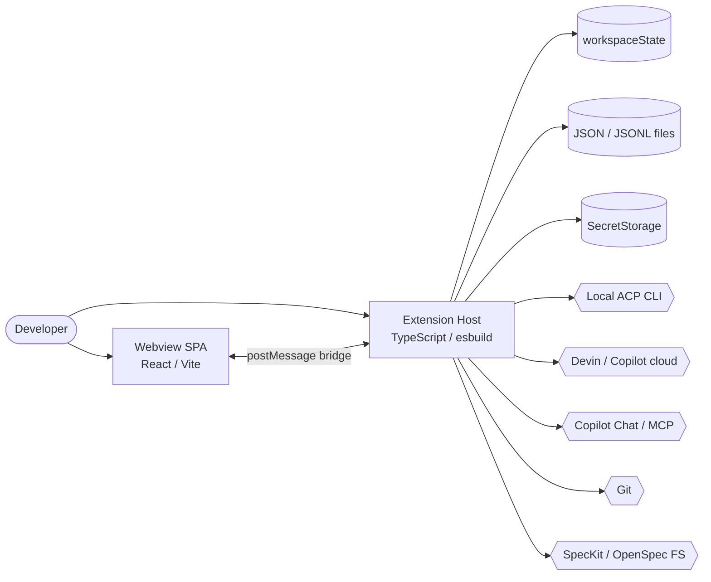

# Architecture Overview — gatomia

> Produced by the Reversa Architect (interpretation phase). The synthesis hub for the discovery artifacts.
> Confidence: 🟢 CONFIRMED from code · 🟡 INFERRED · 🔴 GAP.
> Companion docs: `c4-context.md`, `c4-containers.md`, `c4-components.md`, `erd-complete.md`, `traceability/spec-impact-matrix.md`, `domain.md`, `state-machines.md`, `permissions.md`, `adrs/`.

---

## 1. What gatomia is

**gatomia** (`v0.37.0`) is a single-user **VS Code extension** that turns the editor into an **Agentic Spec-Driven Development (SDD)** workbench. It:

- runs **local AI coding agents** (Devin/Gemini CLIs over the Agent Client Protocol) and delegates to **cloud agents** (Devin Cloud, GitHub Copilot coding agent);
- manages a **spec lifecycle** across two SDD toolchains (SpecKit `.specify/` or OpenSpec `openspec/`);
- automates the workflow with an **event-driven hooks engine**;
- aggregates everything into a monitoring/orchestration surface (**MAESTRO**, prototype).

There is **no backend server and no database** — the extension *is* the whole system (ADR-0005). State lives in VS Code `workspaceState`, JSON/JSONL files under `.vscode/gatomia/`, and `SecretStorage`. 🟢

> Lineage 🟡: forked from `kiro-for-codex-ide` (2025-11-21), pivoted same-day from OpenAI Codex to GitHub Copilot + SpecKit/OpenSpec (ADR-0001). Residual identifiers survive from that origin.

---

## 2. Architecture style

| Dimension | Choice | Evidence |
|-----------|--------|----------|
| Topology | **Client-only desktop extension** (no server, no inbound ports) | 🟢 |
| Build | **Dual-build**: esbuild (Node extension host) + Vite (React webview) | ADR-0002 🟢 |
| Host↔UI | **Single `postMessage` bridge**; webview never imports `src/` | ADR-0003 🟢 |
| Modularity | **Feature-folder bounded contexts** under `src/features/*` mirrored by `ui/src/features/*` | 🟢 |
| Extensibility | **Adapter + strategy** for spec systems and **provider abstraction** for cloud agents | ADR-0004/0007 🟢 |
| Behavior | **FSM-driven** session/spec/task lifecycles; **event-driven** automation | ADR-0010/0011 🟢 |
| Security | **Consent + capability + confirmation** (no RBAC) | ADR-0009/0013, `permissions.md` 🟢 |

Governance is constitution-driven (ADR-0014): kebab-case filenames, TypeScript-strict, test-first, observability, YAGNI — enforced by Biome/ultracite and ~247 Vitest files.

---

## 3. Containers (Level 2 summary)

- **Extension Host** (`src/`) owns all I/O, persistence, and external integration.
- **Webview SPA** (`ui/`) renders six feature pages, chosen at runtime via `page-registry`.
- Full detail in `c4-containers.md`; component decomposition in `c4-components.md`.

---

## 4. Bounded contexts

| Context | Modules | Responsibility | Maturity |
|---------|---------|----------------|----------|
| **Conversational Agents** | `agent-chat`, `agents`, `services/acp` | Local/cloud agent runs in a chat panel; session lifecycle, transcripts, capability negotiation, pending-write approval | 🟢 mature |
| **Cloud Delegation** | `cloud-agents`, `devin` | Delegate to Devin/Copilot; polling, status mapping, PR reconciliation, credential gating | 🟢 mature / 🔴 dual-path overlap |
| **Spec Lifecycle** | `spec`, `steering`, `tasks` | Create/review/archive specs across two SDD systems; steering docs; task normalization | 🟢 mature / 🔴 mock CR→tasks |
| **Automation** | `hooks` | Trigger + conditions + schedule → action (agent/git/github/mcp/custom/acp) | 🟢 mature / 🟡 parallel-exec stub |
| **Orchestration (MAESTRO)** | `orchestration`, `tasks` | Monitoring dashboard + autonomous Kanban→session loop | 🟡🔴 prototype |
| **Presentation infra** | `providers`, `panels`, `commands`, `prompts`, `ui/*` | Tree views, webviews, command handlers, prompts | 🟢 mature |

Context map detail in `domain.md` §2; data model in `erd-complete.md`.

---

## 5. Key architectural patterns

1. **Dual-build, mirrored contracts** (ADR-0002/0003) — host and webview are separate bundles; the webview hand-mirrors extension types and parity-tests them against drift.
2. **Spec-system adapter + strategy** (ADR-0004) — `SpecSystemAdapter` presents a unified `UnifiedSpec`/`TaskProvider` facade over SpecKit and OpenSpec; provider selection is path-based.
3. **Cloud provider abstraction** (ADR-0007) — `CloudAgentProvider` with Devin and GitHub Copilot adapters; exactly one active provider; the legacy `devin` module persists in parallel (🔴 overlap).
4. **FSM everywhere** (ADR-0010) — sessions, specs, change-requests, tasks, worktrees, and the ACP runtime are explicit state machines with **absorbing terminal sets** (INV-1) and **status-detail-overrides-base** (INV-2). See `state-machines.md` (22 machines).
5. **Event-driven hooks with safety rails** (ADR-0011) — chain-depth cap (10), circular-dependency set, action timeout (30 s), filesystem-watcher completion detection.
6. **Consent + capability + confirmation security** (ADR-0009/0013) — tool-call permission model, pending-write approval, global-resource-access consent, npx-spawn consent, destructive-action two-step confirmation. No roles. See `permissions.md`.
7. **Worktree isolation** (ADR-0012) — agent edits land on a dedicated git branch; dirty/unpushed cleanup needs explicit confirmation.
8. **Graceful degradation** (R-OR-2) — missing wiring yields human-readable `degradedReasons` instead of throwing.

---

## 6. Technology stack

| Layer | Tech |
|-------|------|
| Language | TypeScript 5.3 (strict, ES2022) — 624 `.ts(x)` files |
| Extension host | VS Code Extension API (`engines ^1.90.0`), esbuild `0.27` |
| Webview | React 18.3, Vite 7, Zustand 5, Tailwind 4, React Flow 12, `@tanstack/react-virtual` |
| Agent protocol | `@agentclientprotocol/sdk` 0.14 (JSON-RPC/stdio) |
| Rendering | `markdown-it` 14 + `mermaid` 10.9 + PlantUML (host & webview) |
| Templating | Handlebars 4.7, `gray-matter` 4 (frontmatter) |
| Testing | Vitest 4, Testing Library, jsdom (~247 test files) |
| Quality | Biome 2.3 via `ultracite` (lint/format/check) |
| CI/CD | 5 GitHub Actions workflows (ci, cd, release, tag-trigger, version-bump) |

Full dependency catalog in `dependencies.md`; no database/HTTP-server/message-broker deps (🟢).

---

## 7. Technical debt (consolidated)

> Detail + file/line citations in `traceability/spec-impact-matrix.md` §5 and the subagent-level findings. Severity: 🔴 correctness/ownership · 🟡 maintainability.

### 7.1 Correctness & ownership 🔴
- **Devin dual-path overlap** — `devin` and `cloud-agents` both implement Devin polling; ownership undetermined.
- **Autonomous loop** — builds a non-canonical `AgentChatSession` and checks a **non-existent** `"error"` lifecycle state; completion detection is heuristic.
- **CR→tasks is a mock** — `dispatchToTasksPrompt` returns hard-coded tasks and fails 10% at random.
- **Stubbed validations** — `validateConstitution` (always true) and `validateVariables` (always valid) enforce nothing.
- **Unmounted prototypes** — Kanban board has no importer; `devin-progress`/`cloud-agent-progress` pages are absent from `page-registry` ("Unknown page").

### 7.2 Maintainability & drift 🟡
- **Webview spec-explorer drift** — imports `src/` types and uses a second `acquireVsCodeApi()` (`window.specExplorerVscode`), violating ADR-0003 / R-X-6.
- **Duplication (Rule of Three)** — near-identical SpecKit/OpenSpec task providers; two `trigger-action-selector` and two `cli-options` component trees.
- **Sequential "parallel" hooks** — the parallel branch still `await`s each hook.
- **Cross-cutting platform gaps** — no structured logger / no external telemetry sink (in-memory only); manual regex validation instead of a schema library; review-flow uses a module-level singleton (hard to test).
- **Thin tests on big modules** — `acp-client.ts` (1582 LOC) and `review-flow/state.ts` (948 LOC) are lightly covered relative to their complexity.

---

## 8. Quality attributes & observations

- **Resilience** 🟢 — absorbing terminal states, terminal normalization, rate-limit + exponential backoff, polling failure caps, grace windows for late PR merges.
- **Security/privacy** 🟢 — layered consent gates, read-only enforcement, separate secret slots, strict CSP + per-render nonce; **gap 🔴**: no persisted audit trail of granted permissions; MCP downstream side-effects out of gatomia's control.
- **Observability** 🟡 — per-feature telemetry exists but is in-memory and not exported.
- **Portability** 🟢 — IDE-host detection drives ACP eligibility (Windsurf/Antigravity, non-remote only) and dependency requirements.
- **Testability** 🟢 overall (247 files), with the 🔴 hotspots noted in §7.2.

---

## 9. Open questions for the Reviewer (🔴)

Carried forward from `domain.md` §5 / `permissions.md` §10:

1. Which path **owns** Devin polling — `devin` or `cloud-agents`?
2. Is the autonomous loop intended for production, or scaffolding?
3. Should the CR→tasks mock be wired to a real generator?
4. Are the stubbed validators intentionally inert (phased rollout)?
5. Should the unmounted Kanban/progress pages be mounted or removed?
6. Is the webview spec-explorer bridge/type drift intentional?
7. Why is SDD spec **`009` missing** from the lineage?

---

## 10. Document index

| Artifact | Contents |
|----------|----------|
| `inventory.md` / `dependencies.md` | Scout: structure, tech, deps |
| `code-analysis.md` / `data-dictionary.md` / `flowcharts/` | Archaeologist: per-module deep dive, types, control flow |
| `domain.md` | Detective: purpose, ubiquitous language, 49 business rules, gaps |
| `state-machines.md` | Detective: 22 FSMs + cross-machine invariants |
| `permissions.md` | Detective: consent/capability/confirmation model |
| `adrs/` | Detective: 15 retroactive ADRs |
| **`architecture.md`** *(this doc)* | Architect: synthesis hub |
| `c4-context.md` / `c4-containers.md` / `c4-components.md` | Architect: C4 levels 1–3 |
| `erd-complete.md` | Architect: logical data model |
| `traceability/spec-impact-matrix.md` | Architect: dependency map, blast radius, SDD lineage, change-risk |

> Next in the plan: the **Writer** generates SDD specs per component, then the **Reviewer** resolves the 🔴 gaps with the maintainer.
