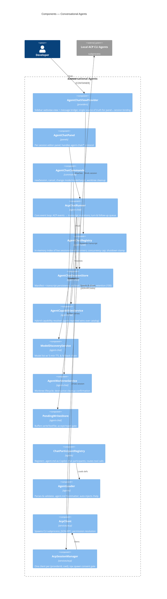
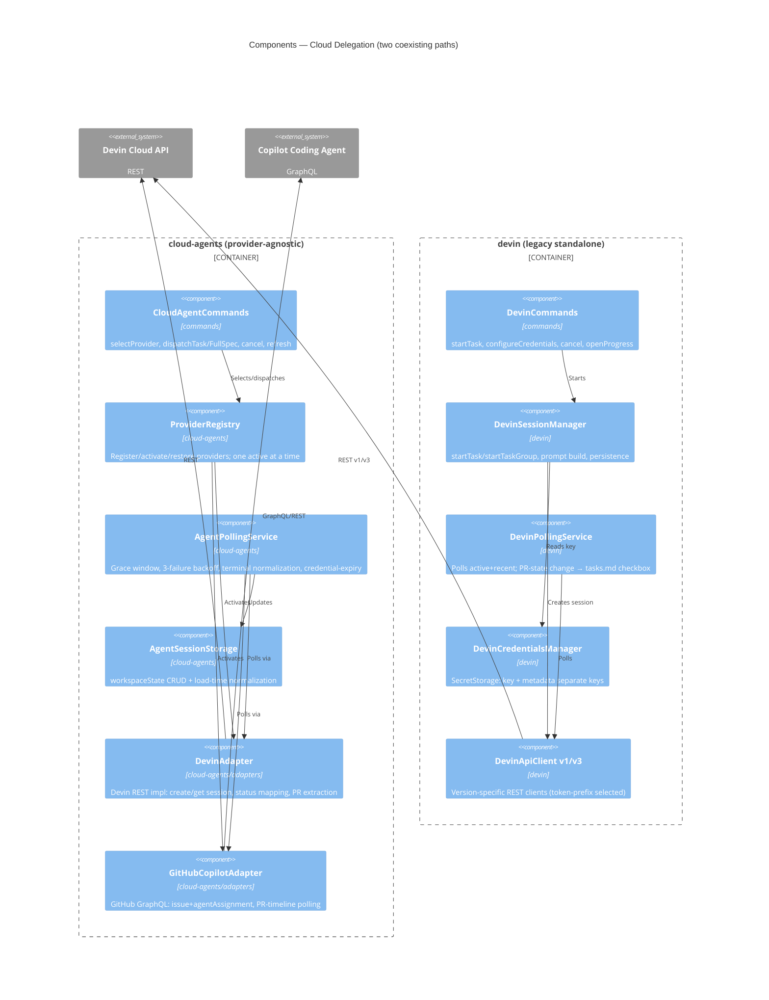
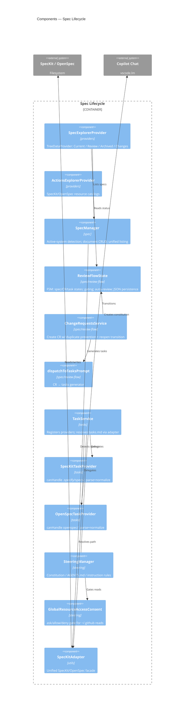
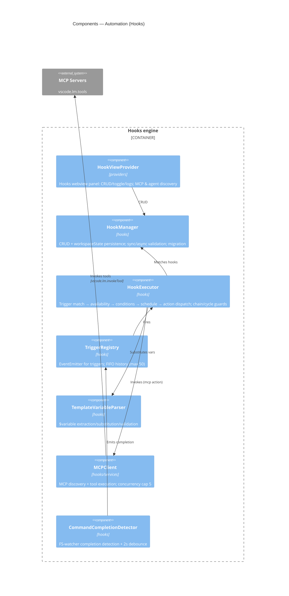
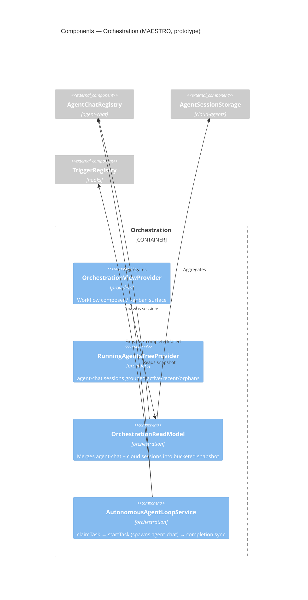
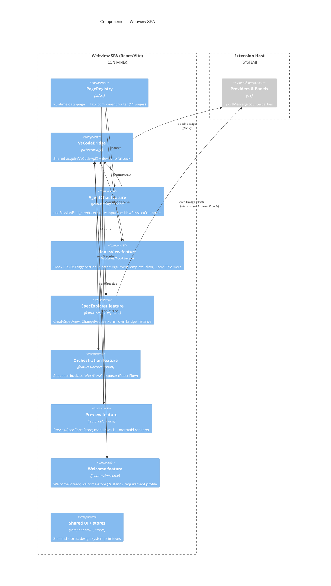

# C4 Model — Level 3: Components — gatomia

> Produced by the Reversa Architect (interpretation phase).
> Confidence: 🟢 CONFIRMED from code · 🟡 INFERRED · 🔴 GAP.
> The Extension Host and Webview SPA are decomposed below, grouped by **bounded context** (`domain.md` §2) to keep each diagram legible. File paths are relative to `src/` or `ui/src/`.

---

## A. Conversational Agents context (`agent-chat`, `agents`, `services/acp`) 🟢

| Component | Responsibility |
|-----------|----------------|
| `AgentChatViewProvider` | Canonical sidebar provider + bidirectional bridge; one-panel-per-session authority (R-AC-11) |
| `AcpChatRunner` | Subscribes to ACP session events, maps to transcript, manages turn/follow-up queue & lifecycle (R-AC-2) |
| `AgentChatSessionStore` | Manifest + transcript CRUD; archival >10k msg / >2 MB (R-AC-4); retention 100 (R-AC-5) |
| `AgentChatRegistry` | Live session/panel/runner index; concurrency cap; `ended-by-shutdown` stamp (R-AC-6) |
| `AgentCapabilitiesService` | Negotiates modes/models — agent-reported wins (R-AC-7) |
| `AgentWorktreeService` | Worktree create/inspect/clean; two-step destructive confirm (R-AC-9) |
| `PendingWritesStore` | Buffers `writeTextFile` and blocks until accept/reject |
| `ChatParticipantRegistry` / `AgentLoader` | Register `.agent.md` as Copilot participants; validation (R-AC-10) |
| `AcpClient` / `AcpSessionManager` | ACP subprocess runtime; permission resolution; npx consent (R-X-5) |

---

## B. Cloud Delegation context (`cloud-agents`, `devin`) 🟢🔴

> **🔴 Ownership overlap:** both the `devin` standalone path and the `cloud-agents` → `DevinAdapter` path implement Devin session lifecycle + polling and are both wired in `extension.ts`. Which path owns polling for a given session is undetermined (ADR-0007, `domain.md` §5.1). Key Devin rules: API version by token prefix (R-CD-1), local-only cancel (R-CD-2), `statusDetail` overrides `status` (R-CD-3), rate-limit + backoff (R-CD-10), clean-repo pre-flight (R-CD-11).

---

## C. Spec Lifecycle context (`spec`, `steering`, `tasks`) 🟢

> Spec status FSM is strictly validated (R-SP-1); send-to-review (R-SP-2) and archive (R-SP-5) gates; auto-return (R-SP-7). **🔴 `dispatchToTasksPrompt` is a mock** (random 10% failure, hard-coded tasks). **🔴 `validateConstitution` is a stub** (always true). **🟡 Task providers are near-duplicates** (Rule of Three).

---

## D. Automation context (`hooks`) 🟢

> Hooks match on agent+operation+same timing (R-HK-1); blocking only `before`+`waitForCompletion` (R-HK-2); chain-depth ≤10 + cycle set (R-HK-3); action timeout 30s (R-HK-4). Actions: `agent/git/github/mcp/custom/acp`. **🟡 parallel branch still `await`s sequentially**; **🔴 `validateVariables` is a stub**.

---

## E. Orchestration context (MAESTRO — `orchestration`, `tasks`) 🟡🔴

> Read-model buckets active/waiting/completed/failed with graceful `degradedReasons` (R-OR-1, R-OR-2). **🔴 The autonomous loop is the least mature component:** it constructs a non-canonical `AgentChatSession` and detects completion by checking a non-existent `"error"` lifecycle state (`domain.md` §5.2). **🔴 Kanban board & progress pages are unmounted.**

---

## F. Webview SPA (`ui/src`) 🟢

> **🟡 `SpecExplorer` uses a separate bridge** and imports `src/` types — the lone violation of the shared-bridge / no-`src/` rule (R-X-6). Other features all route through the shared `bridge/vscode.ts`.

---

## G. Shared services & ACP runtime (`src/services`) 🟢

| Component | Responsibility |
|-----------|----------------|
| `ChatRouter` | Declarative ACP-vs-Copilot routing with 60 s cache; probes host/auth (R-HK-9, R-X-4) |
| `ChatDispatcher` | Routes prompts to ACP or Copilot Chat; rewrites `/command` → natural language for ACP |
| `PromptLoader` | Loads compiled + directory prompts; Handlebars with variable validation |
| `AcpProviderRegistry` | ACP descriptor registry (built-ins + CDN); 24 h cache, 3 s timeout |
| `DependencyChecker` | Detects Copilot/CLI/SpecKit/OpenSpec/Devin/Gemini install status with TTL |
| `DocumentPreviewService` | Parses markdown/code into sectioned `DocumentArtifact` |
| `MCPClient` | MCP discovery + bounded-concurrency tool execution (R-HK-6) |

> See `traceability/spec-impact-matrix.md` for the full directed dependency map and the SDD feature lineage.
