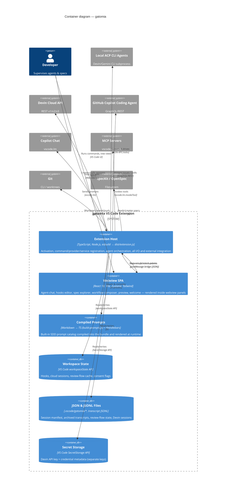

# C4 Model — Level 2: Containers — gatomia

> Produced by the Reversa Architect (interpretation phase).
> Confidence: 🟢 CONFIRMED from code/config · 🟡 INFERRED · 🔴 GAP.
> "Container" here = a separately-bundled/independently-runnable unit, not a Docker container (there is **no Docker** in this project 🟢).

---

## 1. Container overview

gatomia is a **dual-build** extension: a Node.js **extension host** (`src/`, bundled by esbuild) and a **React webview SPA** (`ui/`, bundled by Vite). They never share a module graph; they communicate **only** through the VS Code `postMessage` bridge (ADR-0003). State is persisted through VS Code platform APIs and JSON files (ADR-0005). 🟢

---

## 2. Containers in detail

### 2.1 Extension Host (`src/`) 🟢
- **Tech:** TypeScript 5.3 (strict), bundled by esbuild (`--target=node16`) into `dist/extension.js`.
- **Entry:** `src/extension.ts` (activation) registers every command, tree-view provider, webview provider, and service.
- **Internal layering** (decomposed in `c4-components.md`):
  - `features/*` — the nine domain modules (the bounded contexts).
  - `services/*` — cross-cutting runtime (ACP client/registry, chat routing, prompt loading, dependency checks, MCP client).
  - `providers/*` — VS Code tree views & webview-view providers.
  - `panels/*` — editor webview panels.
  - `commands/*` — command handlers.
  - `utils/*` — adapters (spec-kit), parsers, platform helpers.
- **Responsibility:** owns *all* persistence, *all* external I/O, and the single source of truth for session↔panel binding.

### 2.2 Webview SPA (`ui/`) 🟢
- **Tech:** React 18, Vite 7, Zustand 5, Tailwind 4, React Flow (`@xyflow/react`), `@tanstack/react-virtual`, `markdown-it` + mermaid.
- **Entry:** `ui/src/index.tsx` → `page-registry.tsx` chooses the active page at runtime from `#root[data-page]` (R-X-1).
- **Pages/features:** agent-chat, hooks-view, spec-explorer, orchestration/workflow-composer, preview, welcome.
- **Rule (ADR-0003 / R-X-6):** the webview **must not import from `src/`**; extension types are hand-mirrored in `ui/src/.../types.ts` and guarded by parity tests. 🟡 *violated by `webview-spec-explorer`* (see §4).

### 2.3 Compiled Prompts 🟢
- Markdown prompt sources in `src/prompts/` are compiled to TypeScript by `scripts/build-prompts.js` and registered with the `PromptLoader`, then rendered with Handlebars at runtime.

### 2.4 Persistence containers (ADR-0005) 🟢
| Store | API | Holds |
|-------|-----|-------|
| **Workspace State** | `workspaceState` | hooks, cloud `AgentSession[]`, review-flow cache, consent flags, config snapshots |
| **JSON / JSONL files** | `fs` under `.vscode/gatomia/` | session manifest, archived transcript JSONL, review-flow state, Devin sessions (7-day retention) |
| **Secret Storage** | `SecretStorage` | Devin API key (`gatomia.devin.apiKey`) + metadata (`gatomia.devin.credentials`) under separate keys |

---

## 3. The host↔webview contract (ADR-0003) 🟢

- The **only** channel between the two containers is `postMessage`. Each webview page acquires a single `acquireVsCodeApi()` handle via the shared `bridge/vscode.ts`.
- Messages are JSON commands (webview→host) and state snapshots/events (host→webview).
- Panels **buffer** outbound messages until the webview signals readiness (`welcome/ready`, `preview/ready`).
- Webview HTML is generated per-render with a 32-char nonce and a strict CSP (R-X-1).

---

## 4. Container-level risks & drift

- **🟡 Second bridge instance.** `webview-spec-explorer` acquires its *own* `acquireVsCodeApi()` (`window.specExplorerVscode`) instead of the shared bridge, and imports types directly from `src/` — two violations of the container isolation contract (R-X-6).
- **🔴 Unmounted webview pages.** `cloud-agent-progress` and `devin-progress` panels request pages that are **absent from `page-registry.tsx`** ("Unknown page"); the Kanban board component has no importer. A "prototype graveyard" from the MAESTRO build-out.
- **🟡 Duplicated webview components.** Two `trigger-action-selector.tsx` and two `cli-options/` trees exist; the canonical one is ambiguous.

> Next level: see `c4-components.md` for the component decomposition of the Extension Host and Webview.
