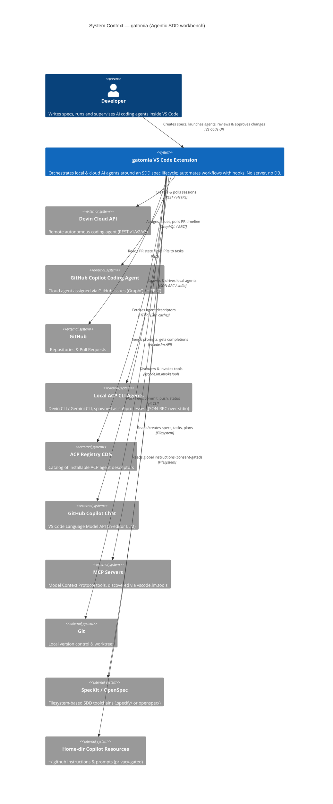

# C4 Model — Level 1: System Context — gatomia

> Produced by the Reversa Architect (interpretation phase).
> Confidence: 🟢 CONFIRMED from code/config · 🟡 INFERRED · 🔴 GAP.
> Mermaid `C4Context` renders in the document-preview panel (mermaid `^10.9.5`).

---

## 1. Purpose

**gatomia** is a single-user VS Code extension (version `0.37.0`) that turns the editor into an **Agentic Spec-Driven Development (SDD)** workbench. It has **no backend server and no database** — the extension *is* the whole system. It orchestrates AI coding agents (local and cloud) around a spec lifecycle and automates workflows via event-driven hooks. 🟢

The single human actor is the **Developer** running VS Code; every external interaction is brokered by the extension on that user's behalf.

---

## 2. System Context diagram

---

## 3. Actors & external systems

| Element | Type | Trust boundary | Confidence |
|---------|------|----------------|------------|
| **Developer** | Person | Full authority; grants/denies all consent | 🟢 |
| **Local ACP CLI Agents** (Devin CLI, Gemini CLI) | External (subprocess) | Untrusted-by-default: file writes & tool calls are gated | 🟢 |
| **Devin Cloud API** | External service | Reached via `SecretStorage` API key; results read-only locally | 🟢 |
| **GitHub Copilot Coding Agent** | External service | Reached via GitHub token; results read-only locally | 🟢 |
| **GitHub** (PRs/repos) | External service | PR state polled; checkbox sync writes to local `tasks.md` only | 🟢 |
| **ACP Registry CDN** | External service | Read-only metadata fetch (`cdn.agentclientprotocol.com`) | 🟢 |
| **GitHub Copilot Chat** | Platform LLM | In-process via `vscode.lm`; gated by `gatomia.chat.provider` | 🟢 |
| **MCP Servers** | External tools | Invoked via `vscode.lm.invokeTool`; downstream tool permission model out of gatomia's control | 🟡 |
| **Git** | Local CLI | Runs with user privileges; destructive ops require confirmation | 🟢 |
| **SpecKit / OpenSpec** | Filesystem toolchain | Spec artifacts under `.specify/` or `openspec/` | 🟢 |
| **Home-dir Copilot Resources** | Filesystem (`~/.github`) | Reads gated by the global-resource-access consent system | 🟢 |

---

## 4. Key context-level observations

- **Two delegation paths to Devin coexist** 🟡 — the standalone `devin` integration and the provider-agnostic `cloud-agents` layer both reach the Devin Cloud API and are both wired in `extension.ts`. Ownership of polling for a given session is a 🔴 gap (see `domain.md` §5).
- **All "remote" work returns as read-only locally** 🟢 — cloud sessions cannot accept follow-ups; only local ACP agents mutate the workspace (through the pending-write approval gate).
- **The IDE host matters** 🟢 — ACP routing is eligible only on Windsurf/Antigravity and non-remote workspaces; the detected `IDE Host` drives capability and dependency requirements.
- **No network server is exposed** 🟢 — gatomia is purely a client; it consumes external APIs and the VS Code platform, and never listens for inbound connections.

> Next level: see `c4-containers.md` for the internal container decomposition.
