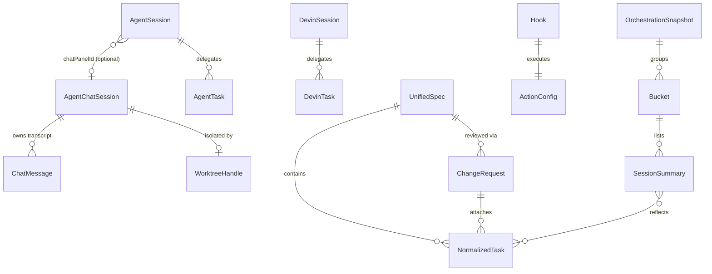
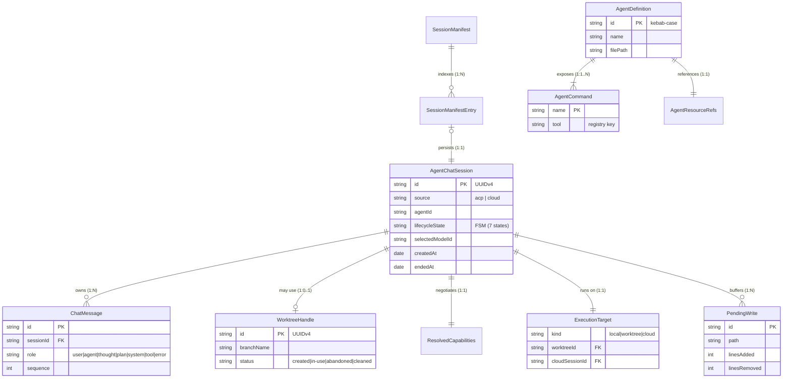
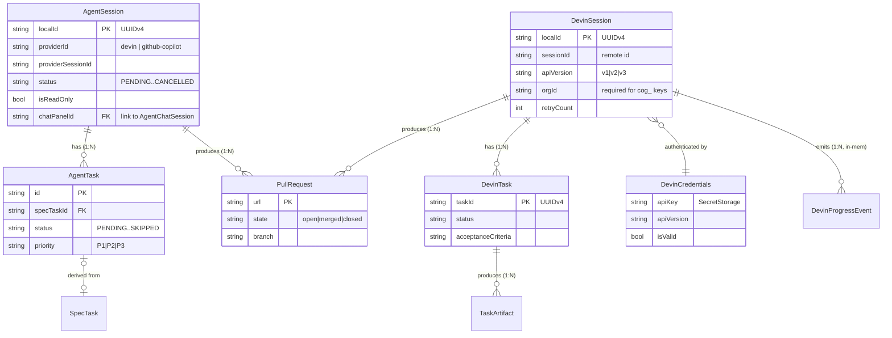
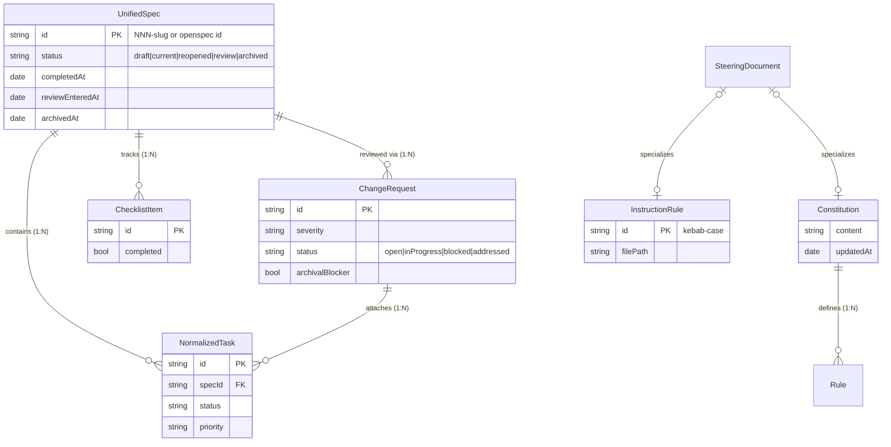
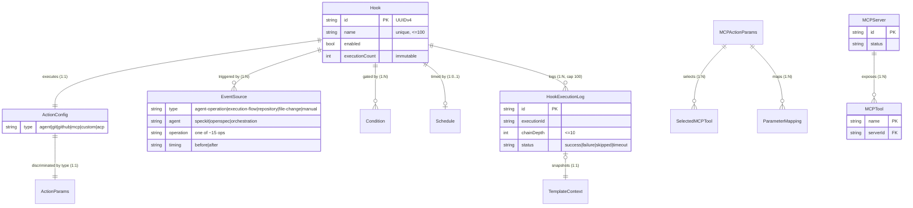
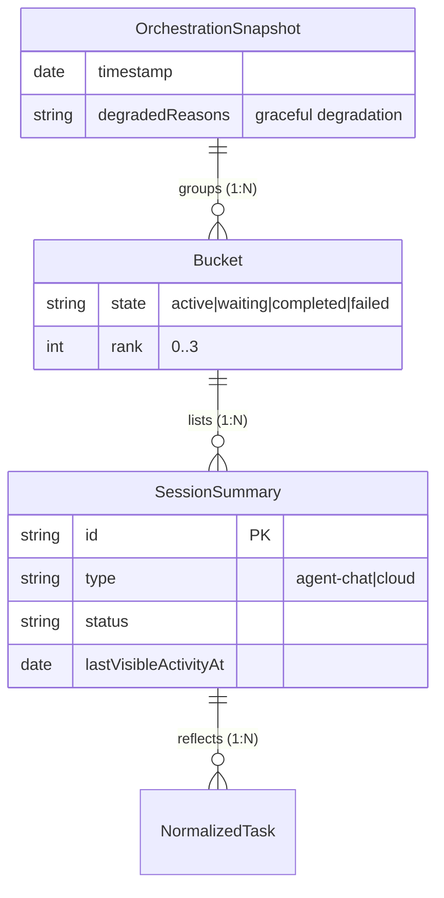

# Entity-Relationship Model — gatomia

> Produced by the Reversa Architect (interpretation phase).
> Confidence: 🟢 CONFIRMED from code · 🟡 INFERRED · 🔴 GAP.
>
> **There is no database** (ADR-0005). This is a **logical data model** of the in-memory / persisted TypeScript domain types. "Entities" are interfaces & discriminated unions; "relationships" are composition and references. Persistence backends per entity are noted in the legend. Source: `data-dictionary.md`, `domain.md`.

---

## Legend — where each aggregate lives

| Persistence | Entities (roots) |
|-------------|------------------|
| **JSON manifest + JSONL** (`.vscode/gatomia/`) | `SessionManifest` / `AgentChatSession` transcripts |
| **workspaceState** | `Hook`, `AgentSession` (cloud), review-flow state |
| **JSON file** (7-day retention) | `DevinSession` |
| **SecretStorage** | `DevinCredentials` (key + metadata, separate slots) |
| **Filesystem (markdown)** | `AgentDefinition` (`.agent.md`), `UnifiedSpec`, `SteeringDocument` |
| **In-memory only** | `OrchestrationSnapshot`, `MCPServer`, `DevinProgressEvent` |

---

## 1. Cross-context overview

The five bounded contexts are loosely coupled. The only cross-context links are: a cloud `AgentSession` may point back to an `AgentChatSession` (`chatPanelId`); both spec tasks and orchestration consume the shared `NormalizedTask` shape; and the `OrchestrationSnapshot` aggregates sessions from two contexts.

---

## 2. Conversational Agents 🟢

---

## 3. Cloud Delegation 🟢🔴

> **🔴** `AgentSession` (cloud-agents) and `DevinSession` (legacy) are **parallel aggregates for the same remote concept**; the ownership boundary is undetermined (`domain.md` §5.1).

---

## 4. Spec Lifecycle 🟢

> Status FSM strictly validated (R-SP-1); `readyToReview` normalized to `review`. A `ChangeRequest` with `archivalBlocker=true` blocks archival until `addressed` (R-SP-4/5).

---

## 5. Automation (Hooks) 🟢

---

## 6. Orchestration (MAESTRO) 🟡🔴

> `SessionSummary` is a **read-model projection** merging agent-chat and cloud sessions — not a stored entity. Sort = bucket rank then `lastVisibleActivityAt` desc (R-OR-1).

---

## 7. Cardinality summary (most important relationships)

| Parent | → | Child | Card. | Notes |
|--------|---|-------|-------|-------|
| `AgentChatSession` | → | `ChatMessage` | 1:N | core transcript; archived past 10k/2 MB |
| `AgentChatSession` | → | `WorktreeHandle` | 1:0..1 | only when target = worktree |
| `AgentChatSession` | → | `ExecutionTarget` | 1:1 | immutable after first turn |
| `AgentDefinition` | → | `AgentCommand` | 1:1..N | ≥1 required |
| `AgentSession` (cloud) | → | `AgentTask` | 1:N | delegated work |
| `AgentSession` (cloud) | → | `AgentChatSession` | 0..1:1 | `chatPanelId` back-link |
| `DevinSession` | → | `DevinTask` | 1:N | legacy path |
| `DevinTask` | → | `TaskArtifact` | 1:N | files/logs/test results |
| `UnifiedSpec` | → | `NormalizedTask` | 1:N | spec tasks |
| `UnifiedSpec` | → | `ChangeRequest` | 1:N | review flow |
| `ChangeRequest` | → | `NormalizedTask` | 1:N | remediation tasks |
| `Constitution` | → | `Rule` | 1:N | governance |
| `Hook` | → | `ActionConfig` | 1:1 | discriminated union |
| `Hook` | → | `EventSource` | 1:N | normalized triggers |
| `Hook` | → | `HookExecutionLog` | 1:N | FIFO cap 100 |
| `MCPServer` | → | `MCPTool` | 1:N | discovered tools |
| `OrchestrationSnapshot` | → | `Bucket` → `SessionSummary` | 1:N:N | dashboard |

> ~94 distinct types/enums were catalogued (`data-dictionary.md`); this model surfaces the ~35 aggregate roots and their relationships. Enums backing FSM `status`/`state` fields are documented in `state-machines.md`.
