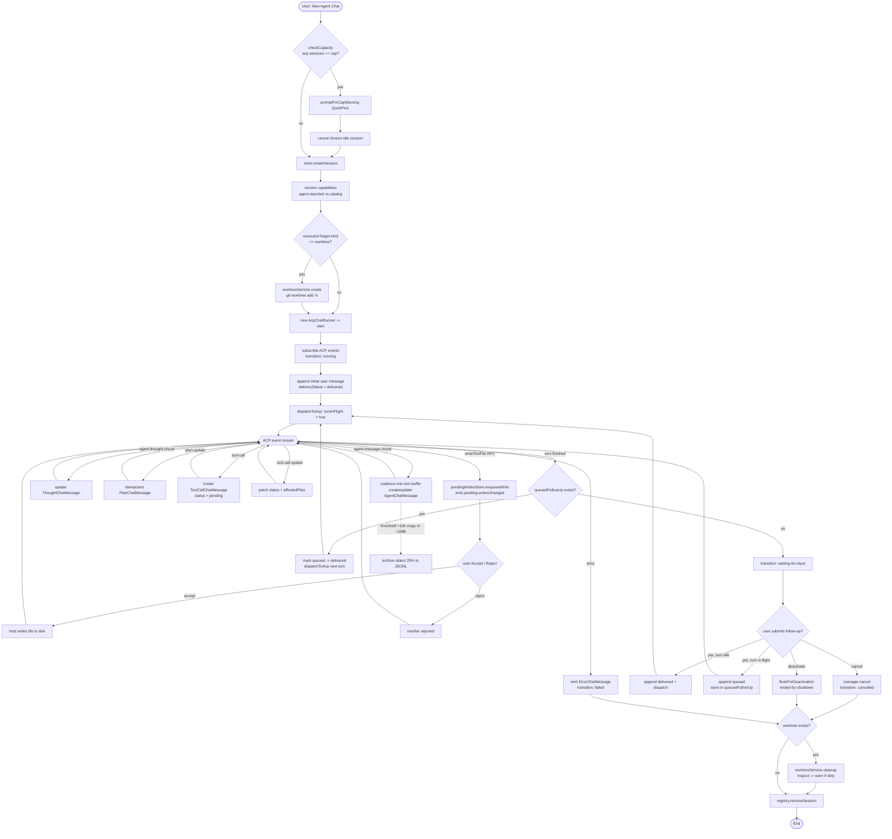
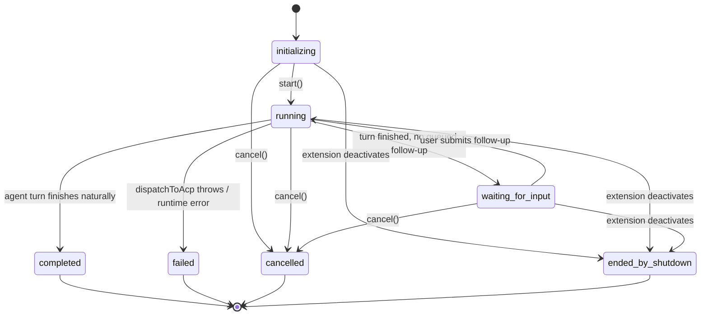
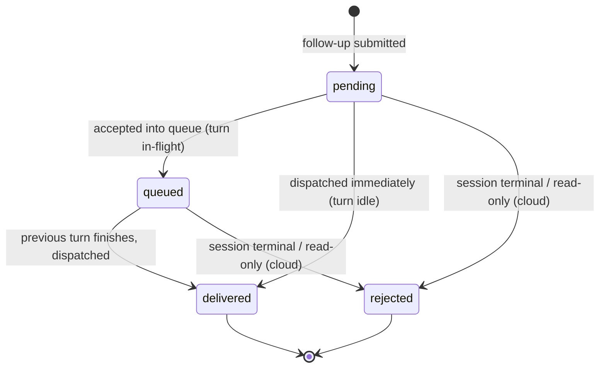
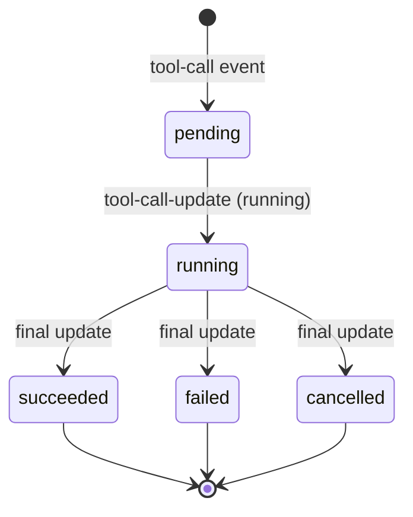
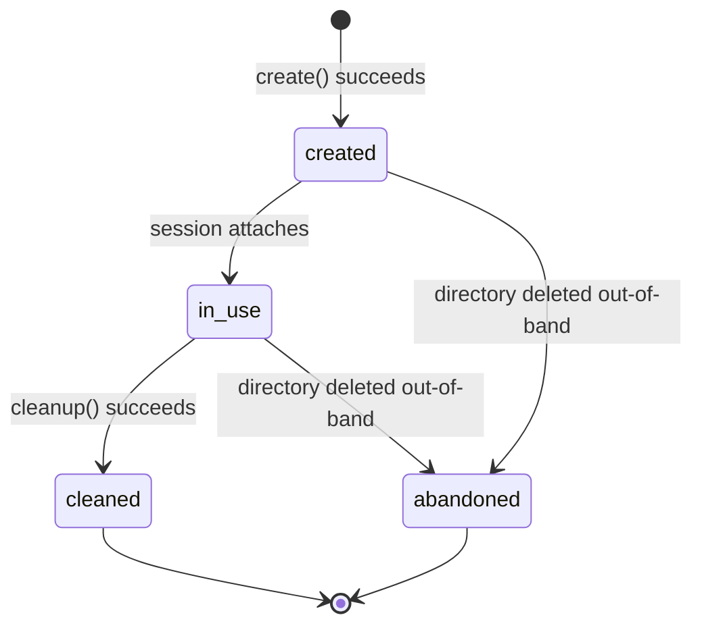

# Flowcharts — `agent-chat` module

> Source: `src/features/agent-chat/`. Confidence: 🟢 CONFIRMED unless noted.
> Generated by the Reversa Archaeologist (escavação phase).

## 1. End-to-end flow: start ACP session → process turn → tool calls → archive

## 2. Session lifecycle state machine 🟢

> `types.ts:18-43`, `acp-chat-runner.ts:890-911`. Terminal states are absorbing.

## 3. User-message delivery state machine 🟢

> `types.ts:229-243`, `acp-chat-runner.ts:304-328`.

## 4. Tool-call status machine 🟢

> `types.ts:311-316`, `acp-chat-runner.ts:674-741`.

## 5. Worktree status machine 🟢

> `types.ts:151-168`, `agent-worktree-service.ts`.

