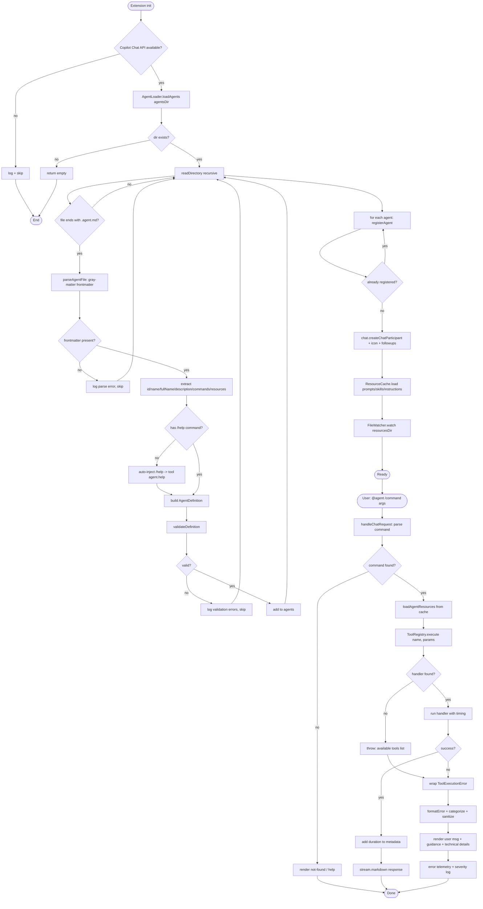
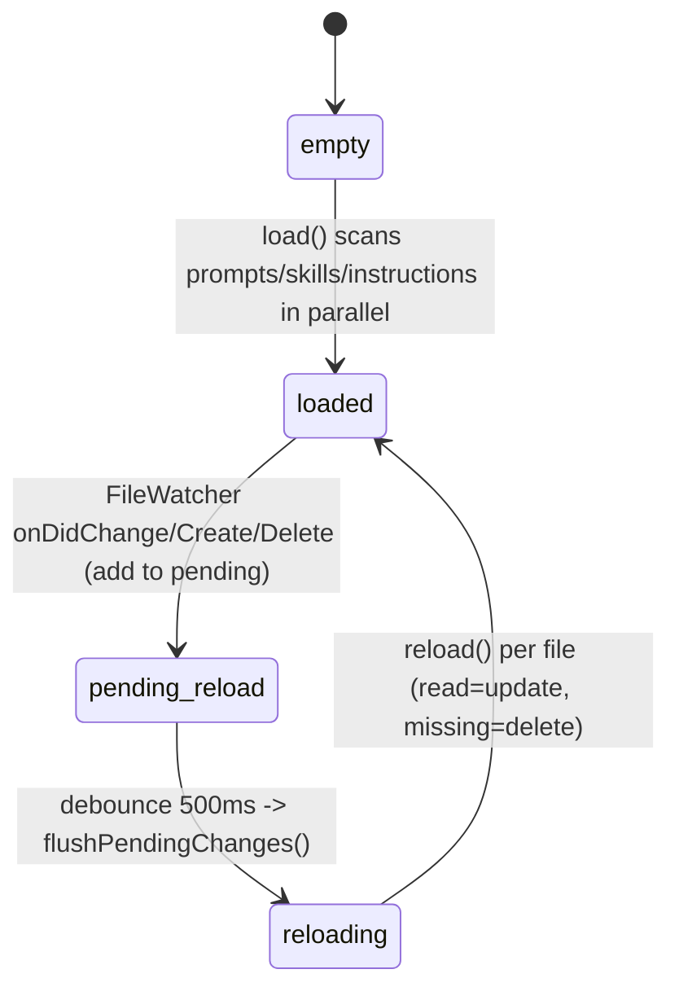
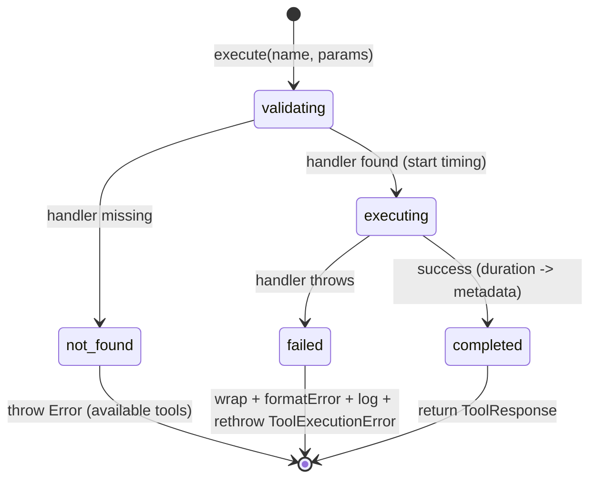

# Flowcharts — `agents` module

> Source: `src/features/agents/`. Confidence: 🟢 CONFIRMED unless noted.
> Generated by the Reversa Archaeologist (escavação phase).

## 1. Discovery → registration → chat request handling

## 2. Resource cache lifecycle (hot-reload) 🟢

## 3. Tool execution lifecycle 🟢

