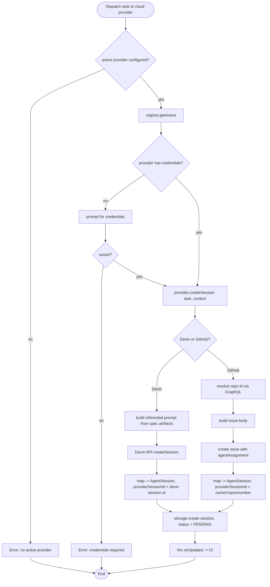
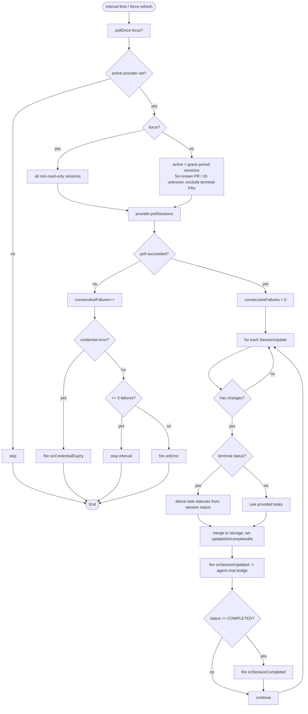
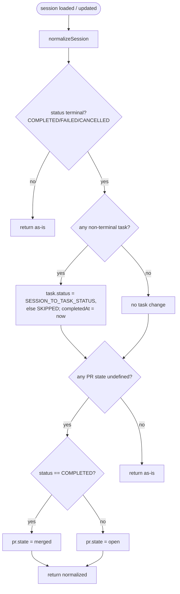
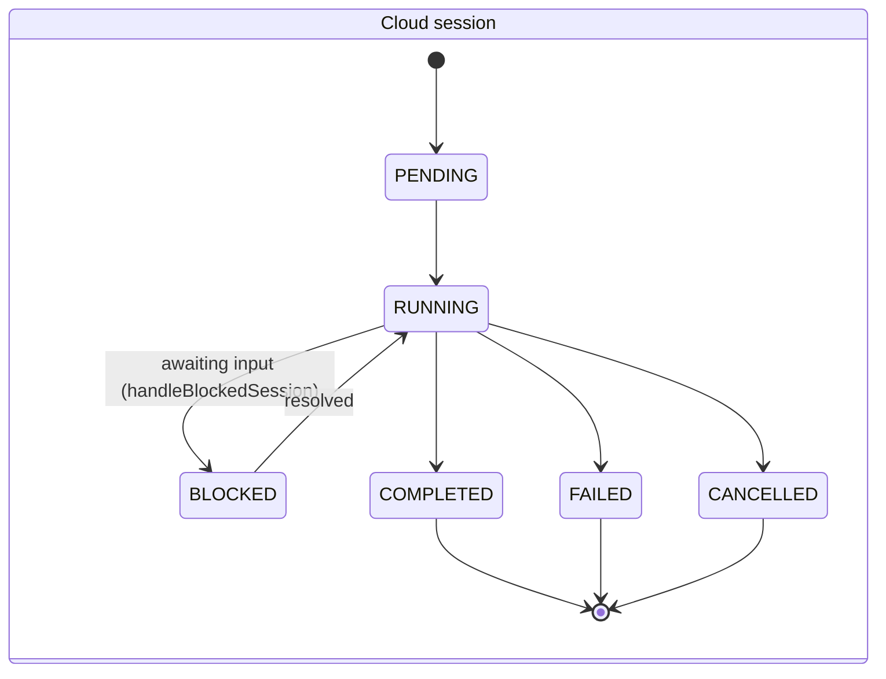
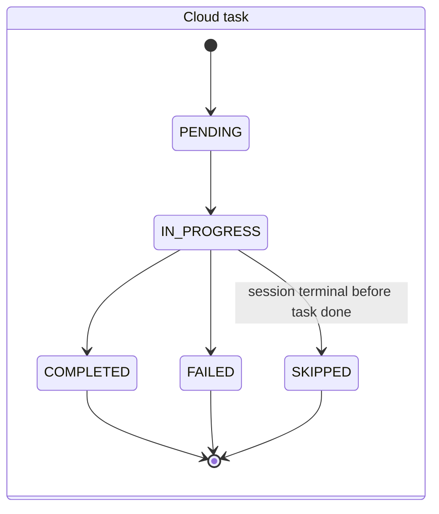
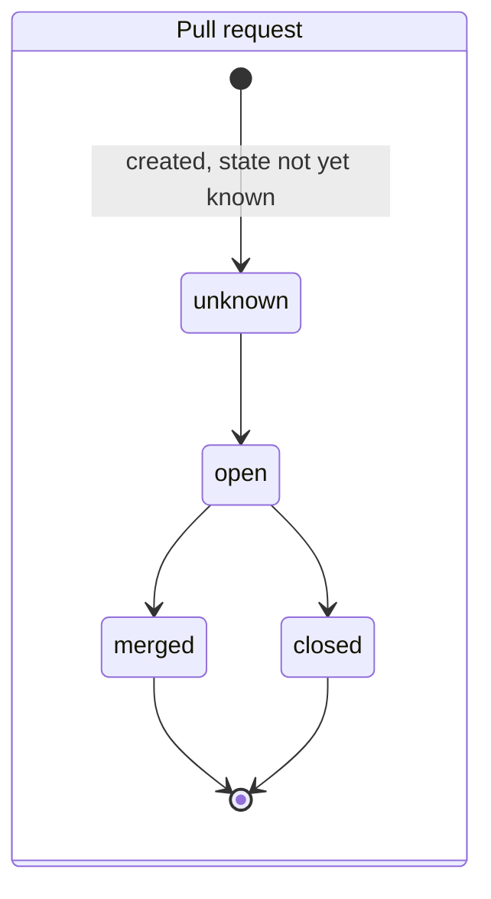
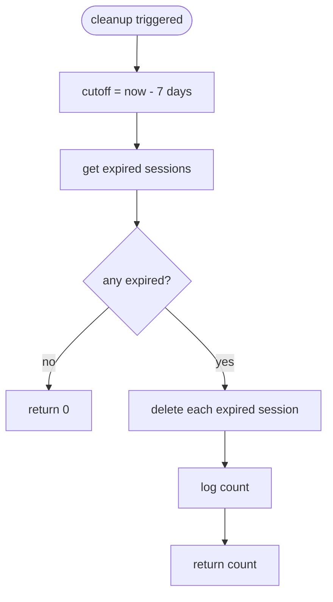

# Flowcharts — `cloud-agents` module

> Source: `src/features/cloud-agents/`. Confidence: 🟢 CONFIRMED unless noted.
> Generated by the Reversa Archaeologist (escavação phase).

## 1. Create a cloud-agent session via a provider

## 2. Polling loop updating status (with backoff + terminal normalization)

## 3. Terminal-state normalization (`normalizeSession`) 🟢

## 4. Session lifecycle / task lifecycle / PR state 🟢

## 5. Session cleanup (7-day retention) 🟢

