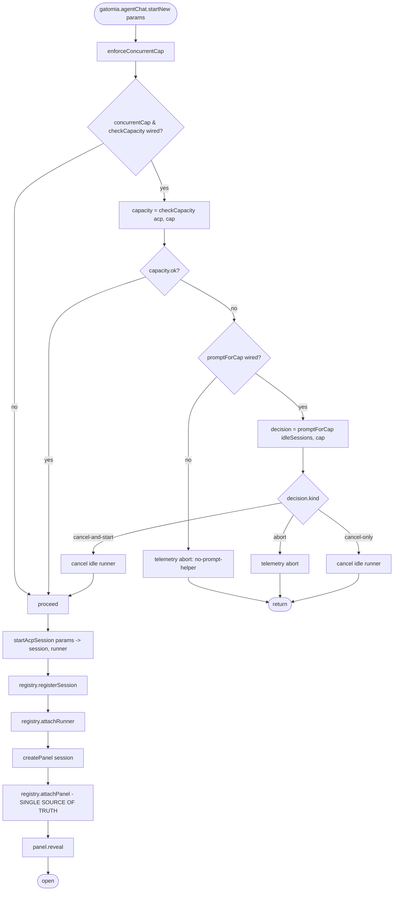
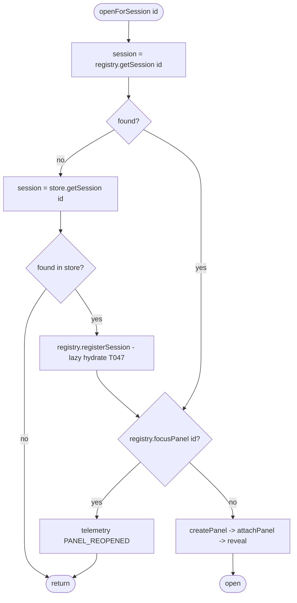
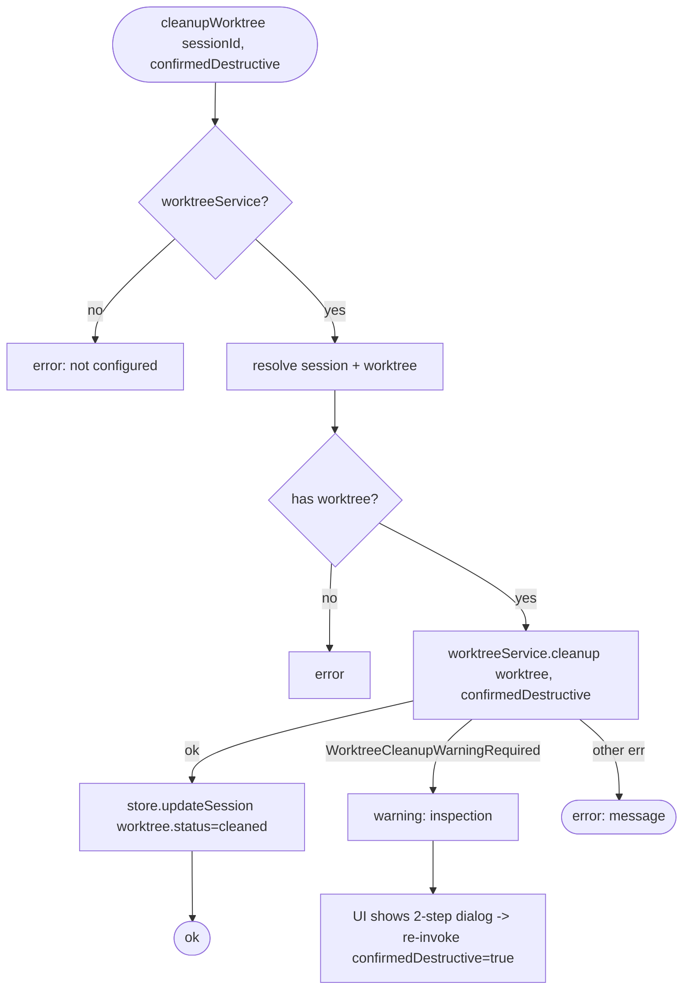
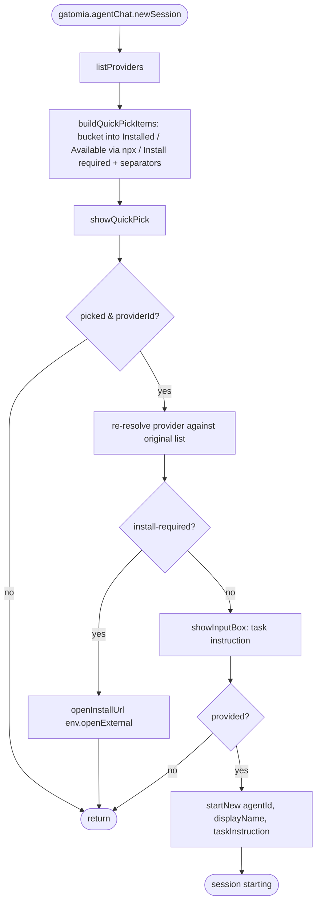

# Flowcharts — `commands` module

> Source: `src/commands/`. Confidence: 🟢 CONFIRMED unless noted.
> Generated by the Reversa Archaeologist (escavação phase).

## 1. handleStartNew — concurrent-cap enforcement + launch 🟢



## 2. handleOpenForSession — restart fallback + one-panel reuse 🟢



## 3. handleChangeModel — ACP set_model with legacy fallback 🟢

```mermaid
flowchart TD
    A([changeModel sessionId, modelId]) --> B[resolve session registry||store]
    B --> C{found & modelId changed?}
    C -- no --> Z([return])
    C -- yes --> D[tryAcpSetModel]
    D --> D1{source==acp && manager?}
    D1 -- no --> F[fallback]
    D1 -- yes --> D2[manager.setSessionModel]
    D2 -->|ok| OK([done - manager fires models-changed])
    D2 -->|err includes ACP_NOT_SUPPORTED| F
    D2 -->|other err| THROW[re-throw to error boundary]
    F --> G[runner.recordModelChange? ]
    G --> H[store.updateSession selectedModelId] --> OK
```

## 4. Two-step worktree cleanup 🟢



## 5. Cloud dispatchTask — guard + retry 🟢

```mermaid
flowchart TD
    A([gatomia.dispatchTask item|taskId]) --> B[ensureActiveProvider]
    B --> B1{provider selected & credentialed?}
    B1 -- no --> B2[chain selectProvider / configureProvider] --> Z0([return])
    B1 -- yes --> C[extractTaskFromItem]
    C --> C1{task found?}
    C1 -- no --> E0[error: no task]
    C1 -- yes --> D{isTaskAlreadyRunning specTaskId?}
    D -- yes --> D1[warn: Open Session / Cancel] --> Z0
    D -- no --> F[build SpecTask + SessionContext - git branch/remote/featurePath]
    F --> G[createSessionWithRetry]
    G --> G1{attempt <= 2}
    G1 --> G2[provider.createSession]
    G2 -->|ok| H[storage.create]
    G2 -->|ProviderError.recoverable & attempts left| G3[backoff 1000*(n+1)ms] --> G1
    G2 -->|non-recoverable / exhausted| ERR[throw -> showErrorMessage]
    H --> I{pollingService running?}
    I -- no --> J[pollingService.start 30000]
    I -- yes --> K[onSessionCreated + onRefresh]
    J --> K --> Z([dispatched])
```

## 6. New-session QuickPick (tier-grouped) 🟢


