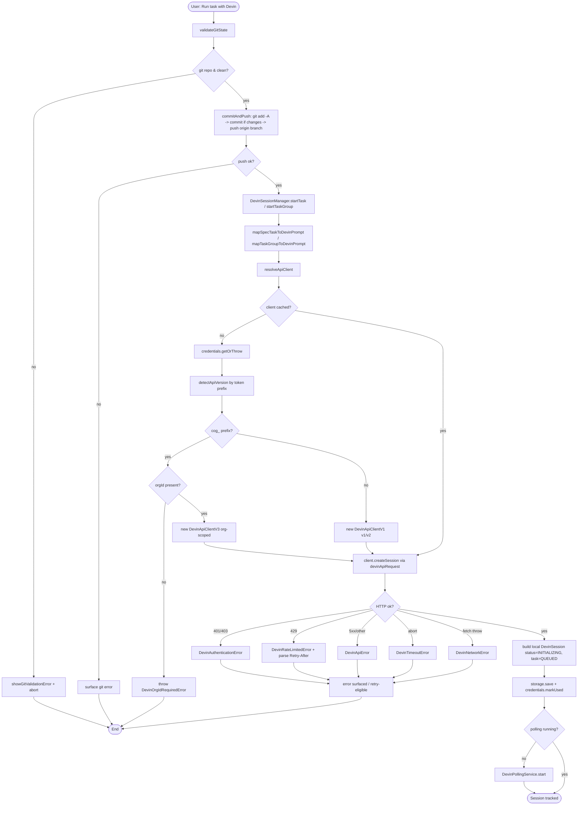
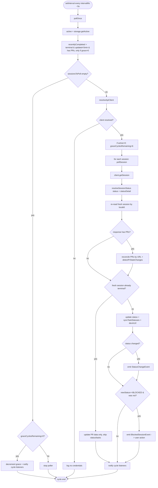
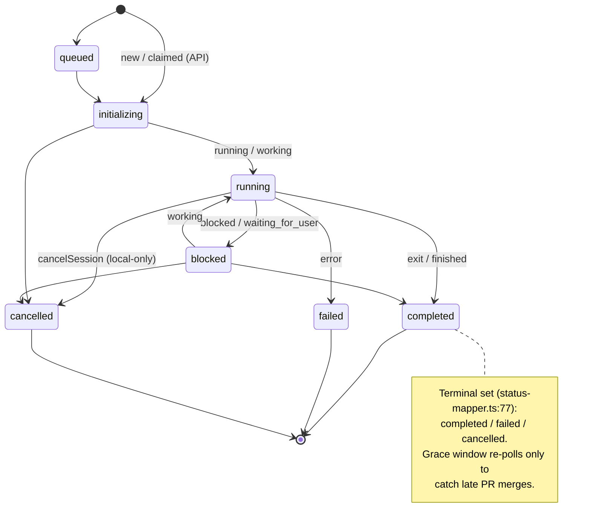
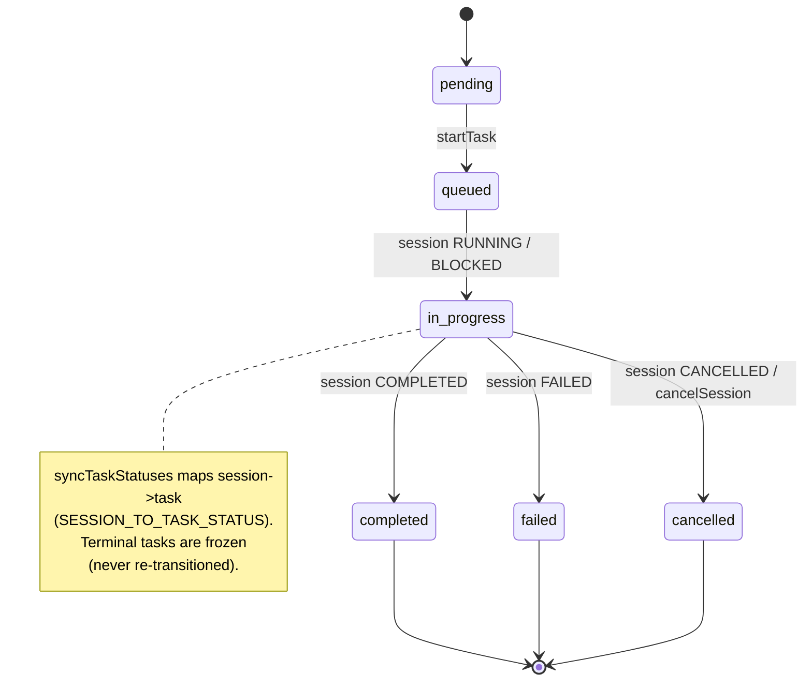

# Flowcharts — `devin` module

> Source: `src/features/devin/` (spec `001-devin-integration`). Confidence: 🟢 CONFIRMED unless noted.
> Generated by the Reversa Archaeologist (escavação phase).

## 1. Task initiation → session creation 🟢



## 2. Polling cycle 🟢



## 3. Session status state machine 🟢



## 4. Task status sync 🟢



## 5. Retry with exponential backoff 🟢

```mermaid
flowchart TD
    A([withRetry op]) --> B[attempt = 1]
    B --> C[run operation]
    C --> D{success?}
    D -- yes --> D0([return result])
    D -- no --> E{isRetryable? 5xx / network / timeout / rate-limited}
    E -- no --> E0[throw original error]
    E -- yes --> F{attempt >= maxAttempts (3)?}
    F -- yes --> F0[throw DevinMaxRetriesExceededError]
    F -- no --> G{RateLimited with Retry-After?}
    G -- yes --> G1[delay = min Retry-After, 30s]
    G -- no --> G2[delay = min base*2^(n-1), 30s + 10% jitter]
    G1 & G2 --> H[onRetry callback + sleep]
    H --> I[attempt++] --> C
```

## 6. PR-state change → tasks.md sync 🟢

```mermaid
flowchart LR
    A[poll detects PR state change] --> B[emit PrStateChangeEvent]
    B --> C{newState == merged?}
    C -- yes --> D[updateSpecTaskStatusOnMerge specPath, specTaskId]
    C -- no --> E[record new PR state only]
    D --> F[markTaskAsCompleted: regex '- [ ] TXXX' -> '- [x]']
    F --> G[workspace.fs.writeFile tasks.md if changed]
```
