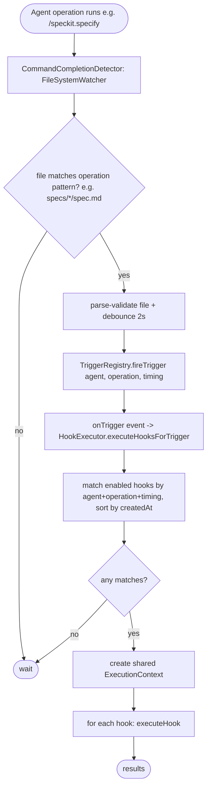
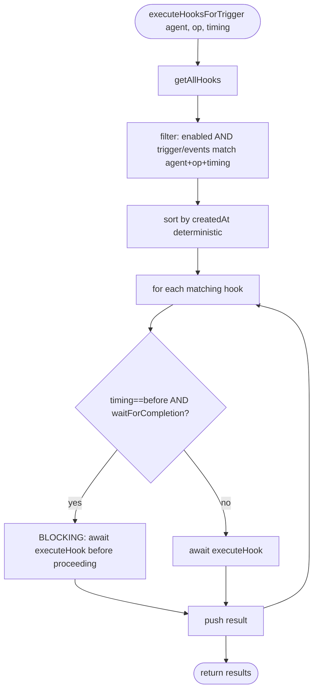
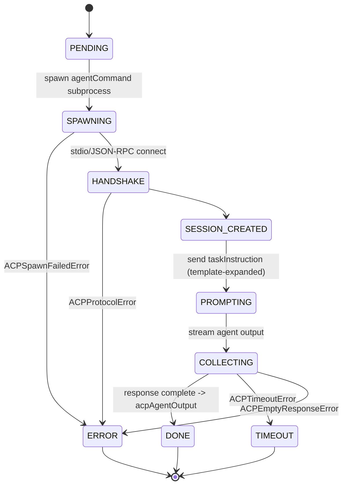
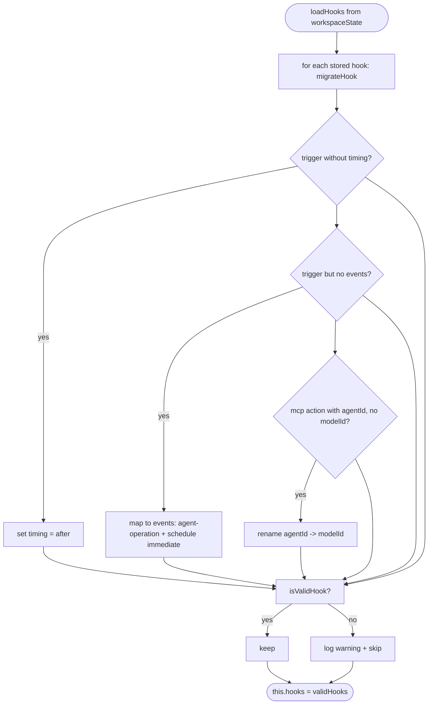

# Flowcharts — `hooks` module

> Source: `src/features/hooks/` (spec `011-custom-agent-hooks`). Confidence: 🟢 CONFIRMED unless noted.
> Generated by the Reversa Archaeologist (escavação phase).

## 1. End-to-end: operation completion → hook action 🟢



## 2. Single-hook execution pipeline 🟢

```mermaid
flowchart TD
    A([executeHook]) --> B{hook.enabled?}
    B -- no --> B0[status=skipped] --> Z([record log])
    B -- yes --> C{action.type == mcp?}
    C -- yes --> C1[validate MCP server/tool]
    C1 --> C2{valid?}
    C2 -- no --> C3[prompt user: Update Hook] --> Z
    C -- yes/after check --> D{action.type == custom?}
    D -- yes --> D1[check agent availability]
    D1 --> D2{available?}
    D2 -- no --> D3[prompt: Retry / Update Hook / handle FILE_DELETED] --> Z
    D -- proceed --> E[evaluate conditions]
    E --> F{conditions met?}
    F -- no --> F0[status=skipped] --> Z
    F -- yes --> G{schedule.type}
    G -- delayed --> G1[await delayMs]
    G -- immediate --> H
    G1 --> H[build TemplateContext + expandTemplate args]
    H --> I[dispatch by action.type]
    I --> I1[agent]
    I --> I2[git]
    I --> I3[github via MCP]
    I --> I4[mcp tool]
    I --> I5[custom: local | background]
    I --> I6[acp subprocess]
    I1 & I2 & I3 & I4 & I5 & I6 --> J{result.status}
    J -- success --> J1[increment executionCount + telemetry success]
    J -- failure --> J2[capture ExecutionError + telemetry failure]
    J -- timeout --> J3[ExecutionTimeoutError]
    J1 & J2 & J3 --> Z[recordExecutionLog FIFO max 100]
```

## 3. Trigger matching + blocking decision 🟢



> 🟡 Note: both branches `await` sequentially in the loop; the "non-blocking / parallel" comment in code does not produce true parallelism (`hook-executor.ts:884-895`).

## 4. ACP action lifecycle 🟢



## 5. Hook load + schema migration 🟢



## 6. Execution-chain guard 🟢

```mermaid
stateDiagram-v2
    [*] --> root: createExecutionContext (depth 0, executedHooks empty)
    root --> running: executeHook adds hookId to executedHooks
    running --> blocked_cycle: isCircularDependency (hookId already in set)
    running --> blocked_depth: isMaxDepthExceeded (chainDepth >= 10)
    running --> chained: hook triggers another hook (depth+1)
    chained --> running
    blocked_cycle --> [*]: CircularDependencyError
    blocked_depth --> [*]: MaxDepthExceededError
```
