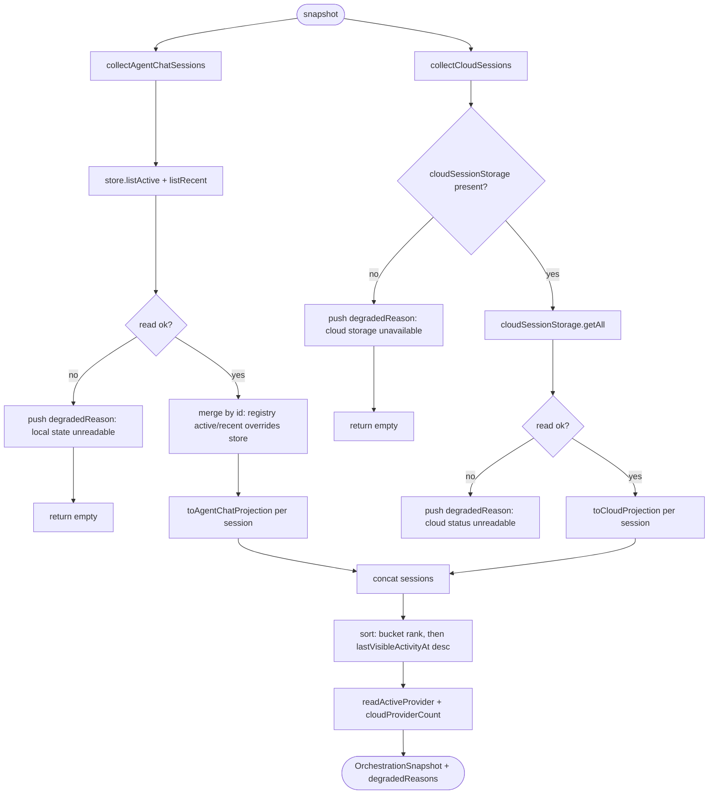
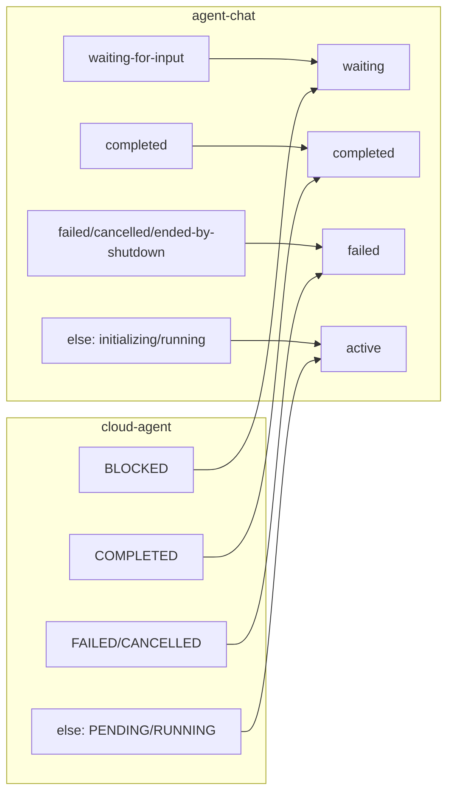
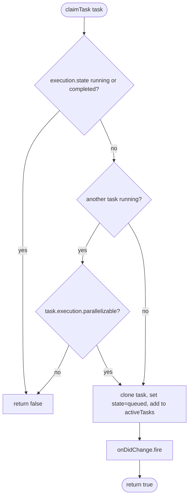

# Flowcharts — `orchestration` module

> Source: `src/features/orchestration/`. Confidence: 🟢 CONFIRMED unless noted.
> Generated by the Reversa Archaeologist (escavação phase).

## 1. Read-model snapshot aggregation 🟢



## 2. Session bucket projection 🟢



## 3. Autonomous task execution loop 🟢

```mermaid
stateDiagram-v2
    [*] --> ready
    ready --> queued: claimTask (not running/completed; parallel-safe if others running)
    queued --> running: startTask -> spawn agent-chat session + map session<->task
    running --> completed: completeTask(true) OR session terminal (success)
    running --> failed: completeTask(false) OR session terminal (failure)
    completed --> [*]: fire orchestration.task-completed hook
    failed --> [*]: fire orchestration.task-failed hook
    note right of running
      handleRegistryChange syncs terminal agent
      sessions back to task state (heuristic;
      checks lifecycleState !== "error").
    end note
```

## 4. claimTask eligibility 🟢


