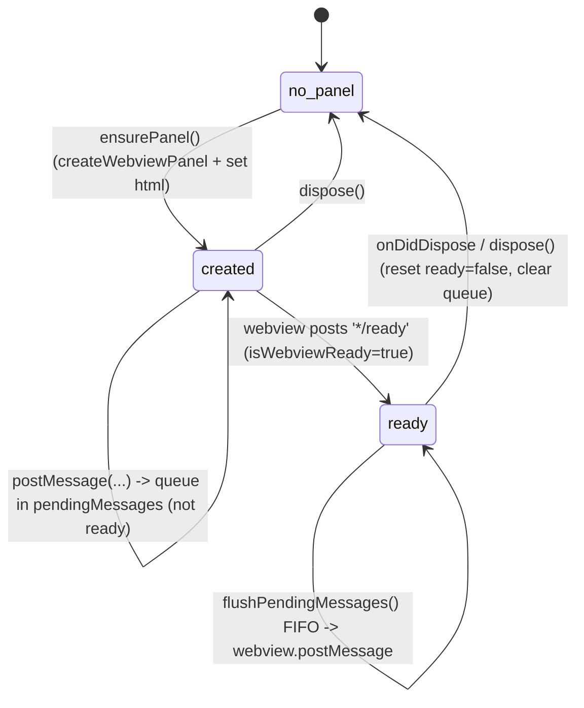
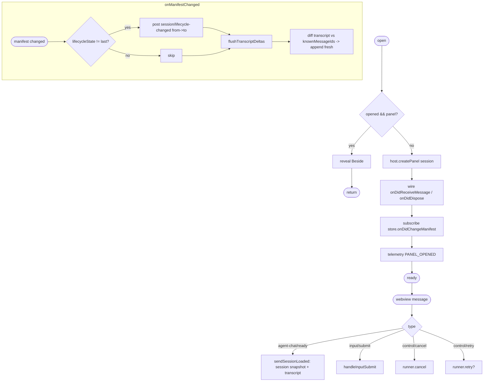
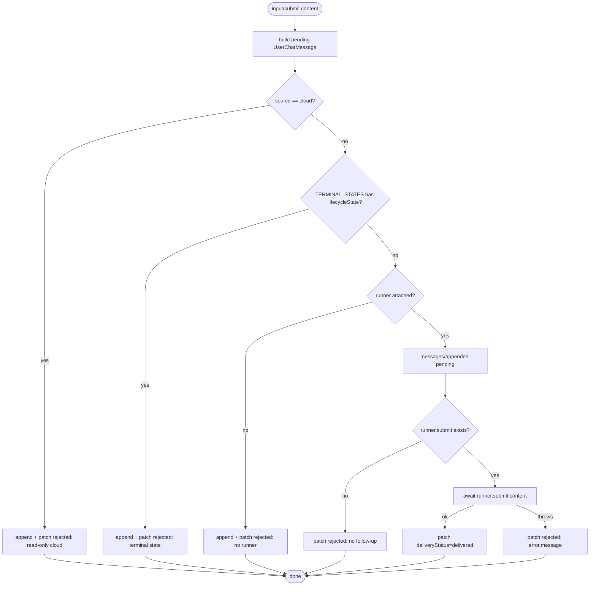
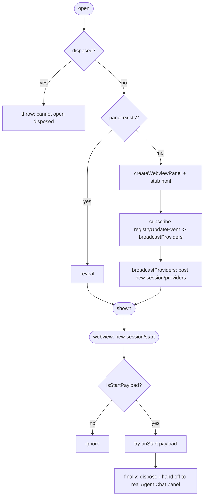

# Flowcharts — `panels` module

> Source: `src/panels/`. Confidence: 🟢 CONFIRMED unless noted.
> Generated by the Reversa Archaeologist (escavação phase).

## 1. Webview-readiness message gate (welcome / document-preview) 🟢



## 2. AgentChatPanel — open → message plumbing → dispose 🟢



## 3. handleInputSubmit — optimistic send + delivery lifecycle 🟢



## 4. NewSessionPanel — start → handoff (self-dispose) 🟢



## 5. CloudAgentProgressPanel — session projection 🟢

```mermaid
flowchart TD
    A([show / refresh-status]) --> B[registry.getActive]
    B --> C[sessionStorage.getAll]
    C --> D[map AgentSession -> view DTO]
    D --> D1[displayStatus = active?.getStatusDisplay s : s.status]
    D1 --> D2[tasks -> {taskId,specTaskId,title,priority,status}]
    D2 --> D3[pullRequests -> {url, state||'open', branch}]
    D3 --> E[postMessage session-update {sessions, activeProvider}]
```
