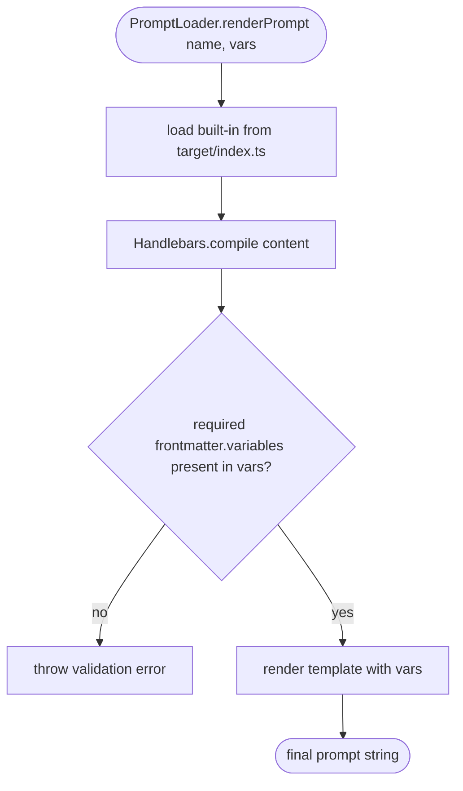

# Flowcharts — `prompts` module

> Source: `src/prompts/` (+ generated `target/`). Confidence: 🟢 CONFIRMED unless noted.
> Generated by the Reversa Archaeologist (escavação phase).

## 1. Prompt build pipeline (build-prompts) 🟢

```mermaid
flowchart TD
    A([npm run build-prompts]) --> B[scan src/prompts/*.prompt.md and *.md]
    B --> C[gray-matter: split YAML frontmatter + Handlebars body]
    C --> D[emit target/&lt;name&gt;.ts]
    D --> D1[export const frontmatter = {...}]
    D --> D2[export const content = JSON-escaped body]
    D --> D3[export default { frontmatter, content }]
    D1 --> E
    D2 --> E
    D3 --> E[write DO NOT EDIT MANUALLY banner]
    E --> F[regenerate target/index.ts barrel]
    F --> G([compiled prompt registry])
```

## 2. Runtime consumption (by PromptLoader, in `services`) 🟢



## 3. SpecKit prompt chain (data flow) 🟢


