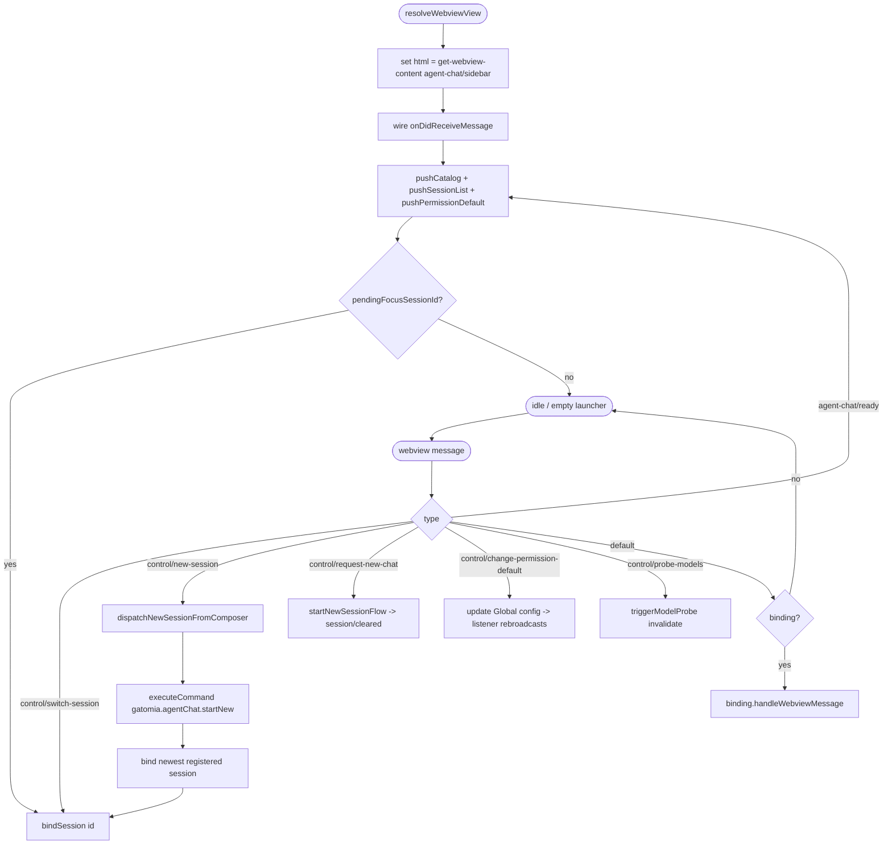
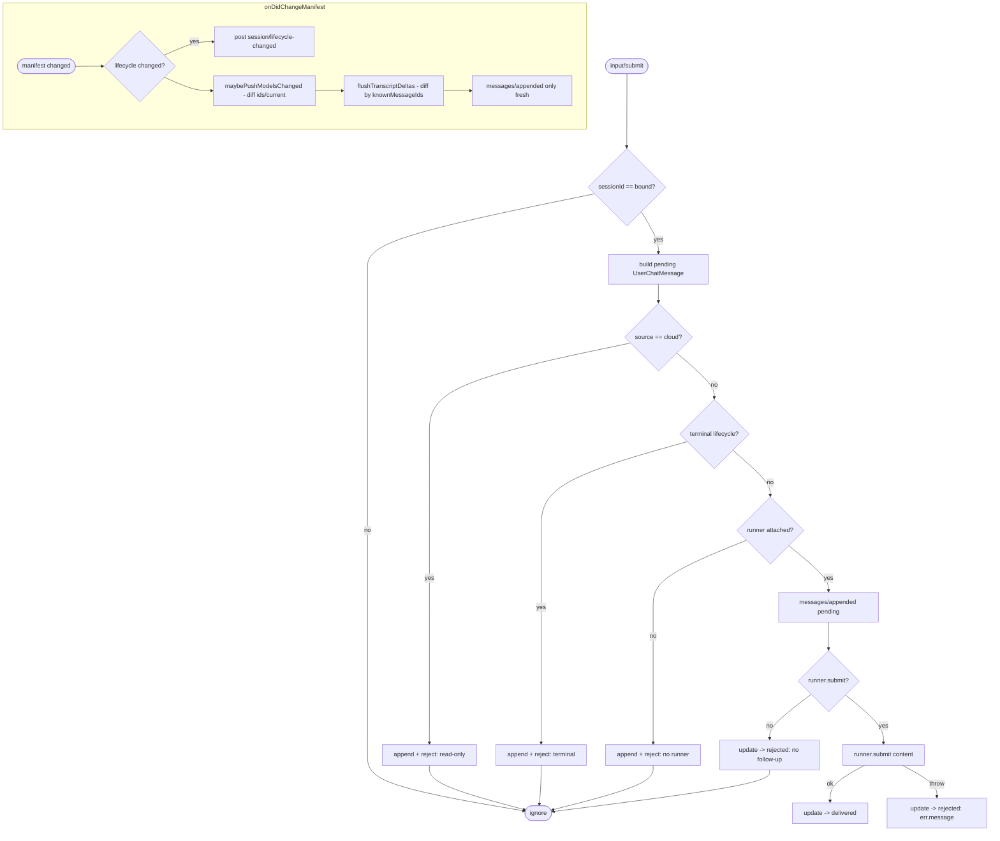
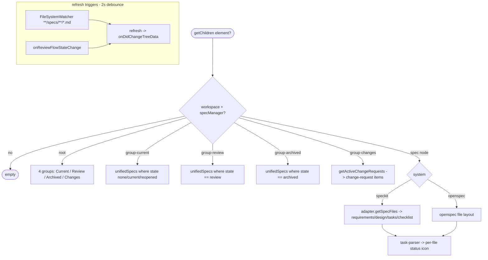
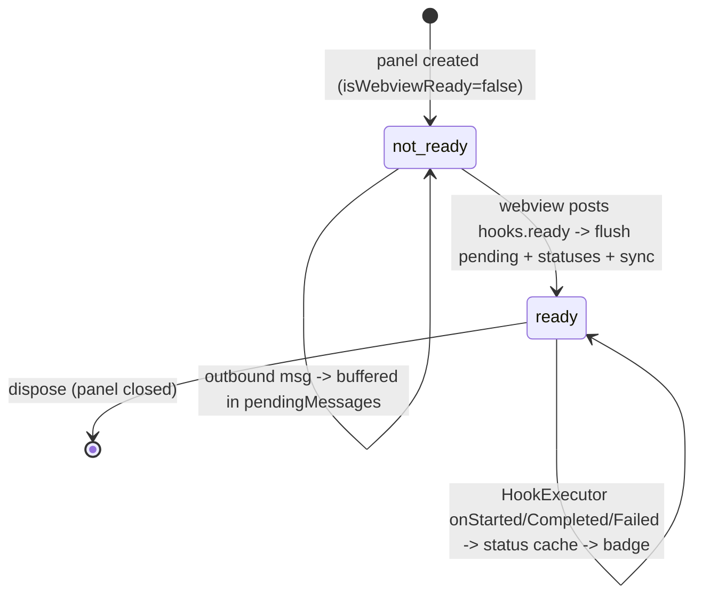
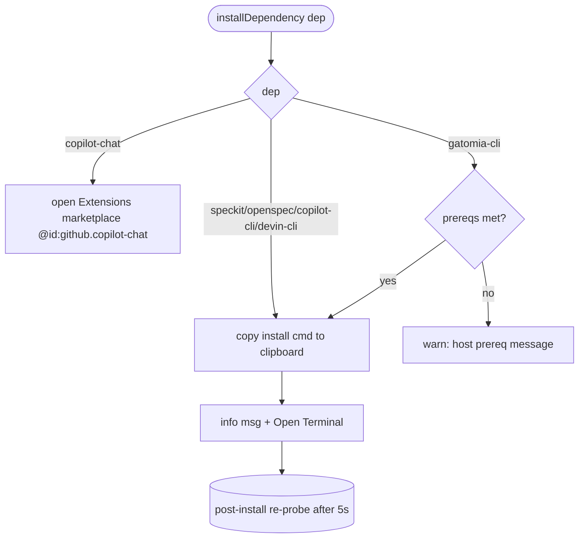

# Flowcharts — `providers` module

> Source: `src/providers/`. Confidence: 🟢 CONFIRMED unless noted.
> Generated by the Reversa Archaeologist (escavação phase).

## 1. Agent Chat sidebar — resolve, route, bind 🟢

## 2. SidebarSessionBinding — submit + delta sync 🟢

## 3. Spec explorer tree expansion 🟢

## 4. Hooks panel — readiness gate + CRUD 🟢

## 5. Welcome screen — install dependency 🟢

> 🟡 **INFERRED:** the post-install re-probe (`POST_INSTALL_REPROBE_DELAY_MS = 5000`) is driven by the install-terminal flow, not every clipboard copy. 🔴 **GAP:** exact re-probe wiring confirmed only partially from this folder; verify in the welcome-screen-panel during `panels` analysis.
