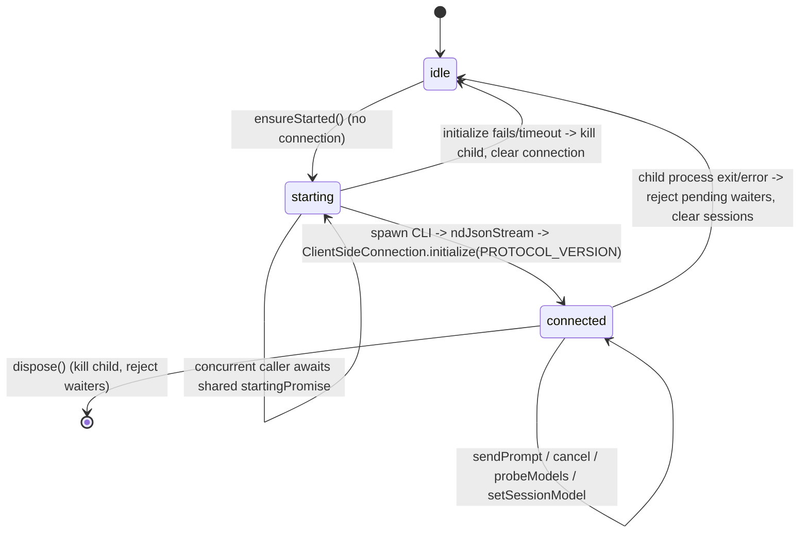
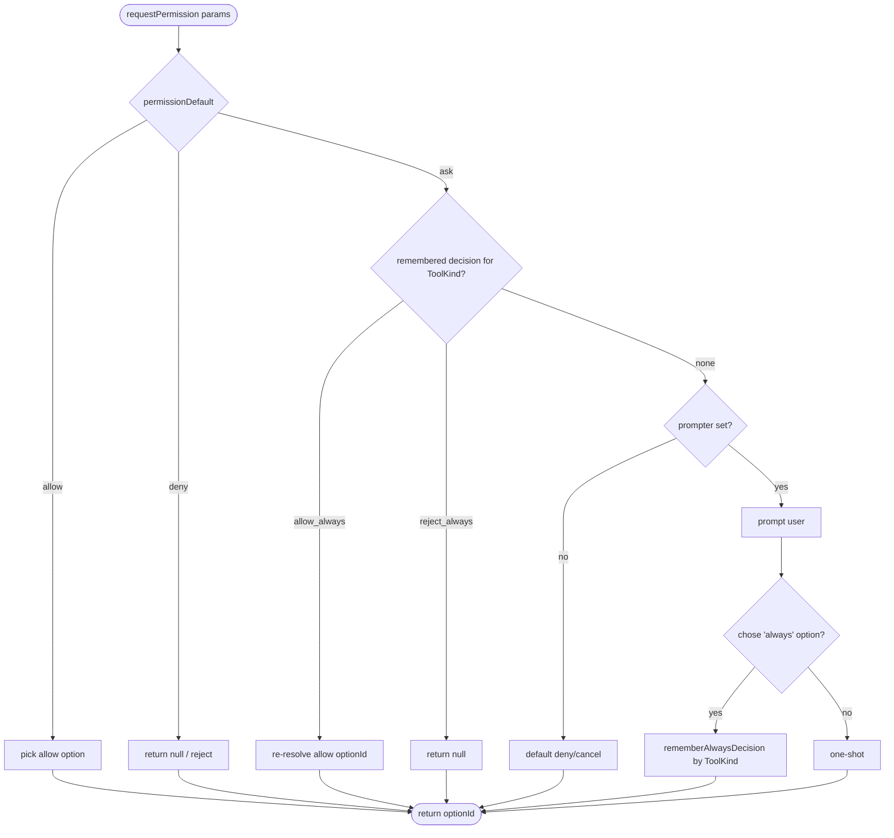
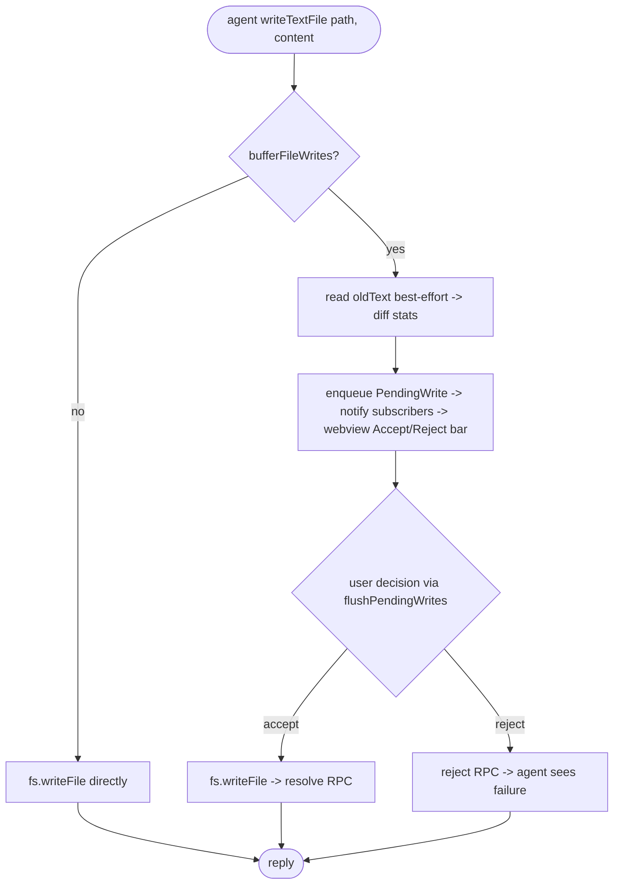
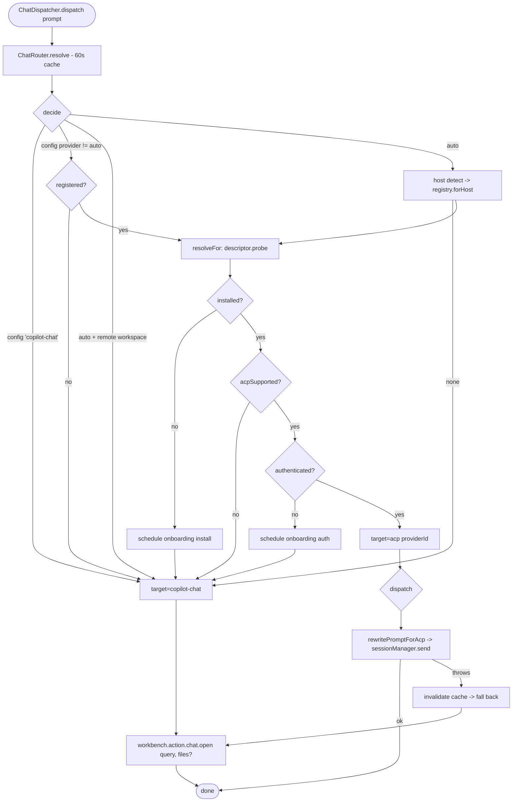
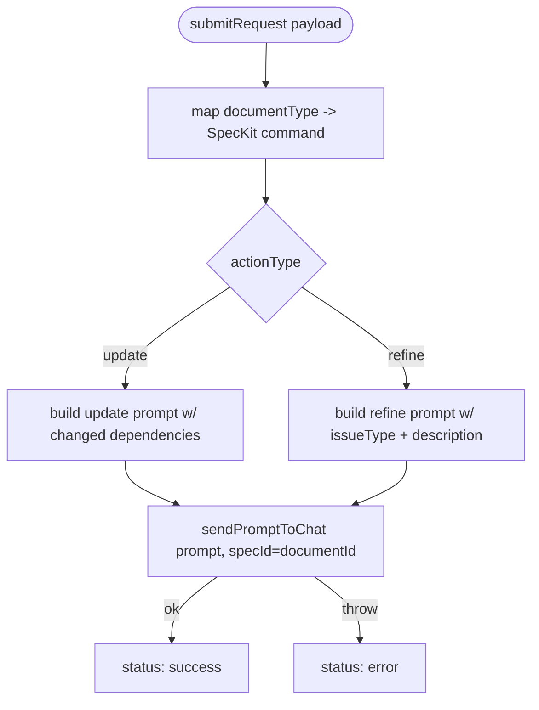

# Flowcharts — `services` module

> Source: `src/services/` (incl. `acp/`, `welcome/`). Confidence: 🟢 CONFIRMED unless noted.
> Generated by the Reversa Archaeologist (escavação phase).

## 1. ACP client lifecycle 🟢



## 2. sendPrompt + session-update dispatch 🟢

```mermaid
flowchart TD
    A([sendPrompt sessionKey, prompt]) --> B[ensureStarted]
    B --> C{session exists?}
    C -- no --> D[createSession: newSession cwd, mcpServers=[]]
    D --> E[capture model state -> emit session-models-changed]
    C -- yes --> F[reuse sessionId]
    E --> G[connection.prompt: text]
    F --> G
    G --> H[await turn -> stopReason]
    H --> I{key starts with 'once:'?}
    I -- yes --> J[delete single-shot session]
    I -- no --> K([done])

    subgraph updates [Client.sessionUpdate -> dispatchSessionUpdate]
      U([update]) --> U1{sessionUpdate kind}
      U1 -- agent/thought/user chunk --> U2[emit chunk event]
      U1 -- plan / available_commands --> U3[emit plan/commands]
      U1 -- mode/session_info/usage --> U4[emit meta]
      U1 -- tool_call / tool_call_update --> U5[extract affected files + diff stats + guess lang -> emit tool-call]
    end
```

## 3. requestPermission resolution 🟢



## 4. writeTextFile (buffered approval) 🟢



## 5. Chat routing + dispatch 🟢



## 6. Document refinement gateway 🟢


