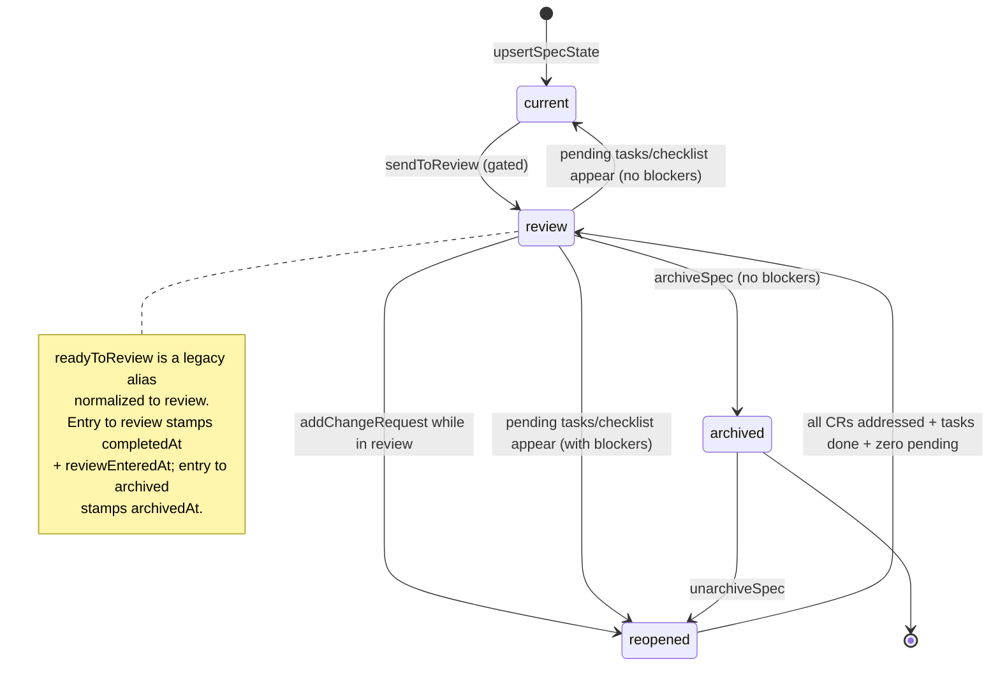
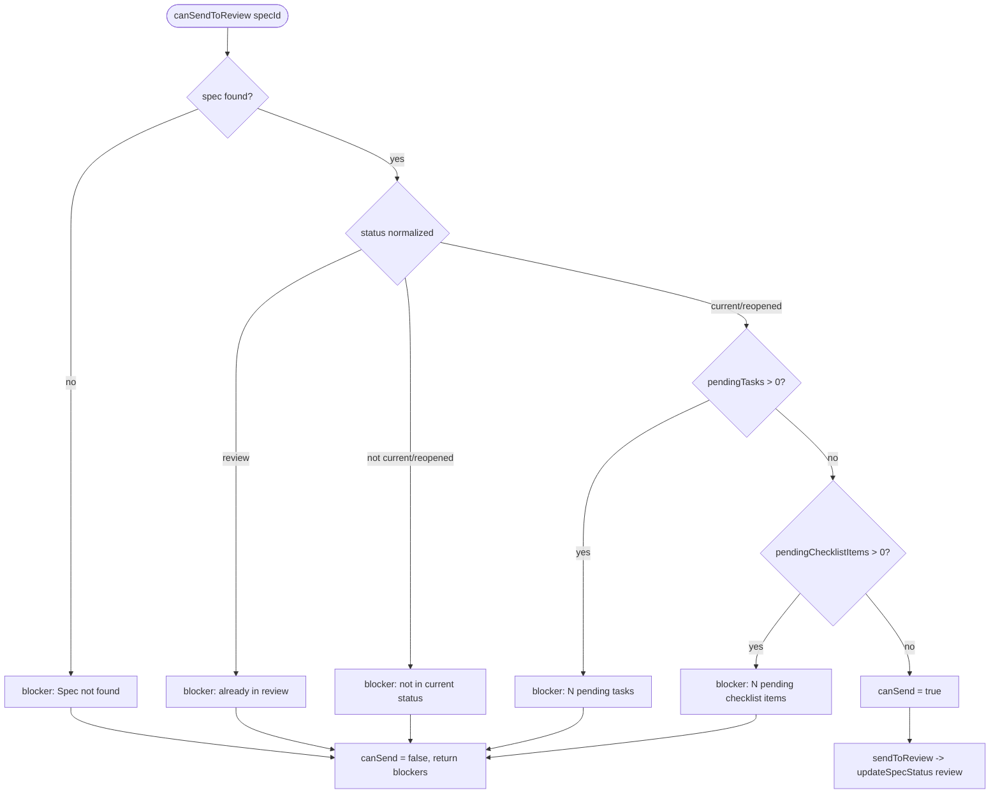
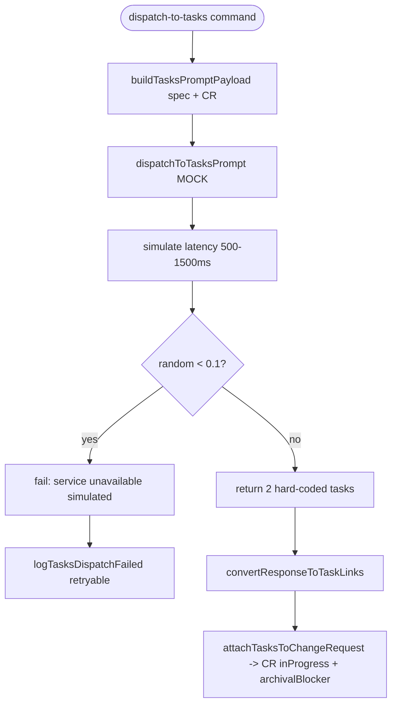

# Flowcharts — `spec` module

> Source: `src/features/spec/` (review flow: spec `001-auto-review-transition`). Confidence: 🟢 CONFIRMED unless noted.
> Generated by the Reversa Archaeologist (escavação phase).

## 1. Spec status FSM 🟢



## 2. Send-to-review gating 🟢



## 3. Change-request lifecycle + auto-return 🟢

```mermaid
stateDiagram-v2
    [*] --> open: createChangeRequest (archivalBlocker=true; spec -> reopened)
    open --> inProgress: attachTasksToChangeRequest (sentToTasksAt set)
    open --> blocked
    inProgress --> addressed: all tasks done (archivalBlocker=false)
    addressed --> inProgress: a done task reverted (archivalBlocker=true)
    addressed --> [*]
    note right of addressed
      When all CRs addressed AND all tasks done
      AND zero pending tasks/checklist ->
      shouldReturnToReview -> returnSpecToReview.
    end note
```

## 4. Dispatch change request to tasks (mock) 🟡



> 🔴 GAP: `dispatchToTasksPrompt` is a mock (no real tasks generator wired) — `tasks-dispatch.ts:76-134`.

## 5. Create-spec flow 🟢

```mermaid
flowchart TD
    A([CreateSpecInputController.open]) --> B[render create-spec webview + init draft]
    B --> C{webview message}
    C -- autosave --> C1[persist draft]
    C -- import-markdown:request --> C2[read .md -> result]
    C -- attach-images:request --> C3[pick images -> dataUrls capped]
    C -- submit --> D[SpecSubmissionStrategyFactory by mode]
    D -- OpenSpec --> E1[read openspec-proposal.prompt.md + sendPromptToChat -> STOP for approval]
    D -- SpecKit --> E2[SpecKit submission strategy]
    E1 & E2 --> F[submit:success | submit:error to webview]
```
