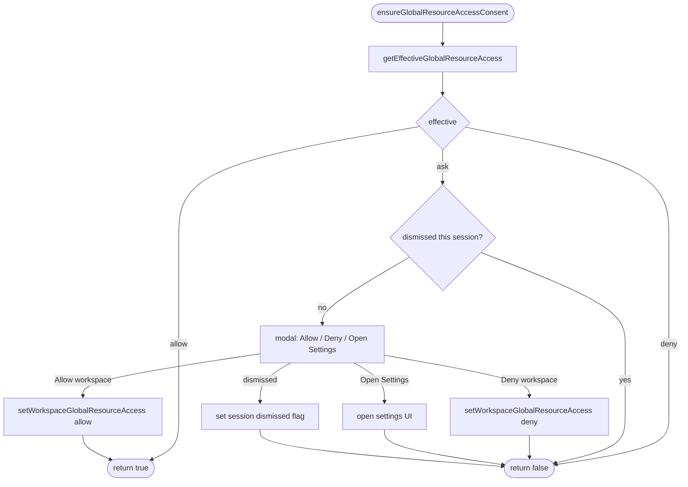
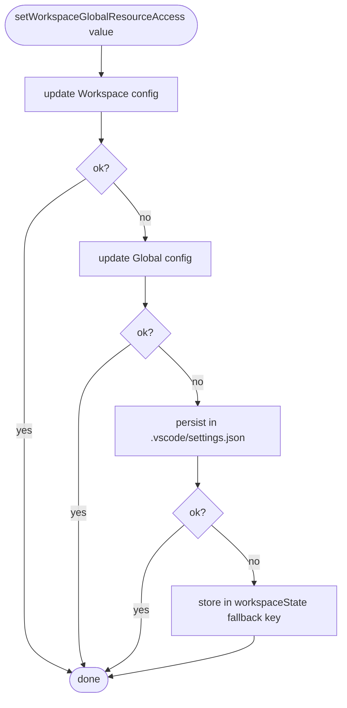
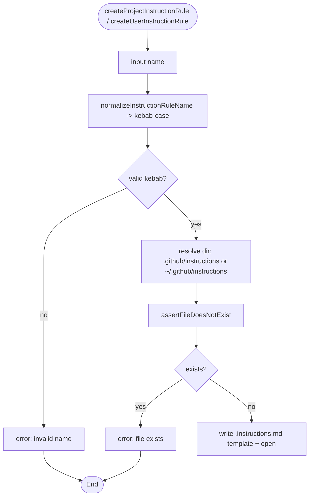

# Flowcharts — `steering` module

> Source: `src/features/steering/`. Confidence: 🟢 CONFIRMED unless noted.
> Generated by the Reversa Archaeologist (escavação phase).

## 1. Create project documentation 🟢

```mermaid
flowchart TD
    A([createProjectDocumentation]) --> B{workspace open?}
    B -- no --> B0[error: no workspace] --> Z([End])
    B -- yes --> C[detect active SDD system]
    C --> D{openspec/ or .specify|specs/ present?}
    D -- no --> E[QuickPick: SpecKit or OpenSpec]
    E --> E1{choice?}
    E1 -- none --> Z
    E1 -- yes --> E2[save specSystem setting + re-init adapter]
    D -- yes --> F
    E2 --> F{active system}
    F -- SpecKit --> G[createSpecKitConstitution]
    F -- OpenSpec --> H[createOpenSpecAgents]
    G --> G1{constitution.md exists?}
    G1 -- yes --> G2[confirm overwrite] --> G3
    G1 -- no --> G3[input directives]
    G3 --> G4[sendPromptToChat /speckit.constitution directives]
    H --> H1{openspec/AGENTS.md exists?}
    H1 -- yes --> H2[confirm overwrite]
    H1 -- no --> H3[write default AGENTS.md + open]
    H2 -- overwrite --> H3
```

## 2. Global-resource-access consent gate 🟢



## 3. Effective access resolution 🟢

```mermaid
flowchart LR
    A[getWorkspaceAccessOverride] --> B{override}
    B -- allow/deny --> R[effective = override]
    B -- inherit --> C[getGlobalAccessDefault] --> R2[effective = ask|allow|deny]
    note1[workspace override: setting -> workspaceState fallback -> inherit]
```

## 4. Consent persistence fallback chain 🟢



## 5. Create instruction rule 🟢


