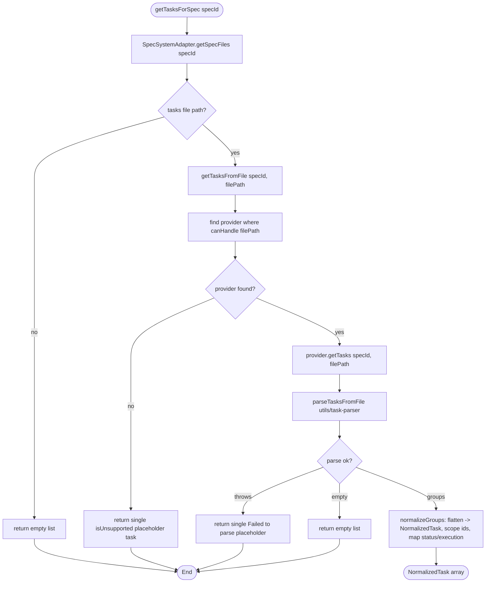
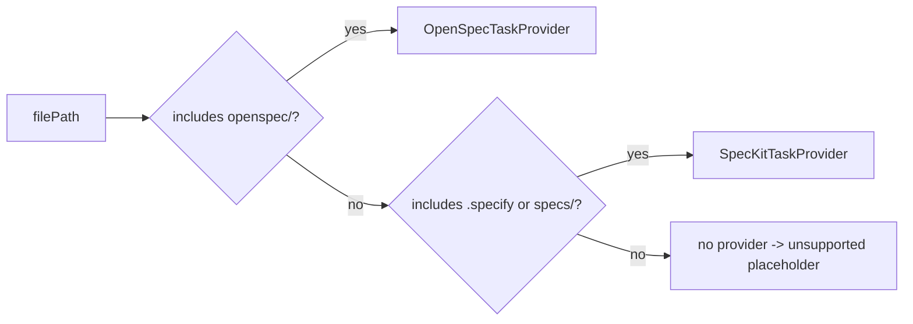
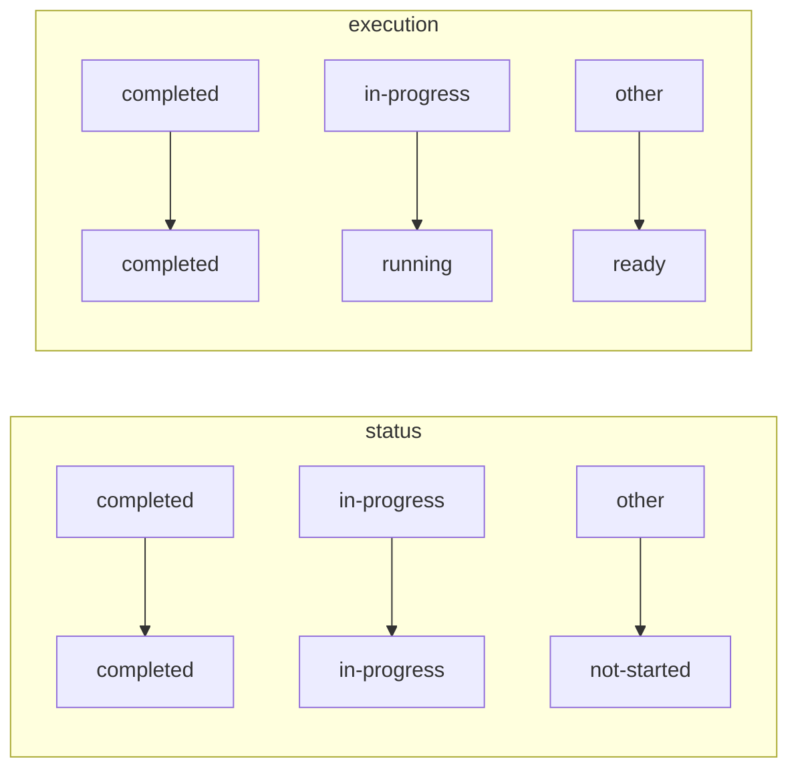
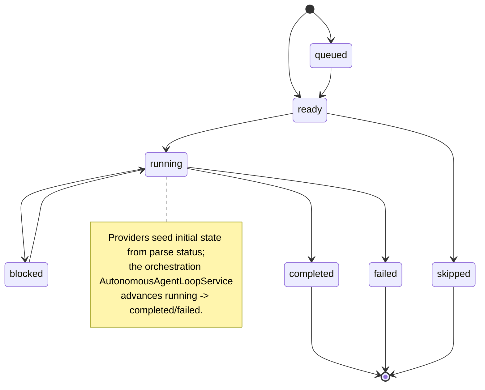

# Flowcharts — `tasks` module

> Source: `src/features/tasks/`. Confidence: 🟢 CONFIRMED unless noted.
> Generated by the Reversa Archaeologist (escavação phase).

## 1. Task resolution + provider dispatch 🟢

## 2. canHandle provider selection 🟢

## 3. Status + execution-state mapping 🟢

## 4. Execution state lifecycle (consumed by orchestration) 🟢

