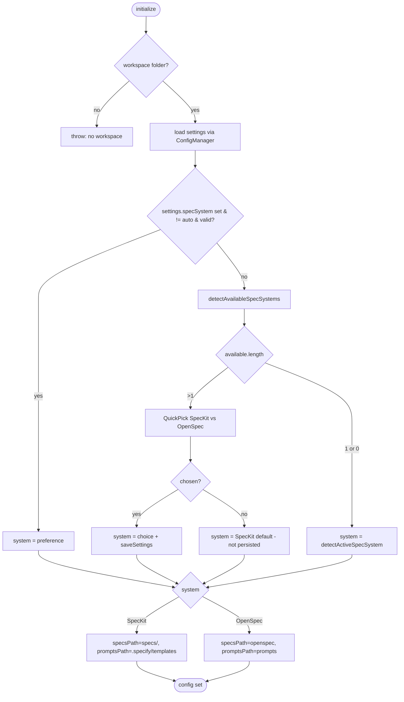
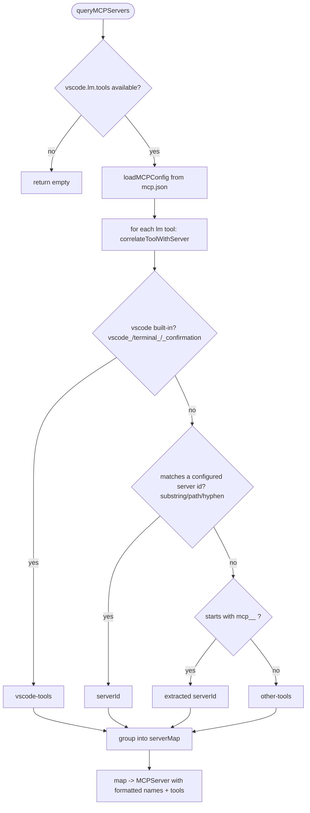
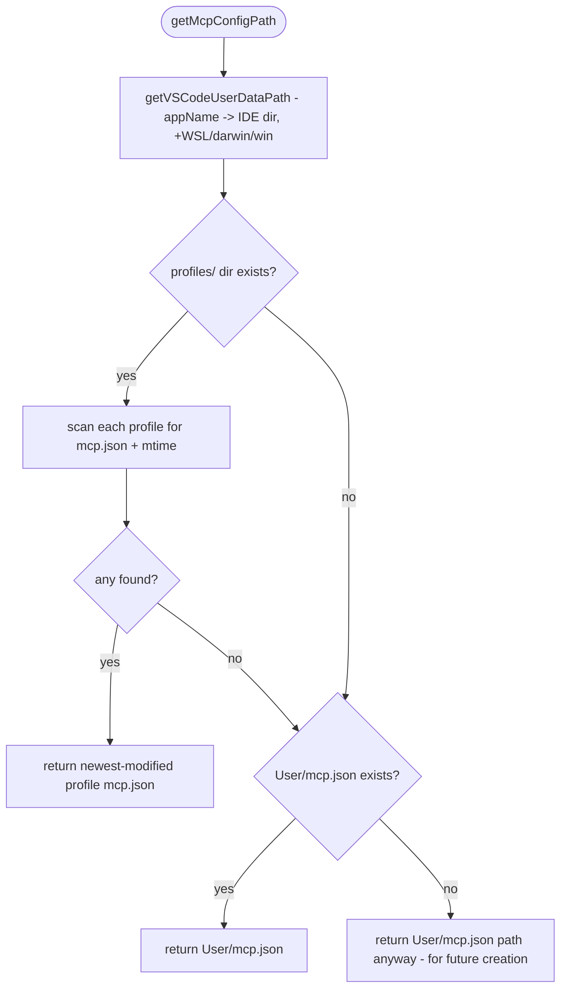
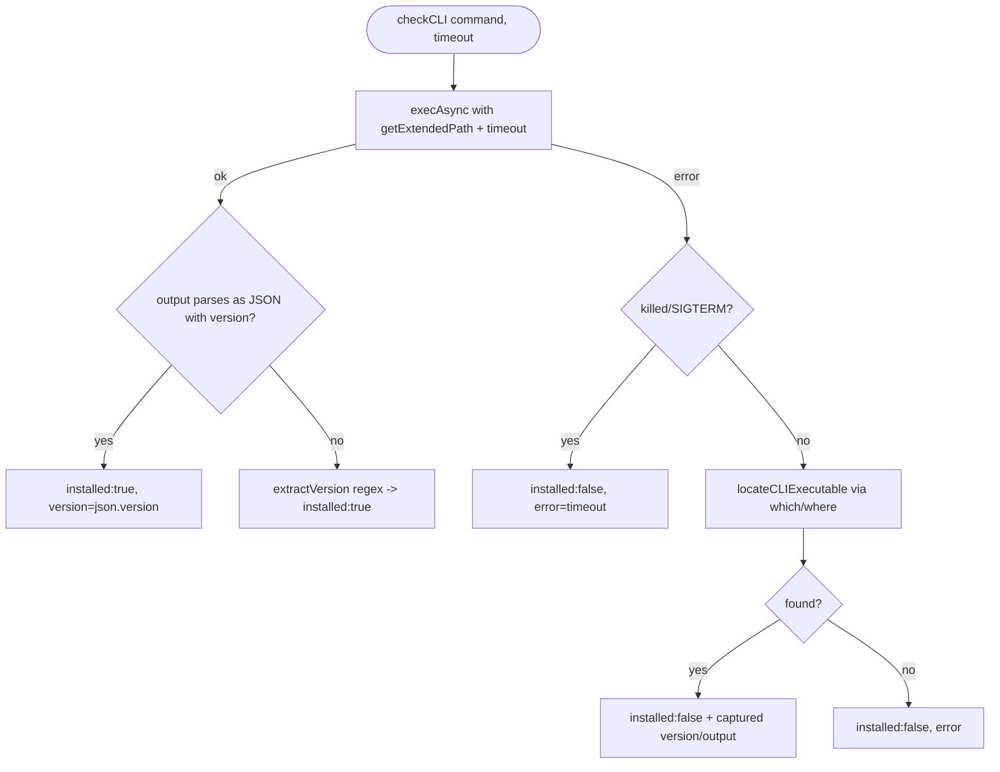

# Flowcharts — `utils` module

> Source: `src/utils/`. Confidence: 🟢 CONFIRMED unless noted.
> Generated by the Reversa Archaeologist (escavação phase).

## 1. SpecSystemAdapter.initialize — active-system resolution 🟢



## 2. parseTasksContent — dual-format task parse 🟢

```mermaid
flowchart TD
    A([for each line]) --> B{phase header? - not in denylist}
    B -- yes --> B1[finalizeTask + start new group]
    B -- no --> C{inline `- [x] T### ...`?}
    C -- yes --> C1[finalizeTask + push inline task - checked=completed]
    C -- no --> D{header `### T1.1: Title`?}
    D -- yes --> D1[finalizeTask + start currentTask]
    D -- no --> E{inside currentTask?}
    E -- yes --> F[collect content; track Acceptance Criteria checkboxes]
    E -- no --> A

    subgraph fin [finalizeTask]
      G([finalize]) --> G1{acceptance items?}
      G1 -- all checked --> S1[completed]
      G1 -- some --> S2[in-progress]
      G1 -- none --> S3[not-started]
      G --> G2{explicit **STATUS** marker?}
      G2 -- COMPLETE --> S1
      G2 -- IN-PROGRESS --> S2
      G --> G3[extract priority/complexity regex] --> push[push to group]
    end
```

## 3. MCP discovery + tool→server correlation 🟢



## 4. getMcpConfigPath — profile-aware resolution 🟢



## 5. checkCLI — version probe with extended PATH 🟢



## 6. sendPromptToChat — decorate + dispatch 🟢

```mermaid
flowchart TD
    A([sendPromptToChat prompt, ctx, files]) --> B[buildFinalPrompt]
    B --> B1[+ global custom instruction]
    B1 --> B2[+ instructionType-specific instruction]
    B2 --> B3{chatLanguage != English?}
    B3 -- yes --> B4[+ "Please respond in <lang>"]
    B3 -- no --> C
    B4 --> C{injected ChatDispatcher?}
    C -- yes --> D[dispatcher.dispatch finalPrompt, {specId}, files]
    C -- no --> E{files & VS Code >= 1.95.0?}
    E -- yes --> F[workbench.action.chat.open {query, files}]
    E -- no --> G[workbench.action.chat.open {query}]
```
