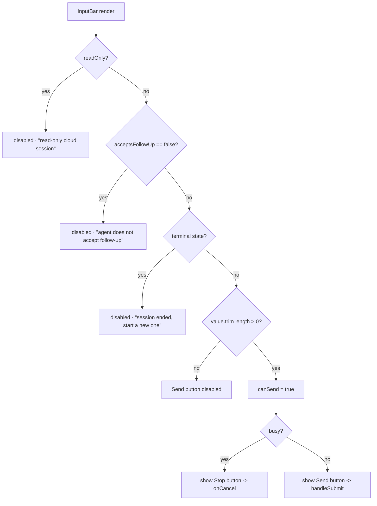
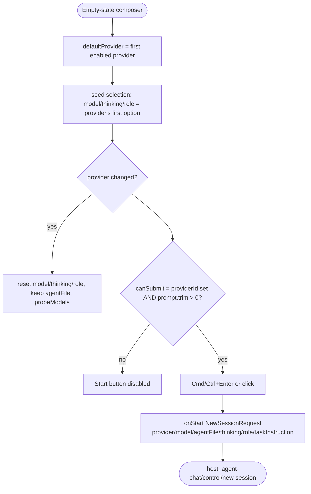

# Flowcharts — `webview-agent-chat` module

> Source: `ui/src/features/agent-chat/`. Confidence: 🟢 CONFIRMED unless noted.
> Generated by the Reversa Archaeologist (escavação phase).
> Webview counterpart of the extension-side `agent-chat` module — communicates only via the VS Code `postMessage` bridge (`@/bridge/vscode`). No `src/` imports (contract mirror in `types.ts`).

## 1. Bridge lifecycle: mount → ready → render

```mermaid
flowchart TD
    A([AgentChatFeature mounts]) --> B[readSurfaceFromDom<br/>data-surface = sidebar | panel]
    B --> C[readSessionIdFromDom<br/>data-session-id]
    C --> D[useSessionBridge<br/>panel: initialSessionId / sidebar: undefined]
    D --> E[useReducer INITIAL_STATE]
    E --> F[effect: postMessage agent-chat/ready]
    F --> G[window.addEventListener message]
    G --> H{{incoming postMessage}}
    H --> I[translateIncoming<br/>type -> INCOMING_HANDLERS]
    I --> J{handler found AND<br/>session-id scope matches?}
    J -- no --> H
    J -- yes --> K[dispatch BridgeAction]
    K --> L[reducer -> next state]
    L --> M{state.ready?}
    M -- no --> M0[render &quot;Loading session…&quot;]
    M -- yes --> N{session bound?}
    N -- no, sidebar --> N1[SessionsList + NewSessionComposer]
    N -- no, panel --> N2[&quot;Session not available&quot; fallback]
    N -- yes --> O[StatusHeader + ChatTranscript<br/>+ RetryAction? + PendingChangesBar + InputBar]
```

## 2. Incoming message → reducer action routing 🟢

> `use-session-bridge.ts:322-440` (`INCOMING_HANDLERS`), `:194-286` (`reducer`).

```mermaid
flowchart LR
    subgraph Incoming [host -> webview]
      direction TB
      L1[agent-chat/session/loaded] --> R1[session/loaded<br/>ready=true, replace transcript]
      L2[agent-chat/messages/appended] --> R2[messages/appended<br/>Set-dedup by id]
      L3[agent-chat/messages/updated] --> R3[messages/updated<br/>per-variant applyPatch]
      L4[.../session/lifecycle-changed] --> R4[session/lifecycle-changed]
      L5[.../session/cleared] --> R5[session/cleared<br/>reset + clearedReason]
      L6[.../catalog/loaded] --> R6[catalog/loaded + modelsLoading]
      L7[.../session/models-changed] --> R7[session/models-changed]
      L8[.../sessions/list-changed] --> R8[sessions/list-changed]
      L9[.../pending-writes/changed] --> R9[pending-writes/changed]
      L10[.../permission-default/changed] --> R10[permission-default/changed<br/>only ask|allow|deny]
    end
    R1 --> S[(AgentChatBridgeState)]
    R2 --> S
    R3 --> S
    R4 --> S
    R5 --> S
    R6 --> S
    R7 --> S
    R8 --> S
    R9 --> S
    R10 --> S
```

> **Session-id scoping:** `messages/*`, `lifecycle-changed`, `models-changed`, `pending-writes/changed` are dropped when `payload.sessionId !== activeSessionId`; `session/loaded` is dropped on the panel surface when `payload.session.id !== initialSessionId` (`:337`).

## 3. Outgoing actions (webview -> host) 🟢

> `use-session-bridge.ts:508-674`. Every action short-circuits when there is no `activeSessionId` (except sidebar-only `switchSession` / `startNewSession` / `requestNewChat` / pending-write settlements / `changePermissionDefault` / `probeModels`).

```mermaid
flowchart TD
    U([User interaction]) --> A1[submit -> agent-chat/input/submit]
    U --> A2[cancel -> control/cancel]
    U --> A3[retry -> control/retry]
    U --> A4[changeMode/Model/ThinkingLevel/AgentRole/Target -> control/change-*]
    U --> A5[switchSession -> control/switch-session]
    U --> A6[startNewSession -> control/new-session]
    U --> A7[requestNewChat -> control/request-new-chat]
    U --> A8[accept/rejectPendingWrite(All) -> pending-writes/*]
    U --> A9[changePermissionDefault -> control/change-permission-default]
    U --> A10[probeModels -> control/probe-models]
    A1 --> H([vscode.postMessage])
    A2 --> H
    A3 --> H
    A4 --> H
    A5 --> H
    A6 --> H
    A7 --> H
    A8 --> H
    A9 --> H
    A10 --> H
```

## 4. InputBar enablement decision 🟢

> `input-bar.tsx:121-138`, `resolveDisabledReason` `:259`.



## 5. NewSessionComposer submit gating 🟢

> `new-session-composer.tsx:92-253`.


