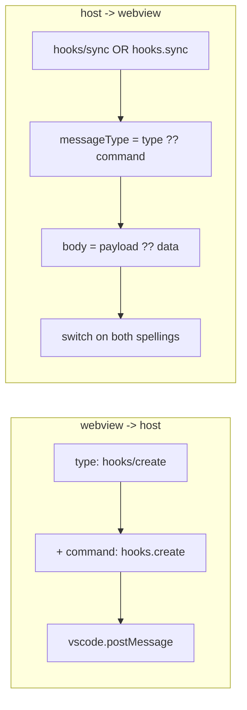
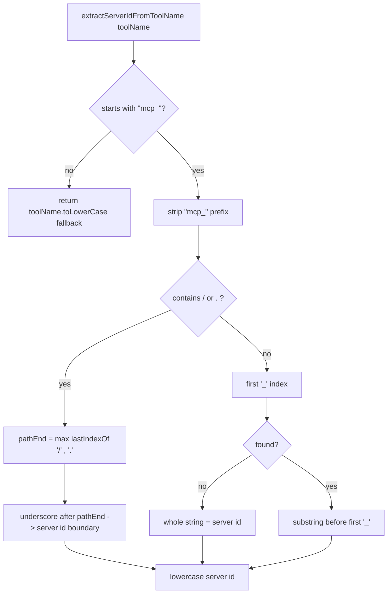
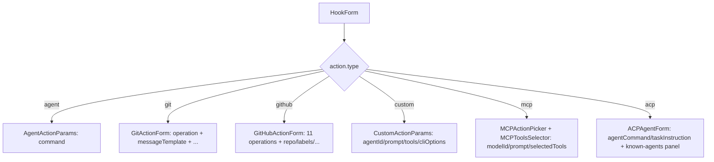

# Flowcharts — `webview-hooks-view` module

> Source: `ui/src/features/hooks-view/`, `ui/src/components/hooks/`, `ui/src/components/cli-options/`, `ui/src/lib/mcp-utils.ts`. Confidence: 🟢 CONFIRMED unless noted.
> Generated by the Reversa Archaeologist (escavação phase).
> Largest webview module (~8,680 LOC). Client of the extension-side `hooks` module. Uses a **dual-keyed** protocol (`type` "hooks/x" + `command` "hooks.x") for backward compatibility.

## 1. Hooks CRUD lifecycle 🟢

> `features/hooks-view/index.tsx`.

```mermaid
flowchart TD
    A([HooksView mounts]) --> B[sendMessage hooks/ready + hooks/list]
    B --> C{{host: hooks/sync}}
    C --> D[setHooks · isLoading=false · prune execution statuses]
    D --> E{showForm?}
    E -- no --> F[HooksList: toggle / edit / delete]
    E -- yes --> G[HookForm: create | edit]
    F -- toggle --> H[sendMessage hooks/toggle]
    F -- delete --> I[sendMessage hooks/delete]
    F -- edit --> J[setEditingHook + showForm]
    G -- submit, editingHook --> K[sendMessage hooks/update id+updates]
    G -- submit, new --> L[sendMessage hooks/create<br/>omit id/createdAt/modifiedAt/executionCount]
    G -- cancel --> M[close form]
    H --> C
    I --> C
    K --> C
    L --> C
    C -.->|form NOT reset on sync| E
    N{{host: hooks/execution-status}} --> O[merge into executionStatuses by hookId]
    P{{host: hooks/show-logs}} --> Q[ExecutionLogsList + requestLogs]
    R{{host: hooks/error}} --> S[render error · format validationErrors]
```

## 2. Dual-keyed message protocol 🟡

> `index.tsx:30,54`; `types.ts:389-503`. Every message carries both `type` ("hooks/x") and an optional `command` ("hooks.x"); the webview sends `command = type.replace(/\//g, ".")` and reads `payload.type ?? payload.command`, `payload.payload ?? payload.data`.



## 3. MCP discovery + tool grouping 🟢

> `hooks/use-mcp-servers.ts`.

```mermaid
flowchart TD
    A([useMCPServers mount]) --> B[discover -> hooks/mcp-discover]
    B --> C{{host: hooks/mcp-servers | hooks/mcp-error}}
    C -- servers --> D[setServers · loading=false]
    C -- error --> E[setError · loading=false]
    D --> F[groupToolsByProvider servers, selectedTools]
    F --> G[server groups: alpha by name<br/>tools: alpha by displayName]
    G --> H{selected tool whose server not in list?}
    H -- yes --> I[append synthetic &quot;Other&quot; group isOther=true]
    H -- no --> J[return server groups]
    I --> K[MCPToolsSelector renders groups]
    J --> K
```

## 4. MCP tool-name parsing algorithm 🟢

> `lib/mcp-utils.ts:40-82` — server IDs never contain `_`; may contain `.` (domain) or `/` (path).



## 5. Action-type form routing 🟢

> `HookForm` switches the parameter sub-form on `action.type` (6 variants).


