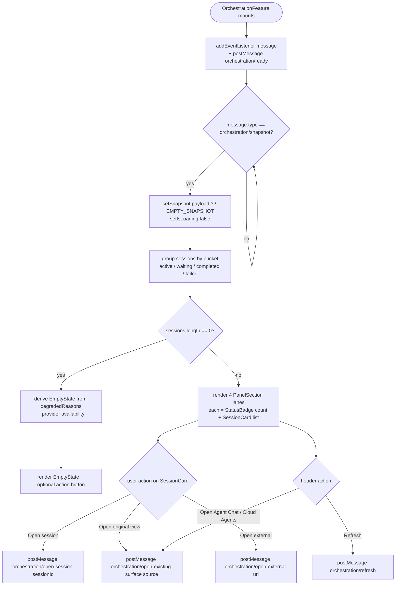
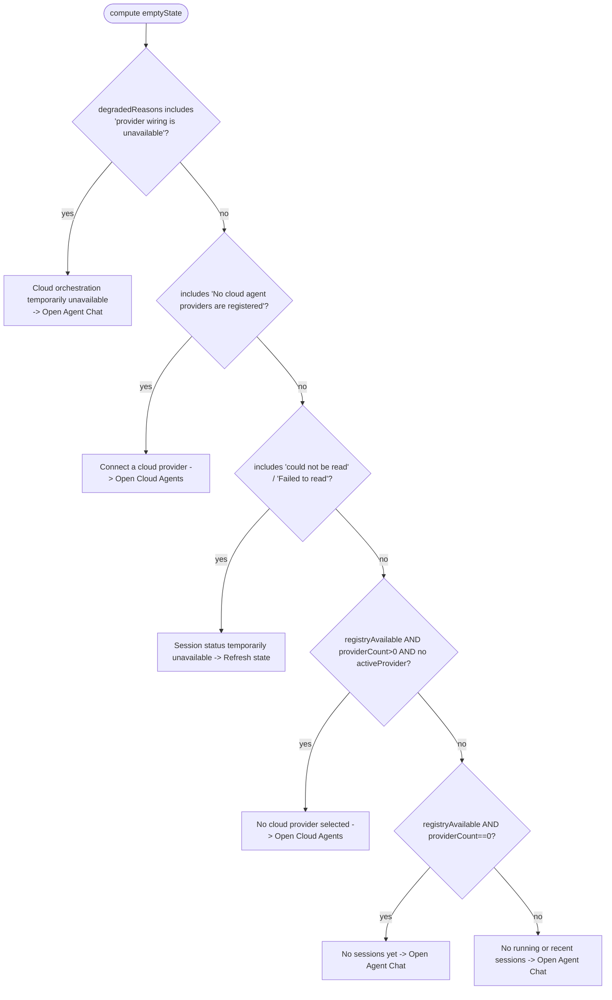
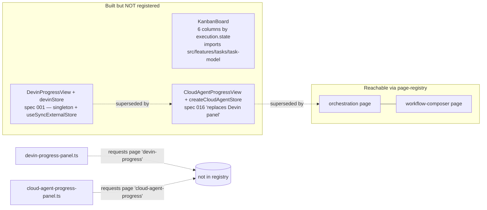
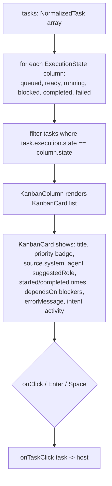

# Flowcharts — `webview-orchestration` module

> Source: `ui/src/features/{orchestration,workflow-composer}/`, `ui/src/components/{workflow,workflow-graph,kanban,devin,cloud-agents}/`, `ui/src/stores/{devin-store,cloud-agent-store}.ts`. Confidence: 🟢 CONFIRMED unless noted.
> Generated by the Reversa Archaeologist (escavação phase).
> Groups the agent-orchestration / monitoring webview surfaces. ⚠️ This module is a **layered prototype graveyard**: only the `orchestration` and `workflow-composer` pages are registered in `page-registry.tsx`. The Kanban board and the legacy Devin / Cloud-Agent progress views are **built but not reachable** through the current page registry (see §4).

## 1. Orchestration view: ready → snapshot → bucketed lanes 🟢

> `features/orchestration/index.tsx`. Registered page `"orchestration"` (host: `providers/orchestration-view-provider.ts`).



## 2. Empty-state decision tree (degraded-mode messaging) 🟢

> `features/orchestration/index.tsx:112-217` — `useMemo` over `degradedReasons` + provider state. First match wins.



## 3. Workflow Composer: hooks → React Flow graph (event → condition → schedule → action) 🟢

> `features/workflow-composer/index.tsx` + `utils/mapper.ts` + `components/workflow-graph/*`. Registered page `"workflow-composer"`. Reuses `hooks-view` types + `HookForm` (cross-module coupling to `webview-hooks-view`).

```mermaid
flowchart TD
    A([WorkflowComposerFeature mounts]) --> B[postMessage hooks/ready + hooks/list<br/>command = type with / -> .]
    B --> C{message hooks/sync | hooks.sync?}
    C -- yes --> D[setHooks payload.hooks]
    D --> E[mapHooksToGraph hooks]
    E --> F[setNodes / setEdges]
    F --> G[ReactFlow renders custom nodeTypes<br/>Source / Condition / Schedule / Action]
    G --> H{onNodeClick}
    H -- has data.hookId --> I[setSelectedHookId -> open side panel HookForm]
    I --> J{HookForm submit}
    J -- selectedHookId set --> K[postMessage hooks/update id, updates]
    J -- new --> L[postMessage hooks/create payload]
    K --> C
    L --> C

    subgraph MAP[mapHooksToGraph — deterministic layout]
      direction TB
      M1[per hook: lane y = hookIndex * 150 * 3] --> M2[processEvents: one source node per event<br/>x=100]
      M2 --> M3[processConditions: x+=300, chain from prev ids]
      M3 --> M4[processSchedule: skip if immediate, else x+=300]
      M4 --> M5[action node at final x; connectEdges from prev ids]
    end
```

## 4. ⚠️ Unmounted prototypes — Kanban board + legacy Devin/Cloud progress views 🔴

> Architectural finding. `KanbanBoard` has **no importer** in `ui/src` or `src`. The Devin/Cloud-Agent progress panels (`src/panels/devin-progress-panel.ts`, `src/panels/cloud-agent-progress-panel.ts`) request webview pages `"devin-progress"` / `"cloud-agent-progress"` that are **absent from `page-registry.tsx`** → the SPA renders "Unknown page".



## 5. Kanban board grouping (logic, even if unmounted) 🟢

> `components/kanban/kanban-board.tsx` — pure grouping of `NormalizedTask[]` (compile-time import from `src/features/tasks/task-model`).


