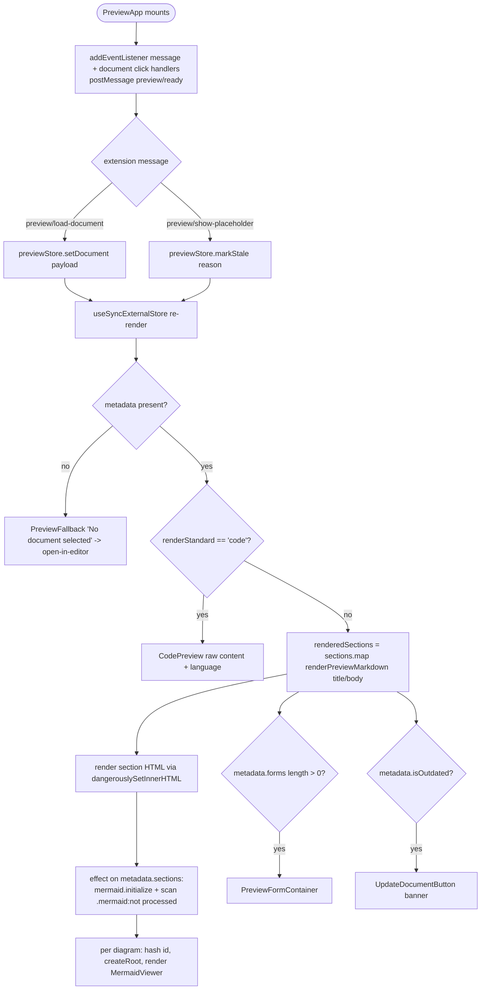
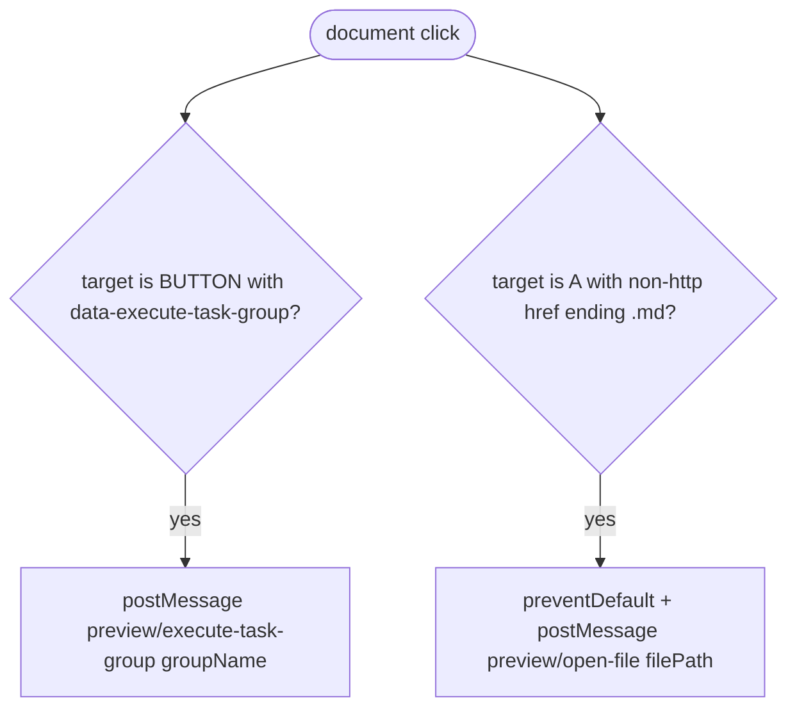
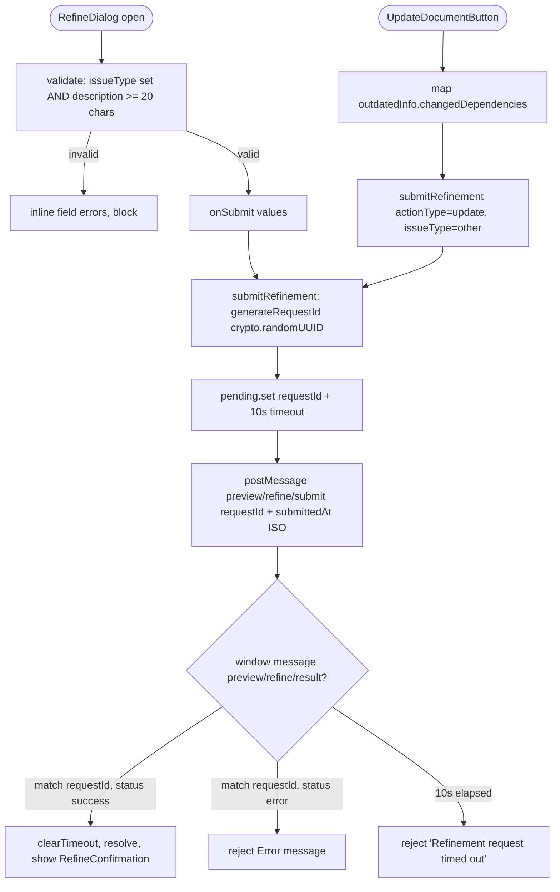
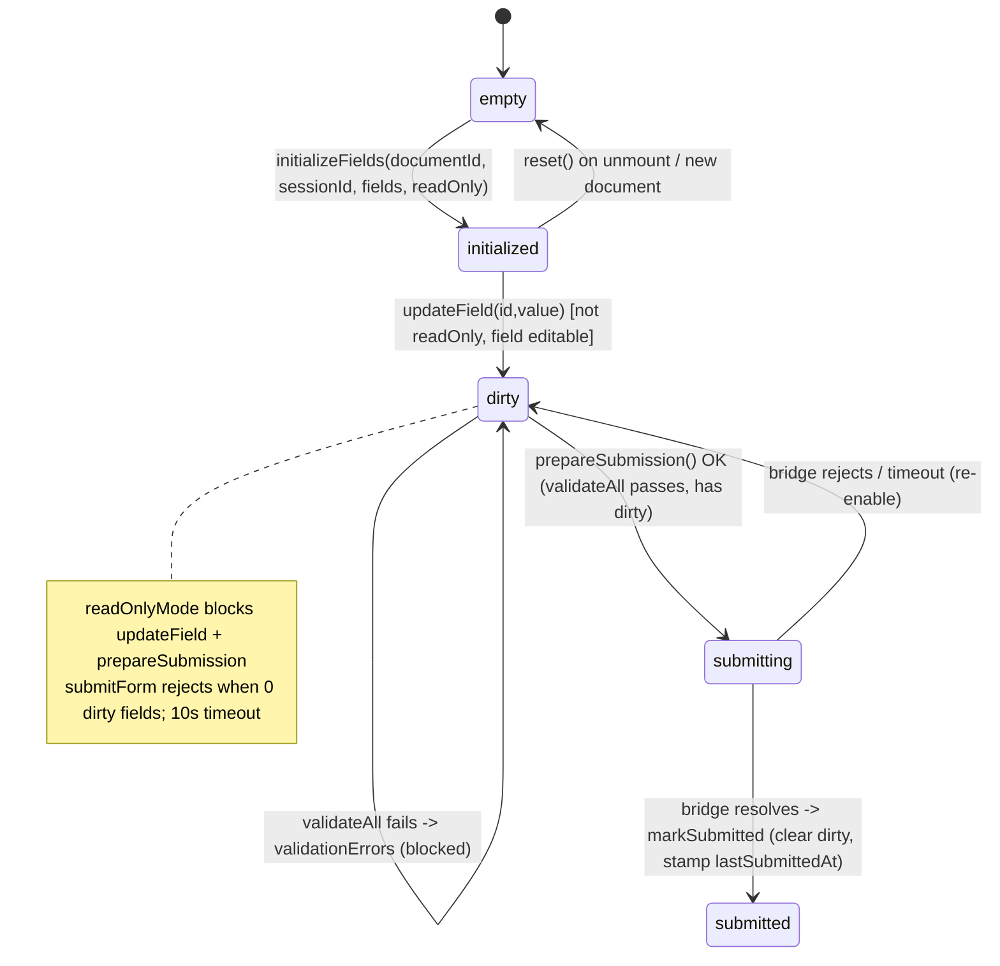
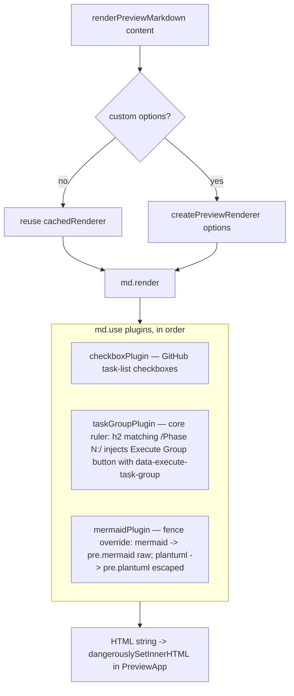

# Flowcharts — `webview-preview` module

> Source: `ui/src/features/preview/`, `ui/src/components/{preview,refine,forms}/`, `ui/src/lib/markdown/`, `ui/src/lib/document-title-utils.ts`. Confidence: 🟢 CONFIRMED unless noted.
> Generated by the Reversa Archaeologist (escavação phase).
> The document-preview surface (registered page `"document-preview"`, host: `src/panels/document-preview-panel.ts`): renders SpecKit/markdown documents, mounts interactive Mermaid diagrams, hosts refinement + dependency-update + interactive-form flows.

## 1. Preview lifecycle: load-document → render sections → interactive mounts 🟢

> `features/preview/preview-app.tsx`. Subscribes to `previewStore` via `useSyncExternalStore`.

## 2. Global document click delegation 🟢

> `preview-app.tsx:57-88` — two delegated `document` click listeners.

## 3. Refinement + dependency-update request/response 🟢

> `RefineDialog` (manual issue report) and `UpdateDocumentButton` (dependency sync) both funnel through `api/refine-bridge.ts:submitRefinement`.

## 4. Interactive form: init → validate → submit (form-store FSM) 🟢

> `components/forms/preview-form-container.tsx` + `features/preview/stores/form-store.ts` + `api/form-bridge.ts`.

## 5. Markdown rendering pipeline (markdown-it + 3 custom plugins) 🟢

> `lib/markdown/preview-renderer.ts` — cached singleton `MarkdownIt` (html, linkify, typographer; highlight.js with auto-detect fallback).

