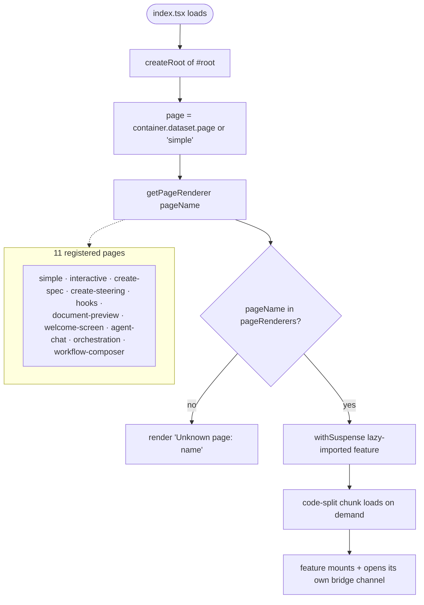
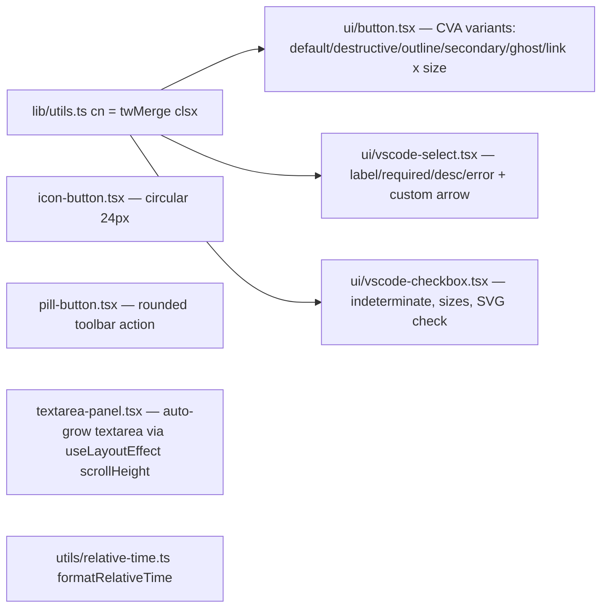
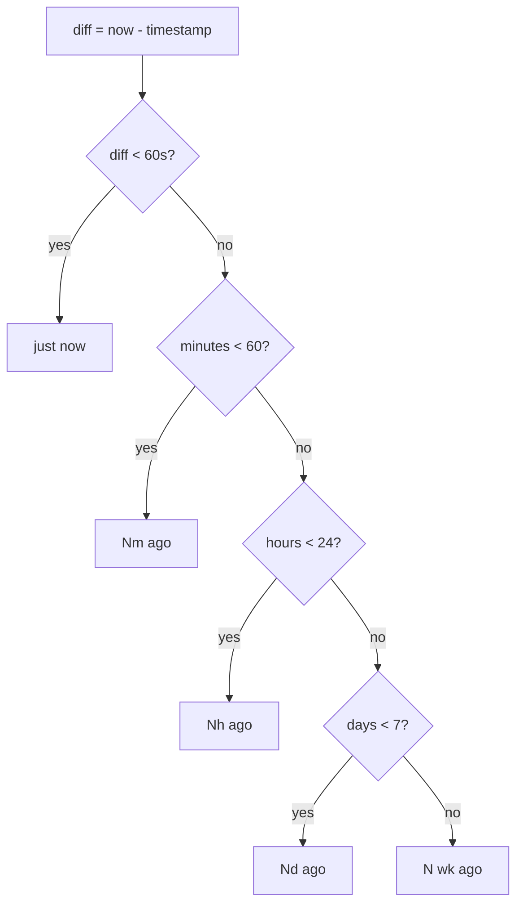
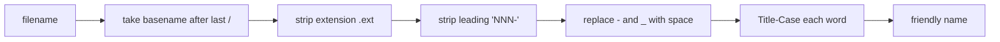

# Flowcharts — `webview-shared` module

> Source: `ui/src/index.tsx`, `ui/src/page-registry.tsx`, `ui/src/bridge/vscode.ts`, `ui/src/components/ui/`, `ui/src/components/{icon-button,pill-button,textarea-panel}.tsx`, `ui/src/lib/utils.ts`, `ui/src/utils/relative-time.ts`, `ui/src/env.d.ts`. Confidence: 🟢 CONFIRMED unless noted.
> Generated by the Reversa Archaeologist (escavação phase).
> The cross-cutting webview infrastructure: single-bundle entry, runtime page router, the VS Code postMessage bridge, themed primitives, and shared utilities consumed by every other webview module.

## 1. Single-bundle bootstrap + runtime page selection 🟢

> `index.tsx` + `page-registry.tsx`. Vite builds **one** bundle (`ui/vite.config.ts`); the active page is chosen at runtime from the host-set `data-page` attribute on `#root`.

> 🔴 GAP: panels `devin-progress-panel` / `cloud-agent-progress-panel` set `data-page` values (`devin-progress` / `cloud-agent-progress`) that are **not** in `pageRenderers` → those panels hit the `Unknown page` branch (see `webview-orchestration` §4).

## 2. VS Code bridge resolution (host vs dev fallback) 🟢

> `bridge/vscode.ts` — resolved **once** at import. The shared channel; some modules (`spec-explorer`) deliberately acquire their own instead.

```mermaid
flowchart TD
    A([import bridge/vscode]) --> B{window.acquireVsCodeApi is function?}
    B -- yes --> C[vscodeApi = window.acquireVsCodeApi&#40;&#41;<br/>real postMessage / getState / setState]
    B -- no --> D[dev fallback: postMessage echoes openspec.chat/echoResult after 50ms<br/>getState -> &#123;&#125;, setState -> no-op]
    C --> E[export const vscode]
    D --> E
```

## 3. Shared themed primitives 🟢

> All map VS Code theme CSS variables; `cn()` = `twMerge(clsx(...))` for class merging.

## 4. `formatRelativeTime` thresholds 🟢

> `utils/relative-time.ts` — shared by `welcome/status-section` and `agent-chat/sessions-list`.

## 5. `toFriendlyName` filename → title 🟢

> `lib/document-title-utils.ts` (sole consumer: `preview-app.tsx`; grouped here as a shared lib util).

