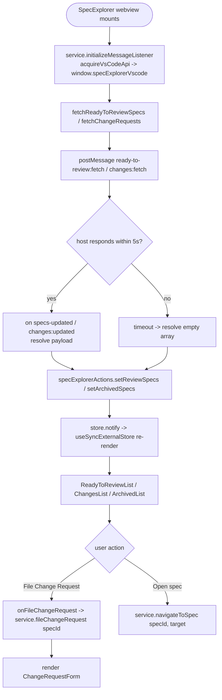
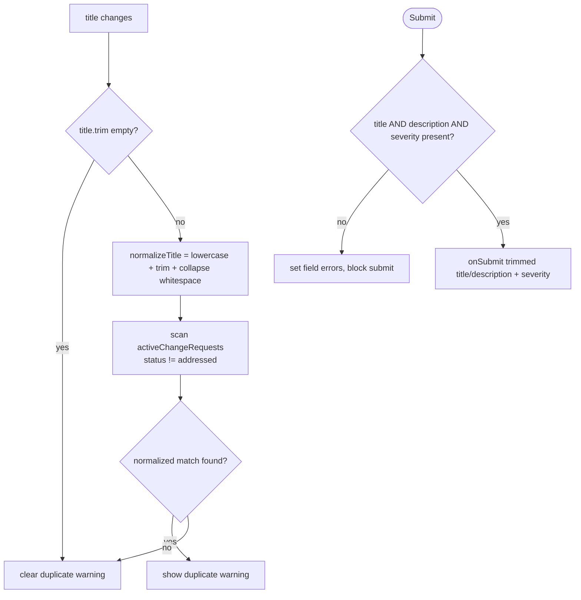
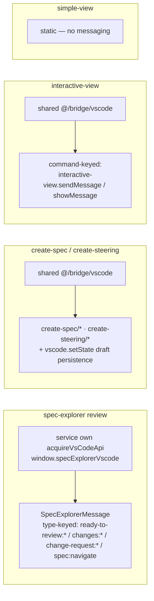

# Flowcharts — `webview-spec-explorer` module

> Source: `ui/src/components/spec-explorer/`, `ui/src/features/{create-spec-view,create-steering-view,simple-view,interactive-view}/`, `ui/src/services/spec-explorer.ts`, `ui/src/stores/spec-explorer-store.ts`. Confidence: 🟢 CONFIRMED unless noted.
> Generated by the Reversa Archaeologist (escavação phase).
> Groups the spec authoring + review-flow webview surfaces. ⚠️ Unlike `webview-agent-chat`, several files here import types directly from `src/` (compile-time coupling).

## 1. Spec review flow: fetch → render → file change request 🟢

> `services/spec-explorer.ts`, `stores/spec-explorer-store.ts`, `components/spec-explorer/*`.



## 2. ChangeRequestForm: validation + duplicate detection 🟢

> `components/spec-explorer/change-request-form.tsx:44-127`.



## 3. Create-spec / create-steering autosave + close lifecycle 🟢

> `features/create-spec-view/index.tsx`, `features/create-steering-view/index.tsx`.

```mermaid
flowchart TD
    A([View mounts]) --> B[readPersistedDraft from vscode.getState]
    B --> C[postMessage create-*/ready]
    C --> D{host sends create-*/init?}
    D -- yes --> E[hydrate form from init draft + vscode.setState]
    F[field change] --> G[isDirty = value != lastPersisted]
    G --> H[debounce 600ms -> persistDraft]
    H --> I[vscode.setState + postMessage create-*/autosave]
    J([Submit]) --> K{required field present?<br/>spec: description · steering: summary}
    K -- no --> K0[field error + focus]
    K -- yes --> L[postMessage create-*/submit]
    L --> M{host: submit:success | submit:error}
    M -- success --> M1[clear submitting]
    M -- error --> M2[show submissionError banner]
    N([Cancel / beforeunload]) --> O{isDirty?}
    O -- yes --> P[postMessage create-*/close-attempt hasDirtyChanges=true]
    P --> Q{host: confirm-close shouldClose?}
    Q -- no --> Q0[show &quot;close cancelled&quot; warning]
```

## 4. Bridge / messaging conventions in this module 🟡

> Three distinct host-communication styles coexist (a notable inconsistency vs. the single bridge in `webview-agent-chat`).


