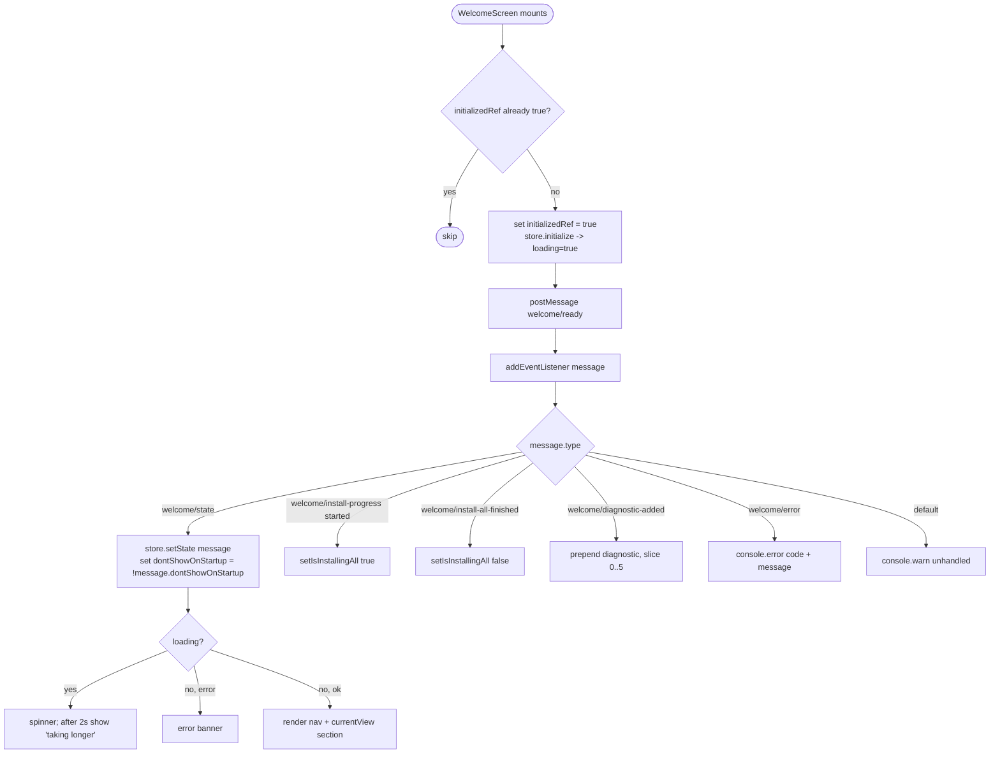
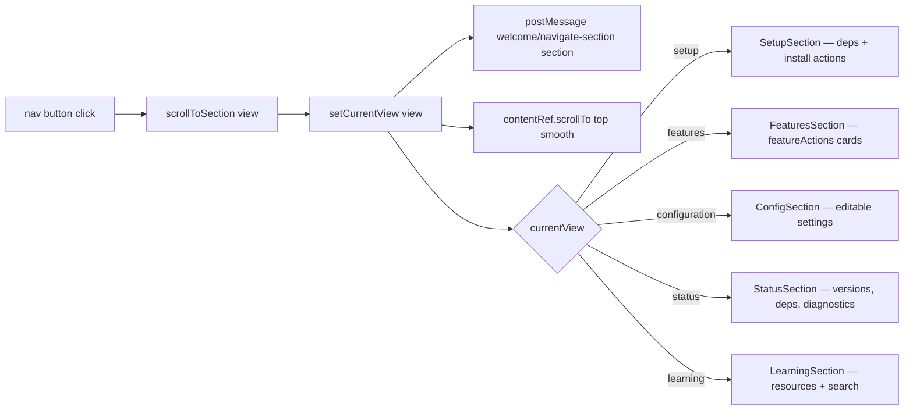
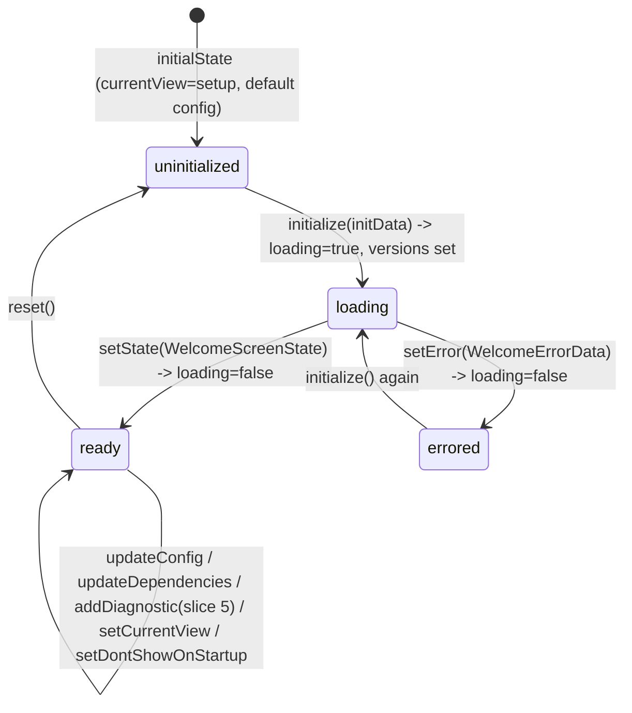

# Flowcharts — `webview-welcome` module

> Source: `ui/src/features/welcome/`. Confidence: 🟢 CONFIRMED unless noted.
> Generated by the Reversa Archaeologist (escavação phase).
> The onboarding Welcome Screen (registered page `"welcome-screen"`, host: `src/panels/welcome-screen-panel.ts`). 5 tabbed sections: Setup, Features, Configuration, Status, Learn. The **only webview module using Zustand**.

## 1. Welcome lifecycle: mount → ready → state → section render 🟢

> `welcome-screen.tsx`. Guards double-init with `initializedRef`. Wrapped in an `ErrorBoundary` class component (exported, used by `page-registry.tsx`).



## 2. Section navigation 🟢



## 3. Setup actions → host commands 🟢

> All actions are fire-and-forget `postMessage` to the host; results return as `welcome/state` / `welcome/install-progress` updates.

```mermaid
flowchart TD
    A[SetupSection] --> B{action}
    B -- Install one --> C[welcome/install-dependency dependency]
    B -- Install missing --> D[setIsInstallingAll + welcome/install-missing-dependencies deps]
    B -- Install prerequisite --> E[setIsInstallingAll + welcome/install-prerequisite key]
    B -- Refresh --> F[setIsRefreshing + welcome/refresh-dependencies; clear after 2s]
    G[FeaturesSection] --> H[welcome/execute-command commandId, args]
    I[ConfigSection] --> J[welcome/update-config key, value]
    I -- Open settings --> K[welcome/execute-command openSettings @ext:gatomia]
    L[LearningSection] --> M[welcome/open-external url | welcome/search-resources query]
```

## 4. Requirement profile computation (host-aware) 🟢

> `requirements.ts:computeRequirementProfile` — pure logic. ⚠️ **Mirror** of `src/services/welcome/requirements.ts` (Vite webview bundle cannot import the esbuild extension bundle; a parity test guards drift).

```mermaid
flowchart TD
    A[computeRequirementProfile ideHost, deps] --> B{ideHost}
    B -- windsurf --> C1[required: devin-cli, speckit, openspec, gatomia-cli<br/>hidden: copilot-chat, gemini-cli]
    B -- antigravity --> C2[required: gemini-cli, speckit, openspec, gatomia-cli<br/>hidden: copilot-chat, devin-cli]
    B -- other --> C3[required: copilot-chat, copilot-cli, speckit, openspec, gatomia-cli<br/>hidden: devin-cli, gemini-cli]
    C1 --> D[specSystemReady = speckit.installed OR openspec.installed]
    C2 --> D
    C3 --> D
    D --> E[missing = required (excl. speckit/openspec) not installed]
    E --> F{specSystemReady?}
    F -- no --> G[push 'speckit' to missing]
    F -- yes --> H[skip]
    G --> I[sort missing by INSTALL_ORDER weight]
    H --> I
    I --> J[return required, optional, hidden, specSystemReady, missing]
```

## 5. Welcome store (Zustand) state shape 🟢

> `stores/welcome-store.ts` — `create<WelcomeStore>`. Diagnostics capped at 5 (newest first).


