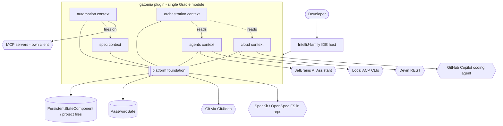

# Target Architecture

> Target architecture honoring `paradigm_decision.md` (Option 1, transformational: idiomatic IntelliJ, native Compose, bridge dropped), `topology_decision.md` (Option 3, Hybrid: feature slices + hexagonal seam in a single Gradle module), and `migration_strategy.md` (A + C: incremental per-context + parallel-run parity).

## Overview

The new system is a **single in-process IntelliJ Platform plugin** in Kotlin. It is organized as **feature-sliced bounded contexts** (one package per context) with a **hexagonal domain/infra seam** inside each, over a shared `platform` foundation. There is **no `postMessage` bridge and no webview** — UI is **Compose for Desktop / Jewel** rendered inside each context's tool window, calling application services in-process. Async is **Kotlin coroutines**; events use the IntelliJ **message bus**; there is **no database** (state via `PersistentStateComponent`, project files, and `PasswordSafe`). During migration the running VS Code extension is the **behavioral oracle** (Strategy C); there is no runtime coupling between the two products.

## Diagram (Mermaid)



## Components

| Component | Type | Responsibility | Origin (legacy / new / merged) |
|---|---|---|---|
| `platform` foundation | Service layer | Persistence, secrets, settings, telemetry, Git, ACP runtime, provider SPI, **own MCP client** | merged from `services/`, `utils/`, `prompts/` |
| `spec` context | Context (ToolWindow + services) | SDD spec lifecycle, steering docs, task normalization | merged from `spec` + `steering` + `tasks` + `utils/spec-kit-*` |
| `automation` context | Context (Service + message-bus listeners) | Hooks engine: trigger + conditions + schedule -> action | from `hooks` (renamed) |
| `agents` context | Context (ToolWindow + services) | Local/cloud chat sessions, `.agent.md` defs, ACP, AI Assistant host | merged from `agent-chat` + `agents` + `services/acp` |
| `cloud` context | Context (Service + coroutine pollers) | Devin/Copilot delegation, polling, PR reconciliation | merged from `cloud-agents` (+`devin` pruned) |
| `orchestration` context | Context (ToolWindow + projection) | MAESTRO dashboard + autonomous Kanban->session loop | from `orchestration` + Kanban view |
| Compose/Jewel tool windows | UI (per context) | Native declarative UI in-process | rebuilt from `ui/*` (no webview) |
| Provider SPI (Devin/Copilot adapters) | Adapter | Pluggable cloud providers | preserved from ADR-0007 pattern |

## Bounded contexts

### BC-01: spec (Spec Lifecycle)
- **Responsibility**: create/review/archive specs across SpecKit/OpenSpec; steering documents; normalize `tasks.md`.
- **Grouping justification**: `spec`, `steering`, `tasks` share the SDD lifecycle transaction and the same FSMs (R-SP-*); they fail and evolve together. **Not** 1:1 with the legacy 3 modules — merged into one context.
- **Internal components**: `Spec` aggregate, `ChangeRequest`, spec-system adapter (SpecKit/OpenSpec), steering manager, task normalizer.
- **Domain events published**: `SpecOperationCompleted` (per SDD op), `ChangeRequestFiled/Addressed`, `SpecArchived` (consumed by automation).
- **Events consumed**: none internal.

### BC-02: automation (Hooks)
- **Responsibility**: bind trigger + conditions + schedule to an action (agent/git/github/mcp/custom/acp); fire before/after SDD operations.
- **Grouping justification**: cohesive event engine (R-HK-*) with its own safety rails; preserved as one context.
- **Internal components**: `Hook` aggregate, trigger registry (message-bus listener), action executor, **own MCP client** (AMB-004), variable parser.
- **Events published**: hook execution logs.
- **Events consumed**: `SpecOperationCompleted`, `orchestration.task-completed/failed` (R-HK-1, R-OR-4).

### BC-03: agents (Conversational Agents)
- **Responsibility**: run local ACP + cloud agents in chat; session lifecycle, transcripts, capability negotiation, pending-write approval; `.agent.md` definitions.
- **Grouping justification**: `agent-chat`, `agents`, `services/acp` share the session aggregate and capability model (R-AC-*); merged.
- **Internal components**: `ChatSession` aggregate, `AgentDefinition` aggregate, ACP runtime adapter, **JetBrains AI Assistant host adapter** (AMB-005), capability resolver.
- **Events published**: `ChatSessionStateChanged` (terminal transitions).
- **Events consumed**: none internal.

### BC-04: cloud (Cloud Delegation)
- **Responsibility**: delegate to Devin/Copilot; polling, status mapping, PR reconciliation, credential gating.
- **Grouping justification**: provider-agnostic delegation (R-CD-*); the legacy standalone `devin` is dropped (BR-DESCARTAR-004), so this is `cloud-agents` only.
- **Internal components**: `CloudSession` aggregate, `CloudAgentProvider` SPI + Devin/Copilot adapters, coroutine polling loop, PR reconciler.
- **Events published**: `CloudSessionStateChanged`, `PrStateChanged` (marks `tasks.md`).
- **Events consumed**: none internal.

### BC-05: orchestration (MAESTRO)
- **Responsibility**: aggregate all sessions into a dashboard read-model; autonomous Kanban->session loop.
- **Grouping justification**: a projection/read-model over `agents` + `cloud`; depends on them but owns no source-of-truth sessions (R-OR-*). Kept separate because it changes independently and carries the heaviest UI.
- **Internal components**: `OrchestrationSnapshot` projection, autonomous loop service, Kanban + graph composer (Compose/Jewel — AMB-002).
- **Events published**: `orchestration.task-completed/failed` (R-OR-4).
- **Events consumed**: `ChatSessionStateChanged`, `CloudSessionStateChanged`.

### BC-06: platform (foundation)
- **Responsibility**: cross-cutting capabilities every context uses — persistence, secrets, settings, telemetry, Git, ACP runtime, provider SPI, MCP client, prompt templating.
- **Grouping justification**: the legacy `services/` (34) + `utils/` (28) + `prompts/` layer buckets, refactored into a cohesive foundation rather than scattered shared code.
- **Internal components**: persistence services, `PasswordSafe` wrapper, telemetry, Git4Idea wrapper, ACP process manager, MCP client, Handlebars-equivalent templating.

## Architectural decisions (ADR-style)

### AD-01: Single in-process plugin, no host/UI bridge
- **Decision**: one Kotlin plugin; UI calls services directly in-process.
- **Alternatives rejected**: JCEF-embedded webview (kept the bridge); two-module host/UI split.
- **Justification**: honors `paradigm_decision.md` I1; eliminates the type-mirror drift class (R-X-6 / D-8).
- **Traceability**: `discard_log.md` BR-DESCARTAR-001/002/005.

### AD-02: Hexagonal seam per context (single Gradle module)
- **Decision**: each context has `domain` (pure) / `app` / `ui` / `infra` packages in one module.
- **Alternatives rejected**: Gradle multi-module (ceremony, no deploy benefit for one plugin, topology Option 2); flat package-by-layer (topology Option 1).
- **Justification**: `topology_decision.md` Option 3; pure domain = cheap headless parity tests (Strategy C).
- **Traceability**: `topology_decision.md`.

### AD-03: FSMs as Kotlin sealed classes
- **Decision**: the 22 legacy FSMs become sealed-class state hierarchies with exhaustive `when`.
- **Justification**: absorbing terminal sets (INV-1) and status-detail-override (INV-2) are naturally expressed; compiler-checked transitions.
- **Traceability**: `domain.md` ADR-0010, `state-machines.md`; paradigm I4.

### AD-04: Coroutines for async; message bus for events
- **Decision**: polling/long-running work via `Task.Backgroundable` + coroutines; intra-plugin events via the IntelliJ message bus; file events via `BulkFileListener`.
- **Justification**: replaces Node event loop + FS watchers (R-HK-7); cancellation via `ProgressIndicator`/coroutine cancellation.
- **Traceability**: paradigm I4.

### AD-05: Persistence via PersistentStateComponent / project files / PasswordSafe
- **Decision**: no DB; state in IntelliJ state components + project-scoped JSON/JSONL + `PasswordSafe` secrets.
- **Justification**: mirrors the legacy no-DB design (ADR-0005); paradigm I5.
- **Traceability**: `architecture.md` §1; `erd-complete.md` legend.

### AD-06: JetBrains AI Assistant as the chat host
- **Decision**: integrate `.agent.md` definitions + chat with JetBrains AI Assistant's surface.
- **Alternatives rejected**: own chat tool window (Curator rec); GitHub Copilot for JetBrains.
- **Justification**: user decision AMB-005 (override). Risk RISK-003 if the API is limited.
- **Traceability**: `target_business_rules.md` BR-HUMANA-003.

### AD-07: Own MCP client
- **Decision**: embed a JVM MCP client that owns server-of-origin metadata.
- **Justification**: `vscode.lm.tools` does not exist on JetBrains; resolves gap G-B. User decision AMB-004.
- **Traceability**: `target_business_rules.md` BR-HUMANA-002.

## Honra ao paradigma escolhido
- **Target paradigm**: idiomatic IntelliJ (OO-with-DI + message bus + coroutines), declarative Compose UI.
- **How the architecture honors it**:
  - **I1 (bridge dissolves)** → AD-01: in-process UI->service calls; no serialization boundary, no type mirror.
  - **I2 (React->Compose)** → Compose/Jewel tool windows per context; orchestration canvas/Kanban rebuilt natively (AMB-002, spiked in Phase 0).
  - **I3 (commands->extension points)** → `plugin.xml` extension points + `AnAction` + tool windows; providers/adapters as `@Service` + SPI.
  - **I4 (event/FSM/async)** → AD-03 (sealed-class FSMs), AD-04 (coroutines + message bus + `BulkFileListener`).
  - **I5 (persistence)** → AD-05 (`PersistentStateComponent`/`PasswordSafe`).

## Honra à topologia escolhida
- **Chosen option**: 3 — Hybrid (feature slices + hexagonal seam, single Gradle module).
- **Final tree**:
  ```
  gatomia-intellij/ (single Gradle module)
  └── src/main/kotlin/dev/gatomia/
      ├── platform/      persistence/ secrets/ settings/ telemetry/ git/ acp/ providers/ mcp/ templating/
      ├── spec/          { domain/ app/ ui/ infra/ }
      ├── automation/    { domain/ app/ ui/ infra/ }
      ├── agents/        { domain/ app/ ui/ infra/ }
      ├── cloud/         { domain/ app/ ui/ infra/ }
      ├── orchestration/ { domain/ app/ ui/ infra/ }
      └── GatomiaPlugin.kt + META-INF/plugin.xml
  ```
- Each context keeps `domain` pure (no IntelliJ imports) for headless parity testing; `infra` holds the IntelliJ adapters; `ui` holds Compose. Promote a context to its own Gradle module only by the Rule of Three.

## Bordas com o legado durante a migração
- **No runtime coupling.** The VS Code extension and the JetBrains plugin are separate products in separate marketplaces.
- **Parallel-Run oracle (Strategy C)**: per context, the same SDD operations are run in the legacy extension and compared (behaviorally) against the new plugin; this is the only "edge", and it is test-time only (feeds the Inspector).
- **Shared repo artifacts**: SpecKit/OpenSpec spec files, `.agent.md`, steering docs live in IDE-agnostic repo paths and are read natively by both — no migration edge needed.

## Notas
- Decomposition is intentionally **not 1:1**: 22 legacy modules -> 6 contexts via justified merges (see `topology_decision.md` mapping).
- `orchestration` is sequenced last (depends on `agents`+`cloud`) but its UI risk (AMB-002) is spiked in Phase 0 per `migration_strategy.md`.
