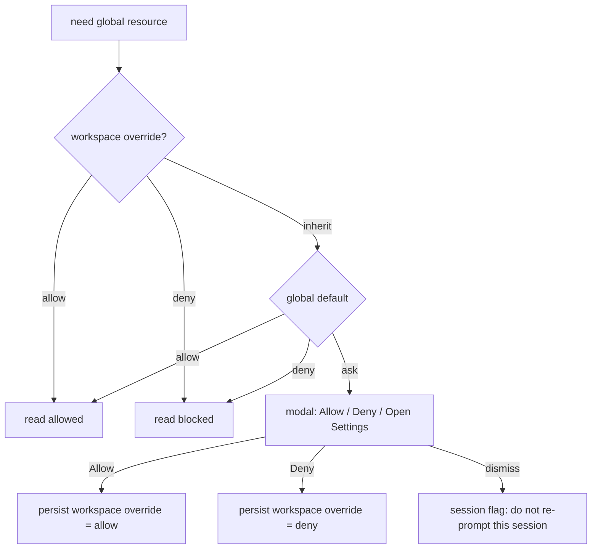

# Access Control, Consent & Capability Model — gatomia

> Produced by the Reversa Detective (interpretation phase). Documents who/what may do what in the system.
> Confidence: 🟢 CONFIRMED from code unless noted.

---

## 0. Key finding — there is no multi-user RBAC

🟢 **gatomia is a single-user VS Code extension.** There are **no user accounts, no roles, no login, and no permission matrix in the traditional RBAC/ACL sense.** The single human actor is the developer running VS Code; everything runs with that user's OS/workspace privileges.

What *does* exist is a layered model of **consent gates, capability gating, read-only enforcement, and destructive-action confirmation** — the real "authorization" surface of this product. The closest thing to "roles" is the set of **non-human actors** the extension brokers:

| Actor | Nature | Trust boundary |
|-------|--------|----------------|
| **Developer (user)** | Human at the keyboard | Full authority; grants/denies all consent. |
| **Local ACP agent** | Spawned CLI subprocess (Devin/Gemini) over stdio | Untrusted-by-default: file writes and tool calls are gated. |
| **Cloud agent** | Remote service (Devin REST / GitHub Copilot) | External; reached via credentials; results are **read-only** locally. |
| **Hook action** | Automated task (agent/git/github/mcp/custom/acp) | Runs with user privileges; guarded by chain/cycle limits. |
| **Extension host** | The extension itself | Mediates every interaction; owns persistence and SecretStorage. |

The rest of this document enumerates the **permission/consent gates** that govern these actors.

---

## 1. Tool-call permission model (ACP) 🟢

The central authorization mechanism. When a local ACP agent requests a tool invocation, the extension resolves a decision. — `services/acp/acp-client.ts:1510`, `acp/types.ts`.

| `PermissionMode` | Behavior |
|------------------|----------|
| `allow` | Short-circuit grant. |
| `deny` | Short-circuit refusal. |
| `ask` (default) | Check remembered decision for the request's `ToolKind`; else prompt the user. |

- **Remembered decisions**: on `ask`, the user may choose `allow_always` / `reject_always`, memoized **per `ToolKind`** for the lifetime of the `AcpClient` (`acp-client.ts:316,1446`). Option ids rotate per request, so the resolver re-maps the remembered choice to the live `optionId`.
- **Default mode source**: the agent-chat permission default (`ask`/`allow`/`deny`) is stored in **Global** VS Code config and rebroadcast to the webview as the single source of truth (`providers/agent-chat-view-provider.ts:534-550`). See §6.
- See `state-machines.md` §19 for the resolution FSM.

---

## 2. Pending file-write approval gate 🟢

A second, write-specific gate layered on top of the permission model. — `agent-chat/pending-writes-store.ts`, `services/acp/acp-client.ts:942`.

- When `bufferFileWrites` is enabled, an agent's `writeTextFile` is **buffered** as a `PendingWrite` and **blocks agent execution** until the user resolves it (R-AC-1 / pending-writes-store.ts:87).
- Resolution actions: `accept-all`, `reject-all`, `accept-one`, `reject-one` (`FlushAction`). A rejection is surfaced back to the agent.
- The webview renders an Accept/Reject "pending changes" bar with per-file diff stats.
- When buffering is disabled, writes go direct (no gate).

---

## 3. Global resource access consent (privacy gate) 🟢

A privacy-sensitive consent system controlling whether the extension may read **home-directory** Copilot resources (`~/.github/...`) on behalf of a given workspace. — `steering/global-resource-access-consent.ts`. This is the most RBAC-like control in the system.

**Three-state model:**

| Setting | Type | Values | Default |
|---------|------|--------|---------|
| `steering.globalResourceAccessDefault` | global default | `ask` \| `allow` \| `deny` | `ask` |
| `steering.workspaceGlobalResourceAccess` | workspace override | `inherit` \| `allow` \| `deny` | `inherit` |

**Effective access resolution** (`getEffectiveGlobalResourceAccess`):
```
effective = workspaceOverride is (allow|deny) ? workspaceOverride : globalDefault
```



- **Persistence fallback chain** (`setWorkspaceGlobalResourceAccess`): workspace config → global config → `.vscode/settings.json` → `workspaceState`. The system degrades gracefully if higher tiers are unwritable.
- **Session suppression**: dismissing the prompt suppresses re-prompts for the rest of the session.

---

## 4. Subprocess spawn consent (`npx` gate) 🟢

Before spawning an ACP agent via `npx`, the extension shows a **one-time consent prompt per `(providerId, cwd)`**. — `services/acp/acp-session-manager.ts:201-225`. This protects against silently downloading+executing an arbitrary npm package.

Additionally, the new-session QuickPick distinguishes availability tiers and, for `install-required` providers, **opens the install URL instead of starting** (no implicit install). — `commands/agent-chat-new-session.ts:209-235`.

---

## 5. Read-only enforcement (capability gating) 🟢

"Read-only" is the system's way of denying mutation rights to certain session/document states.

| Subject | Read-only when | Enforcement |
|---------|----------------|-------------|
| **Cloud sessions** | always (`isReadOnly`) | follow-up submit/retry rejected with a fixed reason — `agent-chat-view-provider.ts:1133`, `panels/agent-chat-panel.ts:404` |
| **Terminal sessions** | lifecycle terminal | input rejected — `agent-chat-panel.ts:414` |
| **Sessions of an inactive provider** | provider deactivated | marked `isReadOnly`, excluded from polling/active — `cloud-agents/agent-session-storage.ts:167` |
| **Imported (previous-provider) sessions** | imported | cloud cancel refuses them — `cloud-agent-commands.ts:555` |
| **Document preview** | always | `edit-attempt` shows a warning, never mutates — `panels/document-preview-panel.ts:158` |
| **Preview forms** | `permissions.canEditForms === false` | `updateField` + submission blocked — `webview-preview/form-store.ts:133` |

> 🟢 `PreviewDocumentPayload.permissions = { canEditForms: boolean, reason? }` is the only explicit per-document "permission" object in the codebase, and it is a binary edit gate, not a role.

---

## 6. Configuration-scoped settings (who can change what) 🟢

Some controls are **global** (apply to all workspaces) vs **workspace** scoped — a coarse "authority" split.

| Control | Scope | Notes |
|---------|-------|-------|
| Agent-chat permission default | **Global** | single source of truth; config-change listener rebroadcasts to webview — `agent-chat-view-provider.ts:205` |
| Global resource access default | **Global** | §3 |
| Workspace global-resource-access override | **Workspace** | §3 |
| `gatomia.specSystem` and spec paths | **Workspace** (6 editable keys via Welcome) | `welcome-screen-provider.ts:71-78` |
| `gatomia.chat.provider` (ACP vs Copilot) | config override | ACP disabled entirely in remote workspaces — `chat-router.ts:71-108` |
| `gatomia.agents.enableHotReload` | config | gates the file-watcher reload — `configuration-service.ts:33` |

---

## 7. Destructive-action confirmation gates 🟢

Mutating/destructive operations require an explicit confirmation step — effectively a "you must be sure" authorization.

| Action | Gate |
|--------|------|
| Worktree cleanup with dirty/unpushed state | two-step: `confirmedDestructive:false` → inspect → `warning{inspection}` → re-invoke with `confirmedDestructive:true` — `agent-chat-commands.ts:409-450` |
| Orphaned-worktree cleanup | same two-step destructive confirmation |
| Devin task start | `validateGitState` (clean repo) **+** explicit confirmation dialog — `devin-commands.ts:181-199` |
| Overwriting `~/.github/copilot-instructions.md` | overwrite-confirmed — `steering-manager.ts:50-92` |
| Overwriting instruction-rule files | refused (never overwrites) — `instruction-rules.ts:98-109` |
| Markdown import over existing text (create-spec) | confirm overwrite — `create-spec-view/index.tsx` |

---

## 8. Credential & secret handling 🟢

Not "permissions" per se, but the trust/secret boundary that authorizes cloud access.

- **Devin credentials**: API key and JSON metadata stored under **separate `SecretStorage` keys** (`gatomia.devin.apiKey` / `gatomia.devin.credentials`); the metadata blob never contains the key. — `devin/devin-credentials-manager.ts:66`.
- **API-version authority**: a `cog_`-prefixed key additionally requires an **Organization ID** (v3) or the call is refused (`DevinOrgIdRequiredError`). — `devin-commands.ts:239`, R-CD-1.
- **Credential gating**: polling/dispatch require a valid credentialed, **active** provider; otherwise the action chains the select/configure commands. — `cloud-agent-commands.ts:319`.
- **Credential expiry**: 3 consecutive auth failures stop polling and fire `onCredentialExpiry`. — `agent-polling-service.ts:50`, R-CD-4.

---

## 9. Automation guardrails (hook authority limits) 🟢

Hooks run with the user's full privileges, so their "authority" is bounded by safety limits rather than scopes:

| Guard | Value | Source |
|-------|-------|--------|
| Max chain depth | 10 (`MAX_CHAIN_DEPTH`) | hooks/types.ts:565 |
| Circular-dependency block | per-execution `executedHooks` set | hook-executor.ts:920 |
| Action timeout | 30 s (`ACTION_TIMEOUT_MS`) | types.ts:566 |
| MCP concurrency | ≤5 (`MCP_MAX_CONCURRENT_ACTIONS`) | types.ts:581 |
| Blocking execution | only `timing="before"` + `waitForCompletion` | R-HK-2 |
| Async availability check | MCP/custom-agent references validated (availability is warn-only) | hook-manager.ts:697 |

---

## 10. Gaps & validations to confirm (🔴 / 🟡)

1. **🟡 No CSP/permission story documented for MCP tool execution side effects.** `executeMCPTool` invokes `lm.invokeTool` with `toolInvocationToken: undefined` (outside a chat request); the downstream tool's own permission model is out of gatomia's control.
2. **🔴 Consent UX coverage.** Whether *every* path that reads home-dir resources actually routes through `ensureGlobalResourceAccessConsent` (vs. some bypassing it) was not exhaustively traced — the Reviewer should confirm there are no unguarded reads.
3. **🟡 Global vs workspace authority** for the permission default is asymmetric (permission default is Global-only; resource access has a workspace override). Confirm this is intentional product behavior.
4. **🔴 No audit trail of granted permissions** beyond in-memory `allow_always`/`reject_always` memos (lost on client dispose) and telemetry. There is no persisted record of what the user authorized.

> **Bottom line:** model gatomia's "security" as **consent + capability + confirmation**, not as roles/permissions. If a future spec introduces multi-user or team features, this section is where an RBAC layer would need to be designed from scratch.
