# State Machines — gatomia

> Produced by the Reversa Detective (interpretation phase). Documents every entity with status/state fields, its allowed transitions, triggers, and terminal (absorbing) states.
> Confidence: 🟢 CONFIRMED from code unless noted. Sources: `data-dictionary.md`, `code-analysis.md`, `flowcharts/<module>.md`.
> Terminal states are marked **(terminal)**. Mermaid `stateDiagram-v2` diagrams are renderable in the document-preview panel.

---

## Index

| # | Machine | Entity / enum | Module |
|---|---------|---------------|--------|
| 1 | Agent-chat session lifecycle | `SessionLifecycleState` | `agent-chat` |
| 2 | User-message delivery | `UserMessageDeliveryStatus` | `agent-chat` |
| 3 | Tool-call status | `ToolCallStatus` | `agent-chat` |
| 4 | Worktree status | `WorktreeHandle.status` | `agent-chat` |
| 5 | Agent-definition lifecycle | (implicit) | `agents` |
| 6 | Resource cache | (implicit) | `agents` |
| 7 | Cloud session status | `SessionStatus` (cloud) | `cloud-agents` |
| 8 | Cloud task status | `TaskStatus` (cloud) | `cloud-agents` |
| 9 | Pull-request state | `PullRequest.state` | `cloud-agents`/`devin` |
| 10 | Devin session status | `SessionStatus` (devin) | `devin` |
| 11 | Devin task status | `TaskStatus` (devin) | `devin` |
| 12 | Spec review status | `SpecStatus` | `spec` |
| 13 | Change-request status | `ChangeRequestStatus` | `spec` |
| 14 | Task-link status | `TaskLinkStatus` | `spec` |
| 15 | Task execution state | `ExecutionState` | `tasks`/`orchestration` |
| 16 | Hook execution pipeline | (pipeline) | `hooks` |
| 17 | ACP action lifecycle | `ACPExecutionState` | `hooks` |
| 18 | ACP client lifecycle | (implicit) | `services/acp` |
| 19 | Tool-call permission resolution | `PermissionMode` | `services/acp` |
| 20 | Orchestration bucket | `OrchestrationSessionBucket` | `orchestration` |
| 21 | Preview form lifecycle | (implicit) | `webview-preview` |
| 22 | Welcome store lifecycle | (implicit) | `webview-welcome` |

> Machines 19 (permission resolution) and the consent FSM are detailed in `permissions.md`; summarized here for completeness.

---

## A. Conversational Agents

### 1. Agent-chat session lifecycle 🟢
`SessionLifecycleState` — `agent-chat/types.ts:18`. Terminal set `TERMINAL_STATES = {completed, failed, cancelled, ended-by-shutdown}` is **absorbing**: a new run creates a new session (R-AC-1).

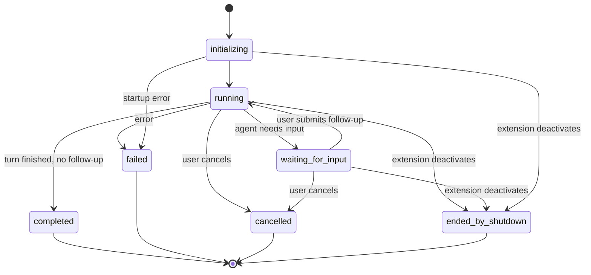
```mermaid
stateDiagram-v2
    [*] --> initializing
    initializing --> running
    running --> waiting_for_input: agent needs input
    waiting_for_input --> running: user submits follow-up
    running --> completed: turn finished, no follow-up
    running --> failed: error
    running --> cancelled: user cancels
    waiting_for_input --> cancelled: user cancels
    initializing --> failed: startup error
    running --> ended_by_shutdown: extension deactivates
    waiting_for_input --> ended_by_shutdown: extension deactivates
    initializing --> ended_by_shutdown: extension deactivates
    completed --> [*]
    failed --> [*]
    cancelled --> [*]
    ended_by_shutdown --> [*]
```
- **Triggers:** ACP session events (`onAcpEvent`), `submit`, `cancel`, extension `deactivate` (atomic stamp, R-AC-6).
- **Note:** `ended-by-shutdown` is stamped on all non-terminal sessions in a single store update on deactivation.

### 2. User-message delivery 🟢
`UserMessageDeliveryStatus` — `agent-chat/types.ts:235`.

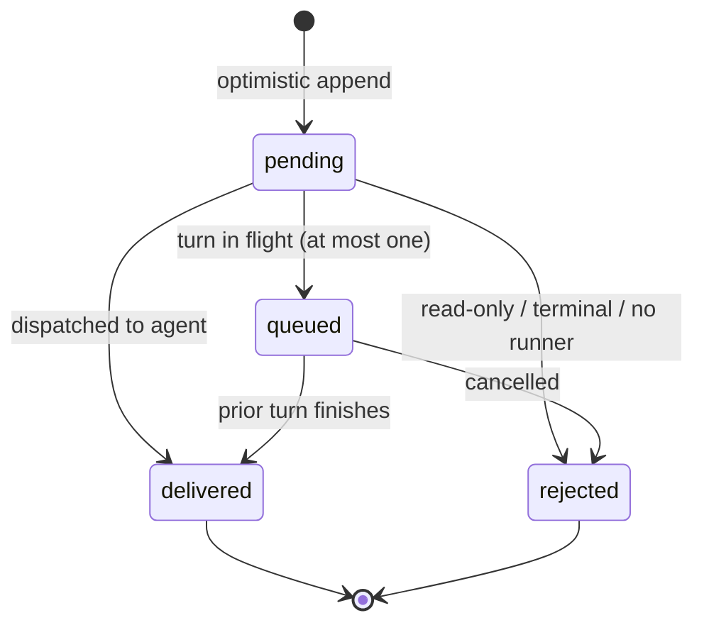
```mermaid
stateDiagram-v2
    [*] --> pending: optimistic append
    pending --> queued: turn in flight (at most one)
    pending --> delivered: dispatched to agent
    queued --> delivered: prior turn finishes
    pending --> rejected: read-only / terminal / no runner
    queued --> rejected: cancelled
    delivered --> [*]
    rejected --> [*]
```
- **Rules:** at most one queued follow-up (R-AC-2); cloud/terminal/no-runner ⇒ `rejected` with a reason (R-AC-3).

### 3. Tool-call status 🟢
`ToolCallStatus` — `agent-chat/types.ts:331`.

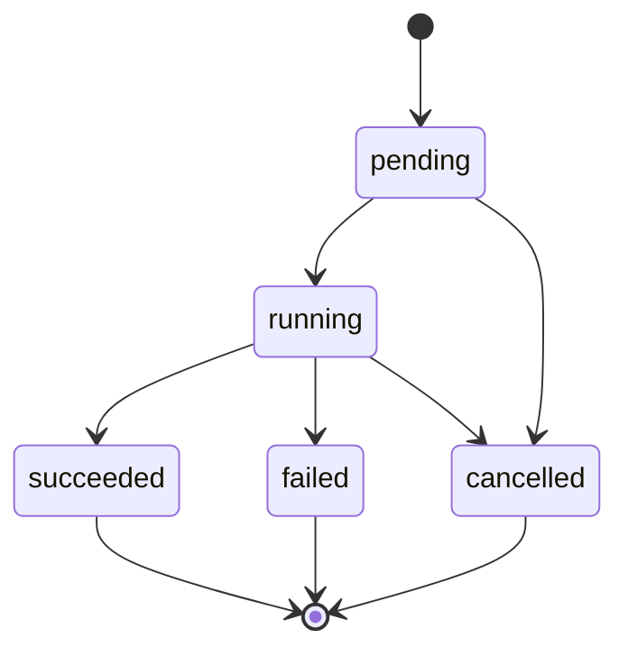
```mermaid
stateDiagram-v2
    [*] --> pending
    pending --> running
    running --> succeeded
    running --> failed
    running --> cancelled
    pending --> cancelled
    succeeded --> [*]
    failed --> [*]
    cancelled --> [*]
```

### 4. Worktree status 🟢
`WorktreeHandle.status` — `agent-chat/types.ts:151`.

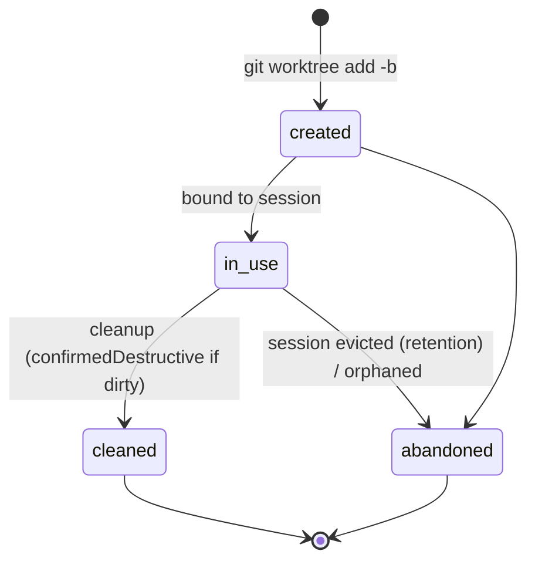
```mermaid
stateDiagram-v2
    [*] --> created: git worktree add -b
    created --> in_use: bound to session
    in_use --> cleaned: cleanup (confirmedDestructive if dirty)
    in_use --> abandoned: session evicted (retention) / orphaned
    created --> abandoned
    cleaned --> [*]
    abandoned --> [*]
```
- **Rule:** dirty/unpushed cleanup requires `confirmedDestructive` (R-AC-9); evicted sessions migrate worktrees to the orphaned list (R-AC-5).

### 5. Agent-definition lifecycle 🟢 (implicit, `flowcharts/agents.md`)
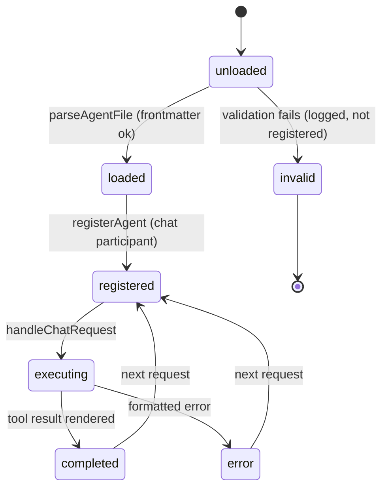
```mermaid
stateDiagram-v2
    [*] --> unloaded
    unloaded --> loaded: parseAgentFile (frontmatter ok)
    unloaded --> invalid: validation fails (logged, not registered)
    loaded --> registered: registerAgent (chat participant)
    registered --> executing: handleChatRequest
    executing --> completed: tool result rendered
    executing --> error: formatted error
    completed --> registered: next request
    error --> registered: next request
    invalid --> [*]
```

### 6. Resource cache 🟢 (`flowcharts/agents.md`)
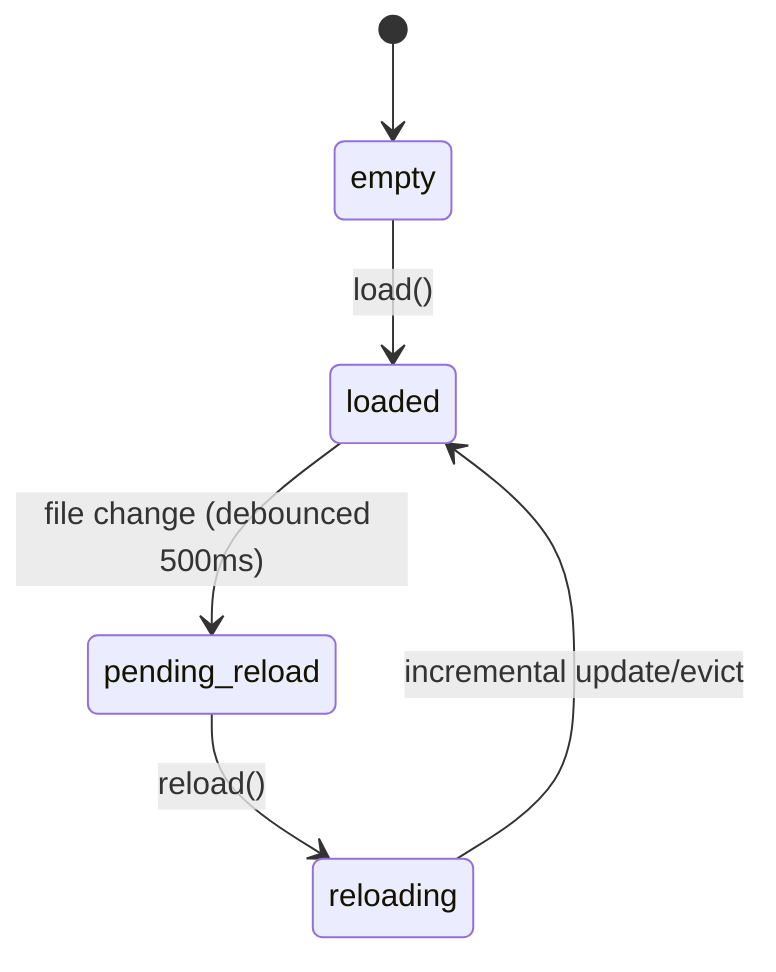
```mermaid
stateDiagram-v2
    [*] --> empty
    empty --> loaded: load()
    loaded --> pending_reload: file change (debounced 500ms)
    pending_reload --> reloading: reload()
    reloading --> loaded: incremental update/evict
```

---

## B. Cloud Delegation

### 7. Cloud session status 🟢
`SessionStatus` (cloud) — `cloud-agents/types.ts:19`. `COMPLETED`/`FAILED`/`CANCELLED` **(terminal)**.

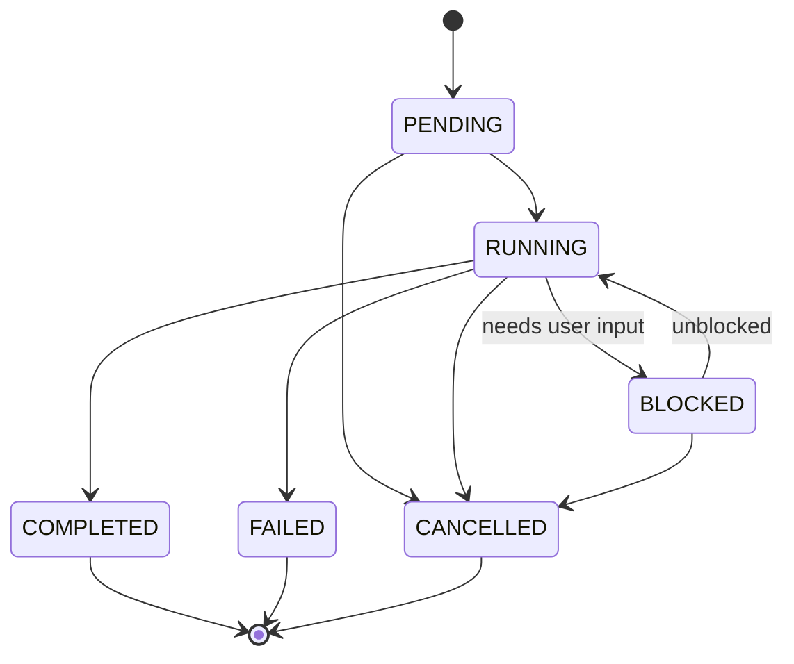
```mermaid
stateDiagram-v2
    [*] --> PENDING
    PENDING --> RUNNING
    RUNNING --> BLOCKED: needs user input
    BLOCKED --> RUNNING: unblocked
    RUNNING --> COMPLETED
    RUNNING --> FAILED
    PENDING --> CANCELLED
    RUNNING --> CANCELLED
    BLOCKED --> CANCELLED
    COMPLETED --> [*]
    FAILED --> [*]
    CANCELLED --> [*]
```
- **Terminal normalization** (R-CD-6): on terminal, stale tasks → derived/`SKIPPED`, unknown PR → `merged` if COMPLETED else `open`.

### 8. Cloud task status 🟢
`TaskStatus` (cloud) — `cloud-agents/types.ts:37`.

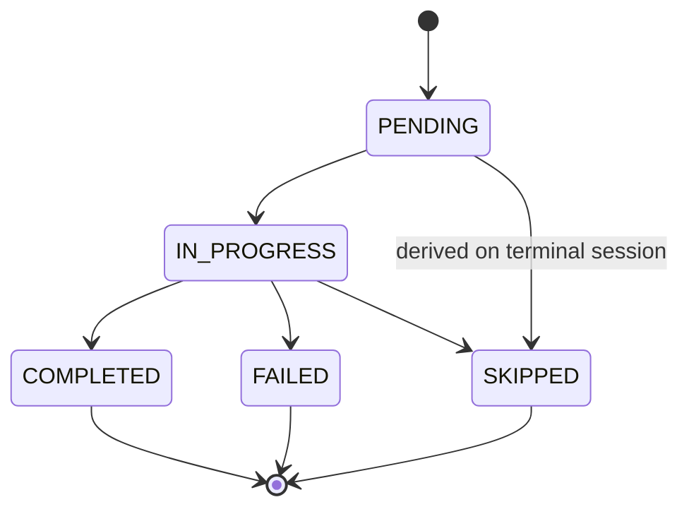
```mermaid
stateDiagram-v2
    [*] --> PENDING
    PENDING --> IN_PROGRESS
    IN_PROGRESS --> COMPLETED
    IN_PROGRESS --> FAILED
    PENDING --> SKIPPED: derived on terminal session
    IN_PROGRESS --> SKIPPED
    COMPLETED --> [*]
    FAILED --> [*]
    SKIPPED --> [*]
```

### 9. Pull-request state 🟢
`PullRequest.state` (cloud) / `prState` (devin). Reconciled by URL, `createdAt` preserved.

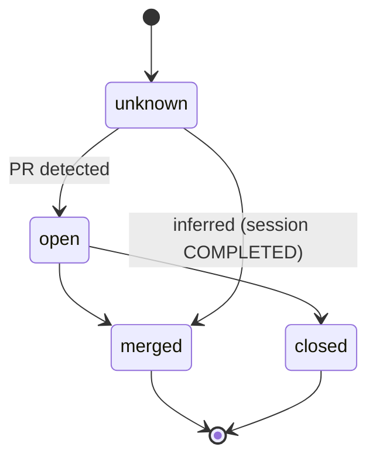
```mermaid
stateDiagram-v2
    [*] --> unknown
    unknown --> open: PR detected
    open --> merged
    open --> closed
    unknown --> merged: inferred (session COMPLETED)
    merged --> [*]
    closed --> [*]
```
- **Effect:** open→merged during polling marks the `tasks.md` checkbox (R-CD-12).

### 10. Devin session status 🟢
`SessionStatus` (devin) — `devin/types.ts:65`. Last three **(terminal)**, via `status-mapper.ts:77`.

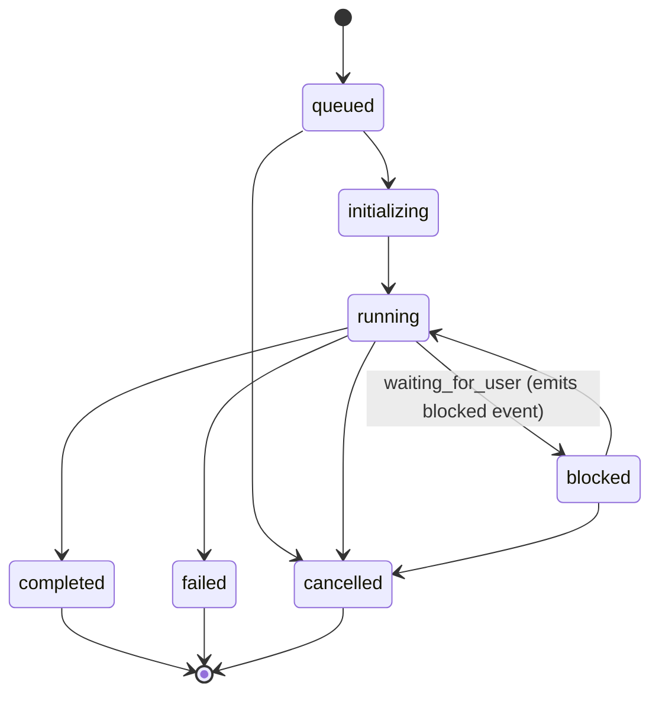
```mermaid
stateDiagram-v2
    [*] --> queued
    queued --> initializing
    initializing --> running
    running --> blocked: waiting_for_user (emits blocked event)
    blocked --> running
    running --> completed
    running --> failed
    queued --> cancelled
    running --> cancelled
    blocked --> cancelled
    completed --> [*]
    failed --> [*]
    cancelled --> [*]
```

**Raw API → local mapping** (`DevinApiStatus` + `DevinStatusDetail` → `SessionStatus`). `statusDetail` wins over base `status` (R-CD-3); fallback `running`.

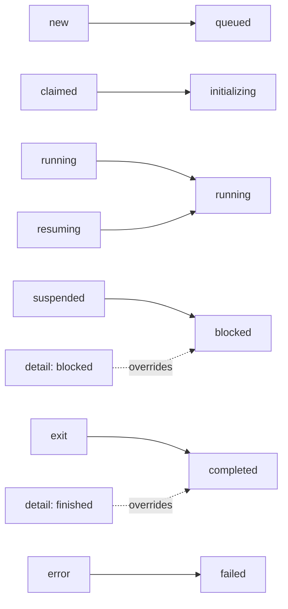
```mermaid
flowchart LR
    new --> queued
    claimed --> initializing
    running_api[running] --> running
    suspended --> blocked
    resuming --> running
    exit --> completed
    error --> failed
    detail_blocked[detail: blocked] -.overrides.-> blocked
    detail_finished[detail: finished] -.overrides.-> completed
```

### 11. Devin task status 🟢
`TaskStatus` (devin) — `devin/types.ts:84`. Synced from session status; terminal tasks frozen.

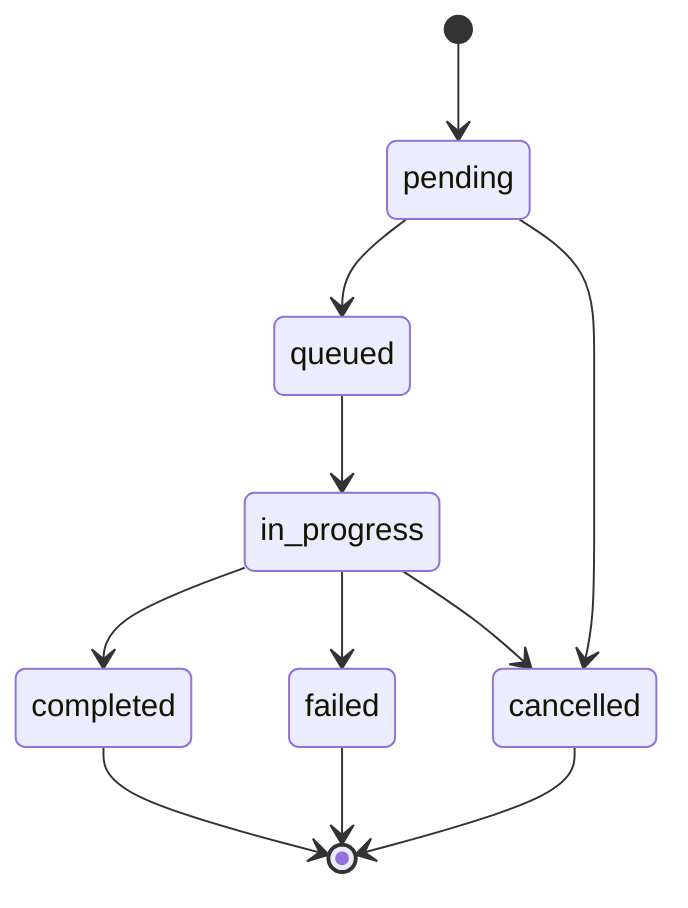
```mermaid
stateDiagram-v2
    [*] --> pending
    pending --> queued
    queued --> in_progress
    in_progress --> completed
    in_progress --> failed
    pending --> cancelled
    in_progress --> cancelled
    completed --> [*]
    failed --> [*]
    cancelled --> [*]
```

---

## C. Spec Lifecycle

### 12. Spec review status 🟢
`SpecStatus` — `spec/review-flow/types.ts:10`. `readyToReview` is a legacy alias normalized to `review` (R-SP-1). No single absorbing terminal — `archived` can be reopened.

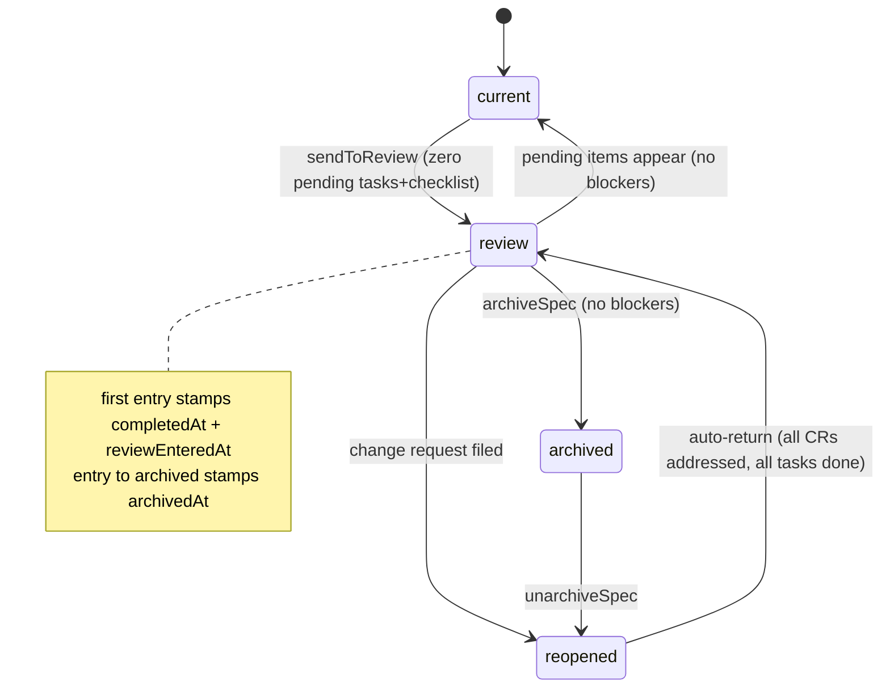
```mermaid
stateDiagram-v2
    [*] --> current
    current --> review: sendToReview (zero pending tasks+checklist)
    review --> archived: archiveSpec (no blockers)
    review --> reopened: change request filed
    review --> current: pending items appear (no blockers)
    reopened --> review: auto-return (all CRs addressed, all tasks done)
    archived --> reopened: unarchiveSpec
    note right of review
      first entry stamps completedAt + reviewEnteredAt
      entry to archived stamps archivedAt
    end note
```
- **Gates:** send-to-review (R-SP-2), archive (R-SP-5), forced exit on new pending items (R-SP-6), auto-return (R-SP-7).

### 13. Change-request status 🟢
`ChangeRequestStatus` — `spec/review-flow/types.ts:20`.

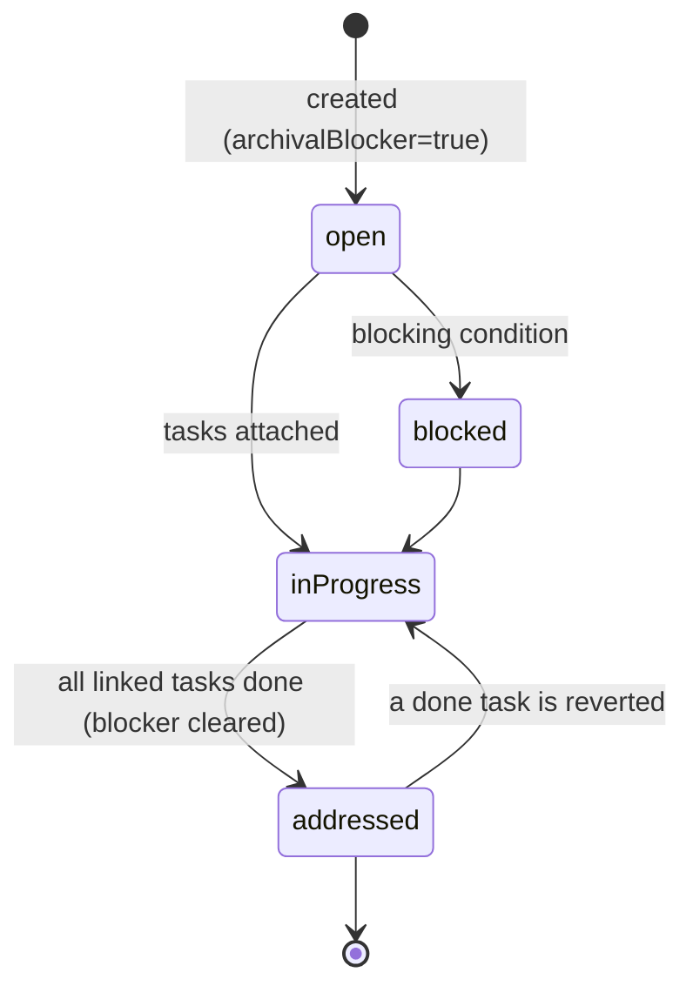
```mermaid
stateDiagram-v2
    [*] --> open: created (archivalBlocker=true)
    open --> inProgress: tasks attached
    open --> blocked: blocking condition
    blocked --> inProgress
    inProgress --> addressed: all linked tasks done (blocker cleared)
    addressed --> inProgress: a done task is reverted
    addressed --> [*]
```

### 14. Task-link status 🟢
`TaskLinkStatus` — `spec/review-flow/types.ts:29`.

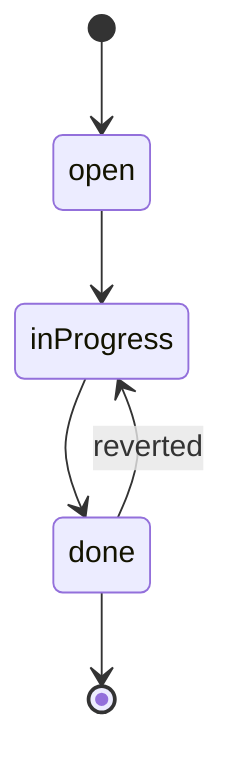
```mermaid
stateDiagram-v2
    [*] --> open
    open --> inProgress
    inProgress --> done
    done --> inProgress: reverted
    done --> [*]
```

---

## D. Orchestration / Tasks

### 15. Task execution state 🟢
`ExecutionState` — `tasks/task-model.ts:5`. Seeded by the provider from parse status; consumed by the autonomous loop and Kanban (6 columns).

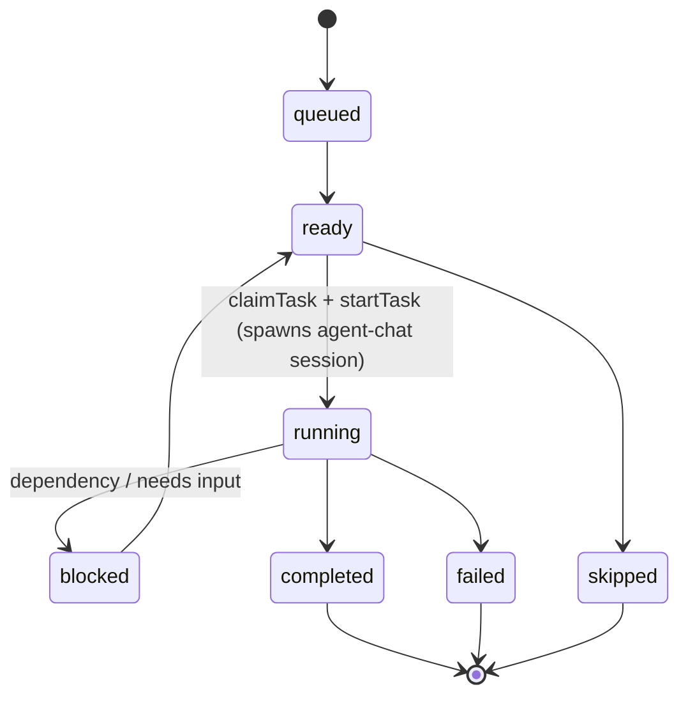
```mermaid
stateDiagram-v2
    [*] --> queued
    queued --> ready
    ready --> running: claimTask + startTask (spawns agent-chat session)
    running --> blocked: dependency / needs input
    blocked --> ready
    running --> completed
    running --> failed
    ready --> skipped
    completed --> [*]
    failed --> [*]
    skipped --> [*]
```
- **Rules:** `claimTask` rejects already-running/completed and a second concurrent task unless `parallelizable`; `startTask` only proceeds from `queued` (R-OR-3). Terminal ⇒ fires `task-completed`/`task-failed` hook trigger (R-OR-4).
- > 🔴 The `running → completed/failed` sync is heuristic (see `domain.md` §5.2).

### 20. Orchestration bucket 🟢
`OrchestrationSessionBucket` — a projection (not a stored FSM). Every session maps to exactly one bucket; sort rank active(0) → waiting(1) → completed(2) → failed(3).

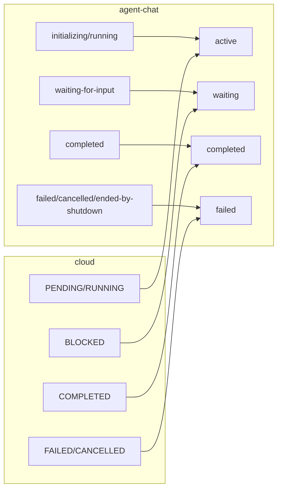
```mermaid
flowchart LR
    subgraph agent-chat
      i[initializing/running] --> active
      w[waiting-for-input] --> waiting
      c1[completed] --> completed
      f1[failed/cancelled/ended-by-shutdown] --> failed
    end
    subgraph cloud
      p[PENDING/RUNNING] --> active
      b[BLOCKED] --> waiting
      c2[COMPLETED] --> completed
      f2[FAILED/CANCELLED] --> failed
    end
```

---

## E. Automation (`hooks`)

### 16. Hook execution pipeline 🟢
A linear pipeline guarded by chain-depth (`MAX_CHAIN_DEPTH=10`) and a circular-dependency set (R-HK-3).

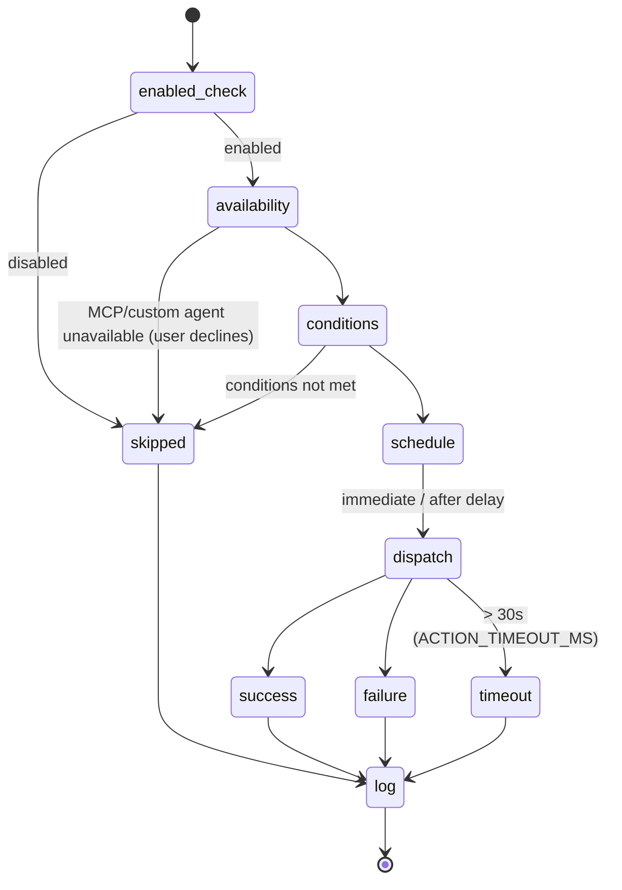
```mermaid
stateDiagram-v2
    [*] --> enabled_check
    enabled_check --> skipped: disabled
    enabled_check --> availability: enabled
    availability --> skipped: MCP/custom agent unavailable (user declines)
    availability --> conditions
    conditions --> skipped: conditions not met
    conditions --> schedule
    schedule --> dispatch: immediate / after delay
    dispatch --> success
    dispatch --> failure
    dispatch --> timeout: > 30s (ACTION_TIMEOUT_MS)
    success --> log
    failure --> log
    timeout --> log
    skipped --> log
    log --> [*]
```

### 17. ACP action lifecycle 🟢
`ACPExecutionState` — `hooks/types.ts:268` (subprocess JSON-RPC session).

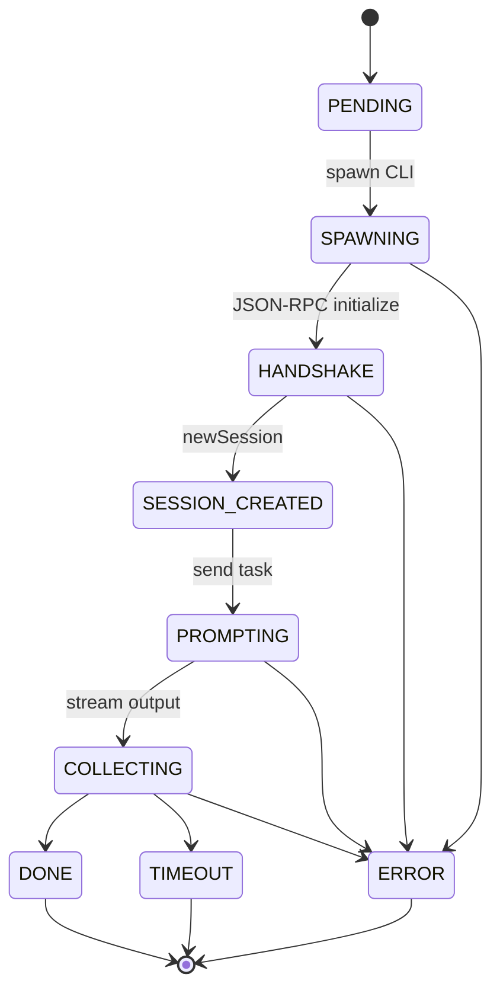
```mermaid
stateDiagram-v2
    [*] --> PENDING
    PENDING --> SPAWNING: spawn CLI
    SPAWNING --> HANDSHAKE: JSON-RPC initialize
    HANDSHAKE --> SESSION_CREATED: newSession
    SESSION_CREATED --> PROMPTING: send task
    PROMPTING --> COLLECTING: stream output
    COLLECTING --> DONE
    SPAWNING --> ERROR
    HANDSHAKE --> ERROR
    PROMPTING --> ERROR
    COLLECTING --> TIMEOUT
    COLLECTING --> ERROR
    DONE --> [*]
    TIMEOUT --> [*]
    ERROR --> [*]
```

---

## F. ACP Runtime (`services/acp`)

### 18. ACP client lifecycle 🟢 (`flowcharts/services.md`)
One `AcpClient` per `(providerId, cwd)`. `ensureStarted` coalesces concurrent starts; process exit/error rejects all pending waiters.

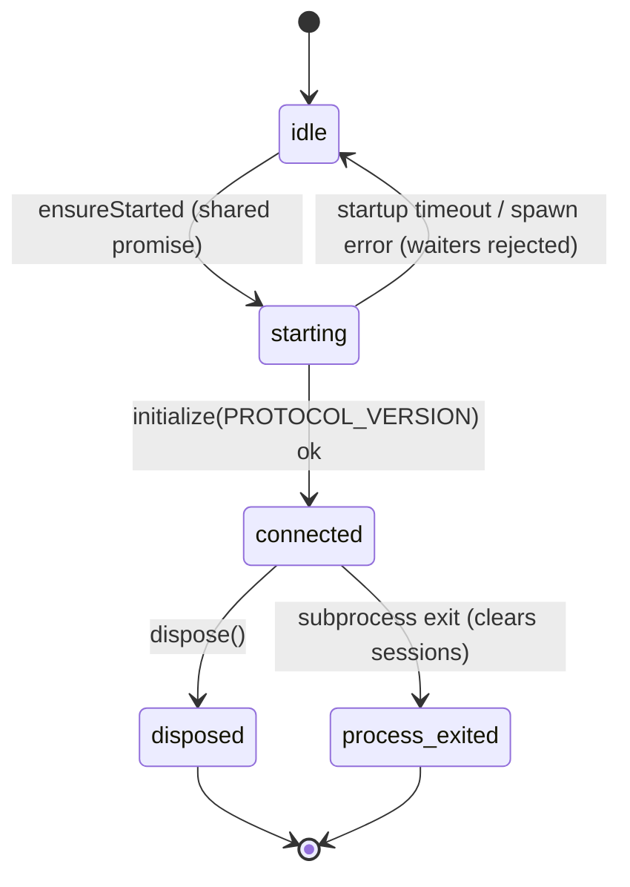
```mermaid
stateDiagram-v2
    [*] --> idle
    idle --> starting: ensureStarted (shared promise)
    starting --> connected: initialize(PROTOCOL_VERSION) ok
    starting --> idle: startup timeout / spawn error (waiters rejected)
    connected --> disposed: dispose()
    connected --> process_exited: subprocess exit (clears sessions)
    disposed --> [*]
    process_exited --> [*]
```

### 19. Tool-call permission resolution 🟢 (summary — see `permissions.md`)
```mermaid
stateDiagram-v2
    [*] --> evaluate
    evaluate --> allow: mode = allow
    evaluate --> deny: mode = deny
    evaluate --> remembered: mode = ask, has memo for ToolKind
    remembered --> allow: allow_always
    remembered --> deny: reject_always
    evaluate --> prompt: mode = ask, no memo
    prompt --> allow
    prompt --> deny
    prompt --> allow: + remember allow_always
    prompt --> deny: + remember reject_always
```

---

## G. Webview state machines

### 21. Preview form lifecycle 🟢
`form-store.ts` — read-only mode blocks all transitions.

```mermaid
stateDiagram-v2
    [*] --> empty
    empty --> initialized: load fields
    initialized --> dirty: updateField
    dirty --> dirty: more edits
    dirty --> submitting: submit (validateAll, >=1 dirty)
    submitting --> submitted: host result ok
    submitting --> dirty: validation/host error
    submitted --> empty: reset
```

### 22. Welcome store lifecycle 🟢
`welcome-store.ts` (Zustand).

```mermaid
stateDiagram-v2
    [*] --> uninitialized
    uninitialized --> loading: initialize()
    loading --> ready: setState
    loading --> errored: setError
    ready --> uninitialized: reset
    errored --> uninitialized: reset
```

---

## Cross-machine invariants

- **INV-1** Every "session-like" entity has an **absorbing terminal set**; the system never resurrects a terminal session (agent-chat R-AC-1, cloud, devin). 🟢
- **INV-2** **Status detail overrides base status** wherever a remote API reports both (Devin `statusDetail` > `status`). 🟢
- **INV-3** **Terminal normalization** is applied uniformly: terminal sessions reconcile their child tasks and PR state rather than leaving them stale (cloud R-CD-6, devin task freeze). 🟢
- **INV-4** **Spec status is the only non-absorbing lifecycle** — `archived` is reversible to `reopened` by design (R-SP-5). 🟢
- **INV-5** **Mode/model/target changes are deferred** to the next turn and audited (R-AC-8). 🟢
- **INV-6** 🔴 The autonomous-loop task FSM is the least mature: its terminal sync checks a non-existent `"error"` lifecycle state — see `domain.md` §5.2.
