# UI Navigation Flow — gatomia-vscode

> Produced by the Reversa Visor on 2026-05-29.
> Confidence: 🟢 view structure CONFIRMED from screenshot + `package.json`; 🟡 action targets INFERRED from view ids and module behavior.
> Scope: navigation that originates from the **GatomIA** activity-bar sidebar (the captured surface). Webview-internal flows will be added when those screenshots are provided.

```mermaid
flowchart TD
    AB["Activity Bar icon: GatomIA"] --> SIDEBAR["GatomIA sidebar (container 'gatomia')"]

    SIDEBAR --> SPECS["Specs view<br/>(specExplorer)"]
    SIDEBAR --> ACTIONS["Actions view<br/>(actionsExplorer)"]
    SIDEBAR --> STEER["Steering view<br/>(steeringExplorer)"]
    SIDEBAR --> WIKI["Repo Wiki view<br/>(wikiExplorer)"]
    SIDEBAR --> RUN["Running Agents view<br/>(runningAgents)"]
    SIDEBAR --> CLOUD["Cloud Agents view<br/>(cloudAgents)"]
    SIDEBAR --> HOOKS["Hooks view<br/>(hooksExplorer)"]
    SIDEBAR --> QA["Quick Access view<br/>(overview)"]
    SIDEBAR --> ORCH["Orchestration view<br/>(orchestration / MAESTRO)"]

    %% Specs
    SPECS --> SPECITEM["Spec / Plan / Research / Data Model / Quickstart"]
    SPECITEM --> DOCPREV["Document Preview panel<br/>(webview-preview, render + Edit mode)"]
    DOCPREV --> VIEWMODE["View-mode toggle: Preview / Source / Edit"]
    DOCPREV --> UPDATE["Update (refresh render)"]
    SPECITEM -.review.-> SPECREVIEW["Spec review-flow webview<br/>(webview-spec-explorer)"]
    SPECS --> TASKSNODE["Tasks node — per-task items"]
    TASKSNODE --> TASKDONE["done task (✅)"]
    TASKSNODE --> TASKWIP["in-progress task (e.g. T081)"]
    TASKWIP -->|"run (local)"| LOCALRUN["Execute task locally<br/>(orchestration/autonomous-task-loop)"]
    TASKWIP -->|"cloud (configured: Devin / Copilot)"| CLOUDDISPATCH["Execute task in cloud<br/>(commands/cloud-dispatch + cloud-agents)"]

    %% Actions
    ACTIONS --> SK["SpecKit (SDD engine):<br/>Prompts / Agents / Instructions / Scripts / Templates"]
    ACTIONS --> CAASSETS["Copilot coding-agent assets:<br/>Agents / Prompts / Skills / Scripts / Templates"]
    SK -.open/run.-> COPILOT["Copilot Chat prompt / SDD action"]
    CAASSETS -.invoke.-> COPILOT
    CAASSETS -.loaded by.-> AGENTSMOD["agents module<br/>(agent-loader, chat-participant-registry)"]

    %% Steering
    STEER --> RULES["Rules: copilot-instructions / constitution / AGENTS.md"]
    STEER --> CUSTINST["Custom Instructions (17 × .instructions.md)"]
    STEER --> USERINST["User Instructions (global copilot-instructions.md)"]
    RULES --> EDITOR["Open file in editor"]
    CUSTINST --> EDITOR
    USERINST -.consent-gated.-> CONSENT["Global-resource consent<br/>(steering/global-resource-consent, ADR-0013)"]
    USERINST --> EDITOR

    %% Repo Wiki
    WIKI --> WIKISYNC["Synchronize (regenerate via codewiki_analyzer.py)"]
    WIKI --> WIKIFLAT["Flat docs (docs/*.md)"]
    WIKI --> WIKIARCH["Architecture docs (docs/architecture/&lt;category&gt;/)"]
    WIKIFLAT -.preview.-> DOCPREV
    WIKIARCH -.preview.-> DOCPREV

    %% Running Agents + Agent Chat
    RUN --> NEWSESSION["+ New agent session…"]
    NEWSESSION --> COMPOSER["Agent Chat composer: pick ACP agent + describe task<br/>(webview-agent-chat / inputbar-composer-gating)"]
    COMPOSER --> CHATPANEL["Agent Chat transcript<br/>(webview-agent-chat / message-reducer-routing)"]
    RUN --> ACTIVE["Active (running)"]
    RUN --> RECENT["Recent (finished)"]
    RUN --> ORPHAN["Orphaned worktrees (lost)"]
    ACTIVE --> CHATPANEL
    RECENT --> CHATPANEL
    ORPHAN -.cleanup.-> WORKTREE["Worktree cleanup<br/>(agent-chat/worktree-lifecycle)"]
    CHATPANEL -.drives.-> ACPSESSION["ACP session: tool calls + agent messages<br/>(agent-chat/start-and-run-session)"]

    %% Cloud Agents
    CLOUD --> CLOUDEMPTY["Empty: 'No sessions' (Devin)"]
    CLOUD --> CLOUDSESSION["Running session (e.g. T040)"]
    CLOUDSESSION --> CLOUDPR["PR: 001-observability-stack (open)"]
    CLOUDSESSION --> OPENPROVIDER["Open in Provider"]
    OPENPROVIDER -.external.-> DEVINCLOUD["Devin Cloud session (external UI):<br/>execution log + requirements preview"]
    CLOUDSESSION -.progress.-> CLOUDPROGRESS["Cloud Agent Progress<br/>(panels/cloud-agent-progress-panel)"]

    %% Hooks
    HOOKS --> HOOKEMPTY["Empty: 'No hooks configured yet'"]
    HOOKS --> HOOKGROUPS["Populated: grouped by action type<br/>(Agent Commands / Git Operations / GitHub Tools / Custom Agents / Custom Tools)"]
    HOOKEMPTY --> ADDHOOK["Add Hook"]
    ADDHOOK --> HOOKFORM["Hooks form (webview-hooks-view):<br/>Trigger + Action + variable picker"]
    HOOKGROUPS --> HOOKFORM
    HOOKFORM --> ACTIONTYPES["Action types: Agent Command / Git Operation / Custom Agent / ACP Agent / GitHub Tools / Custom Tools"]
    HOOKFORM --> EXECLOGS["Execution Logs"]
    HOOKEMPTY --> IMPORTHOOK["Import Hooks"]

    %% Quick Access + Welcome
    QA --> SELAGENT["Select Spec Agent (QuickPick)"]
    QA --> INSTALL["Install Dependencies"]
    QA --> SETTINGS["Open Settings"]
    QA --> MCP["Open MCP Config"]
    QA --> HELP["Help (Resources)"]
    QA -.full version.-> WELCOME["Welcome to GatomIA webview<br/>(webview-welcome): Setup / Features / Configuration / Status / Learn"]
    WELCOME -.mirrors.-> CMDS["Contributed gatomia.* commands"]

    %% Orchestration (MAESTRO)
    ORCH --> BOARD["MAESTRO board<br/>(webview-orchestration / orchestration-lanes)"]
    BOARD --> LANES["Lanes: Running / Blocked / Ready"]
    BOARD --> BGROUP["Grouped by space / feature"]
    BOARD --> SESSIONDETAIL["Session detail (transcript)"]
    LANES -.aggregates.-> READMODEL["orchestration read-model<br/>(aggregate-snapshot: agent-chat + cloud-agents + tasks)"]
    ORCH -.sibling.-> COMPOSER2["Workflow Composer / React Flow<br/>(webview-orchestration/workflow-composer)"]
```

## Entry & exit points
- **Entry:** the GatomIA activity-bar icon opens the sidebar; each view is an independent collapsible section.
- **Primary exits to webviews:** Agent Chat panel (Running Agents), Hooks form (Hooks → Add Hook), Document Preview (Repo Wiki), Spec review-flow (Specs). 🟡
- **Primary exits to editor/host:** opening spec/steering/wiki markdown files; Quick Access → Settings / MCP config / terminal install. 🟡

## Notes
- Solid arrows = directly evidenced from the screenshot (view → visible items). Dashed arrows = inferred targets (the webview/panel a control opens), cross-referenced with `spec-impact-matrix.md` §1 (providers → features) and the module specs.
- Orchestration (MAESTRO) and the auxiliary-bar Agent Chat container are not in this capture and are omitted from the flow until captured.
