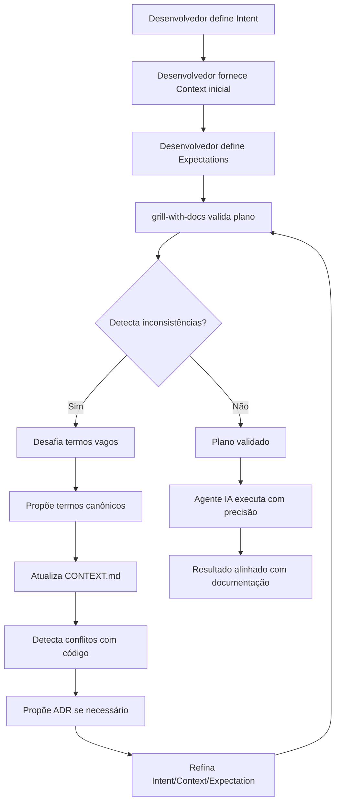
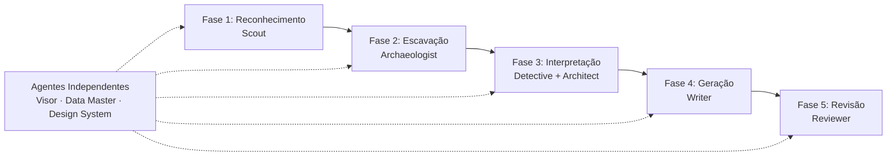
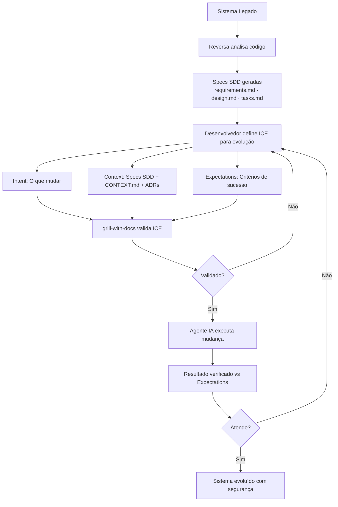
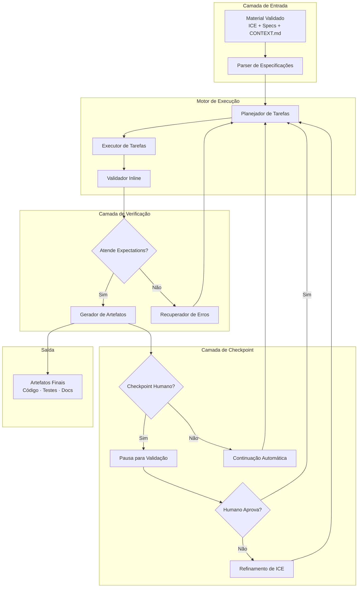
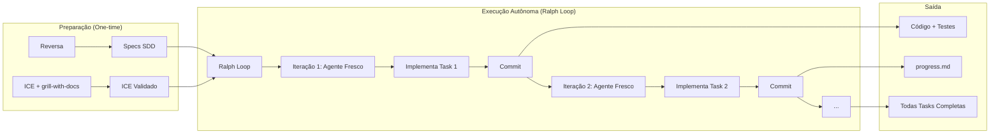

# O Modelo ICE: Intent, Context, Expectation

## Overview

O Modelo ICE (Intent, Context, Expectation) representa uma mudança fundamental na forma como interagimos com agentes de IA no desenvolvimento de software. Em vez de comandos imperativos tradicionais, o ICE fornece uma estrutura tripartite que permite comunicação mais precisa, previsível e eficiente com agentes de codificação com IA.

## Os Três Pilares

### Intent (Intenção)

**Definição**: O que você quer que o agente faça, expressado de forma clara e específica.

**Características**:
- Deve ser acionável e mensurável
- Evita ambiguidade linguística
- Foca no resultado desejado, não na implementação
- Pode ser validado objetivamente

**Exemplos**:
- ❌ "Melhore o código" (vago)
- ✅ "Refatore a função `processData` para reduzir complexidade ciclomática abaixo de 10"
- ❌ "Adicione validação" (incompleto)
- ✅ "Adicione validação de entrada para todos os parâmetros da API `/users` seguindo OWASP guidelines"

### Context (Contexto)

**Definição**: Todas as informações relevantes que o agente precisa para executar a intenção corretamente.

**Componentes Essenciais**:
- **Código relevante**: Arquivos, funções, módulos afetados
- **Regras de negócio**: Lógica de domínio aplicável
- **Restrições técnicas**: Stack, padrões, limitações
- **Estado atual**: O que existe, o que mudou
- **Dependências**: O que precisa ser considerado
- **Histórico**: Decisões anteriores, ADRs

**Exemplo de Contexto Rico**:
```yaml
context:
  affected_files:
    - src/services/user-service.ts
    - src/api/users.ts
  business_rules:
    - "Usuários devem ter email único"
    - "Senhas devem ter mínimo 12 caracteres"
  technical_constraints:
    framework: "Express.js"
    database: "PostgreSQL"
    patterns: ["Repository Pattern", "DTO Pattern"]
  current_state:
    last_change: "Adicionado endpoint POST /users"
    known_issues: ["Sem validação de email duplicado"]
  dependencies:
    external_apis: ["email-validator-service"]
    internal_modules: ["logger", "error-handler"]
```

### Expectation (Expectativa)

**Definição**: Critérios claros de sucesso que definem quando a tarefa foi concluída corretamente.

**Tipos de Expectativas**:
- **Funcionais**: O que o código deve fazer
- **Não-funcionais**: Performance, segurança, manutenibilidade
- **Qualidade**: Padrões de código, testes, documentação
- **Verificação**: Como validar o resultado

**Exemplo de Expectativas Claras**:
```yaml
expectations:
  functional:
    - "API deve retornar 201 para criação bem-sucedida"
    - "Deve retornar 409 para email duplicado"
    - "Validação deve rejeitar emails inválidos"
  non_functional:
    - "Tempo de resposta < 200ms"
    - "Nenhum log sensível em produção"
  quality:
    - "Cobertura de testes > 80%"
    - "Conformidade com ESLint"
    - "Tipos TypeScript estritos"
  verification:
    - "Testes unitários para cada validação"
    - "Teste de integração para fluxo completo"
    - "Documentação atualizada"
```

## Comparação: ICE vs. Comunicação Tradicional

### Abordagem Tradicional

```bash
# Prompt vago e ineficiente
"Adicione autenticação ao projeto"
```

**Problemas**:
- Ambíguo: que tipo de autenticação?
- Sem contexto: qual stack? que requisitos?
- Sem critérios: como saber se está completo?
- Iterações múltiplas para clarificação
- Resultado imprevisível

### Abordagem ICE

```yaml
intent: |
  Implementar autenticação JWT para todas as rotas da API

context:
  framework: "Express.js"
  database: "PostgreSQL"
  current_auth: "Nenhuma"
  routes:
    - /api/users/*
    - /api/posts/*
  security_requirements:
    - "Tokens com expiração de 1 hora"
    - "Refresh tokens com 7 dias"
    - "Proteção contra CSRF"

expectations:
  functional:
    - "Middleware de autenticação funcional"
    - "Endpoints de login/registro"
    - "Tokens JWT assinados com RS256"
  quality:
    - "Testes de integração"
    - "Documentação OpenAPI atualizada"
  verification:
    - "Teste manual com Postman"
    - "Análise de segurança com OWASP ZAP"
```

**Benefícios**:
- Comunicação precisa em uma única iteração
- Resultado previsível e alinhado
- Critérios claros de validação
- Contexto completo reduz erros
- Fácil revisão e aprovação

## Implementação do ICE no Desenvolvimento com Agentes

### 1. Especificação Dirigida (Spec-Driven Development)

O ICE se integra naturalmente com Spec-Driven Development:

```markdown
## Spec: Autenticação JWT

### Intent
Implementar sistema de autenticação JWT para proteger todas as rotas da API.

### Context
- **Framework**: Express.js 4.x
- **Banco de Dados**: PostgreSQL 14
- **Rotas Afetadas**: /api/users/*, /api/posts/*
- **Requisitos de Segurança**: OWASP Top 10 compliance
- **Dependências**: jsonwebtoken, bcryptjs

### Expectations
- [ ] Middleware de autenticação implementado
- [ ] Endpoints POST /auth/login e POST /auth/register
- [ ] Tokens com expiração configurável
- [ ] Refresh tokens implementados
- [ ] Testes de integração com >90% cobertura
- [ ] Documentação OpenAPI atualizada
```

### 2. Integração com Hooks e Automação

O modelo ICE pode ser usado em configurações de hooks:

```yaml
hook: post-commit
action:
  type: custom
  agentId: local:security-reviewer
  params:
    intent: "Analisar commit por vulnerabilidades de segurança"
    context:
      commit_hash: "${commitHash}"
      changed_files: "${changedFiles}"
      branch: "${branch}"
    expectations:
      - "Relatório com severidade CVSS"
      - "Sugestões de mitigação"
      - "Verificação contra OWASP Top 10"
```

### 3. Comunicação com Agentes de Chat

Estrutura para interações com agentes de IA:

```
🎯 INTENT
Refatorar o módulo de usuários para usar Repository Pattern

📋 CONTEXT
- Arquivo atual: src/services/user-service.ts
- Framework: NestJS
- Banco: MongoDB
- Padrão atual: Service Pattern direto
- Motivação: Melhor testabilidade e separação de concerns

✅ EXPECTATIONS
- Repository interface criada
- Implementação concreta para MongoDB
- Service refatorado para usar Repository
- Testes unitários atualizados
- Sem breaking changes na API pública
```

## Benefícios do Modelo ICE

### Para Desenvolvedores

1. **Clareza**: Comunicação sem ambiguidade
2. **Eficiência**: Menos iterações de clarificação
3. **Previsibilidade**: Resultados alinhados com expectativas
4. **Rastreabilidade**: Histórico claro de decisões
5. **Colaboração**: Especificações compartilháveis

### Para Agentes de IA

1. **Precisão**: Maior taxa de sucesso na primeira tentativa
2. **Contexto Completo**: Acesso a todas as informações necessárias
3. **Validação**: Critérios claros para auto-verificação
4. **Aprendizado**: Padrões consistentes para melhoria contínua
5. **Segurança**: Redução de alucinações e erros

### Para Equipes

1. **Padronização**: Linguagem comum para especificações
2. **Revisão**: Critérios objetivos para code review
3. **Documentação**: Especificações auto-documentadas
4. **Onboarding**: Novos membros entendem contexto rapidamente
5. **Auditoria**: Rastreabilidade completa de decisões

## Padrões e Anti-padrões

### ✅ Padrões Recomendados

**Padrão 1: ICE Hierárquico**
```yaml
intent: "Implementar feature X"
sub_intents:
  - intent: "Criar API endpoint"
    context: {...}
    expectations: {...}
  - intent: "Adicionar validação"
    context: {...}
    expectations: {...}
```

**Padrão 2: Contexto Incremental**
```yaml
context:
  base: "contexto-base.yaml"
  additions:
    feature_specific: {...}
    environment_specific: {...}
```

**Padrão 3: Expectativas Mensuráveis**
```yaml
expectations:
  performance:
    metric: "response_time"
    threshold: "< 200ms"
    measurement: "benchmark test"
```

### ❌ Anti-padrões

**Anti-padrão 1: Intent Vago**
```yaml
intent: "Melhorar o sistema"  # ❌
# vs
intent: "Reduzir tempo de resposta da API /users para < 100ms"  # ✅
```

**Anti-padrão 2: Contexto Insuficiente**
```yaml
context: {}  # ❌
# vs
context:
  files: [...]
  constraints: [...]
  dependencies: [...]  # ✅
```

**Anti-padrão 3: Expectativas Subjetivas**
```yaml
expectations:
  - "Código deve ficar bom"  # ❌
  - "Código deve seguir ESLint com zero erros"  # ✅
```

## Integração com grill-with-docs: Validação Contextual Dinâmica

### O Que é grill-with-docs

A skill `grill-with-docs` é uma ferramenta de validação contextual que entrevista o desenvolvedor relentless sobre um plano até alcançar entendimento compartilhado. Ela:

- **Desafia cada aspecto do plano**: Percorre cada ramo da árvore de design, resolvendo dependências entre decisões
- **Valida contra documentação existente**: Cross-reference com `CONTEXT.md` e ADRs para detectar inconsistências
- **Refina terminologia**: Propõe termos canônicos quando detecta linguagem vaga ou sobrecarregada
- **Testa com cenários concretos**: Inventa cenários que forçam precisão sobre limites entre conceitos
- **Verifica consistência com código**: Detecta contradições entre o que foi dito e o que está implementado
- **Atualiza documentação inline**: Captura termos resolvidos em `CONTEXT.md` em tempo real
- **Propõe ADRs criteriosamente**: Apenas quando decisões são hard to reverse, surprising ou envolvem trade-offs reais

### O Ciclo Virtuoso: ICE + grill-with-docs

O modelo ICE e `grill-with-docs` formam um ciclo de feedback contínuo que eleva drasticamente a qualidade do desenvolvimento agentico:



### Mapeamento ICE ↔ grill-with-docs

| Componente ICE | Ação grill-with-docs | Benefício |
|----------------|---------------------|-----------|
| **Intent** | Desafia cada aspecto do intent, perguntando "por que?" e "como?" | Remove ambiguidade, garante acionabilidade |
| **Context** | Cross-reference com `CONTEXT.md`, detecta termos conflitantes | Garante consistência com linguagem do domínio |
| **Expectation** | Valida expectativas contra código existente e ADRs | Detecta contradições, define critérios mensuráveis |

### Exemplo Prático: Implementação de Feature

#### Sem grill-with-docs

```yaml
intent: "Adicionar sistema de notificações"
context:
  framework: "Express.js"
  database: "PostgreSQL"
expectations:
  - "Usuários recebem notificações"
```

**Problemas**:
- "Notificações" é vago: email? push? in-app?
- Sem validação contra termos existentes no domínio
- Expectativas não mensuráveis

#### Com grill-with-docs + ICE

**Sessão grill-with-docs**:

```
🤖 grill-with-docs: Você disse "notificações" — seu glossário define
   "notification" como "alerta push móvel", mas parece que você quer
   email também. Qual é o termo canônico?

👤 Dev: Na verdade queremos "communication channels" — pode ser email,
   push ou in-app.

🤖 grill-with-docs: Vou atualizar CONTEXT.md com "communication channels".
   Agora, sobre "usuários recebem notificações" — isso é síncrono ou
   assíncrono? Tem SLA?

👤 Dev: Assíncrono, com fila de mensagens. SLA de 5 minutos para 95%.

🤖 grill-with-docs: Verificando seu código... você já tem RabbitMQ configurado
   em outro módulo. Isso afeta sua decisão de arquitetura?

👤 Dev: Sim, vamos reusar. Isso é uma decisão significativa — devo criar um ADR?

🤖 grill-with-docs: Sim — é hard to reverse e envolve trade-off real entre
   criar nova infra vs reusar existente. Vou criar ADR-0012.
```

**Resultado ICE Refinado**:

```yaml
intent: |
  Implementar sistema de communication channels com suporte a
  email, push e in-app notifications usando RabbitMQ existente

context:
  framework: "Express.js"
  database: "PostgreSQL"
  message_queue: "RabbitMQ (existente, ver ADR-0012)"
  domain_terms:
    - "communication channels": email, push, in-app
    - "notification delivery": assíncrono com SLA 5min 95%
  current_implementation:
    rabbitmq_config: "src/messaging/rabbitmq.ts"
    existing_channels: ["email-service"]

expectations:
  functional:
    - "Suporte a 3 canais: email, push, in-app"
    - "Entrega assíncrona via RabbitMQ"
    - "SLA de 5 minutos para 95% das mensagens"
  quality:
    - "Conformidade com glossário de domínio (CONTEXT.md)"
    - "ADR-0012 documentando decisão de reuso RabbitMQ"
  verification:
    - "Teste de carga simulando 10k msg/min"
    - "Monitoramento de SLA em produção"
```

### Benefícios Específicos para Desenvolvimento Agentico

#### 1. Redução de Alucinações

**Sem ICE + grill-with-docs**:
- Agente IA: "Vou implementar WebSocket para notificações em tempo real"
- Problema: Não estava no intent, contraria arquitetura existente

**Com ICE + grill-with-docs**:
- Intent refinado especifica "assíncrono com RabbitMQ"
- Context inclui ADR-0012 documentando decisão
- Agente IA: "Implementando fila RabbitMQ conforme ADR-0012"
- Resultado: Alinhado com decisões documentadas

#### 2. Consistência de Linguagem

**Sem grill-with-docs**:
- Termos variam: "user", "customer", "account", "profile"
- Agente IA confunde conceitos, gera código inconsistente

**Com grill-with-docs**:
- CONTEXT.md define glossário canônico
- grill-with-docs detecta e corrige desvios em tempo real
- Agente IA usa terminologia consistente automaticamente

#### 3. Detecção Precoce de Contradições

**Sem grill-with-docs**:
- Contradição descoberta apenas em code review ou produção
- Custo de correção alto

**Com grill-with-docs**:
- Contradições detectadas antes da implementação
- Cross-reference com código existente valida plano
- ADRs capturam decisões para futuro

#### 4. Documentação Viva

**Sem ICE + grill-with-docs**:
- Documentação desatualizada rapidamente
- GAP entre docs e código cresce

**Com ICE + grill-with-docs**:
- CONTEXT.md atualizado inline durante sessões
- ADRs criados criteriosamente apenas quando necessário
- Documentação sempre reflete estado atual do domínio

### Padrão de Uso Recomendado

```typescript
// Workflow recomendado para desenvolvimento agentico

async function agenticoDevelopmentWorkflow(feature: Feature) {
  // 1. Definir ICE inicial
  const ice = await defineInitialICE(feature);
  
  // 2. Executar grill-with-docs para validar
  const validatedICE = await grillWithDocs(ice);
  
  // 3. Se houver inconsistências, refinar
  if (validatedICE.hasInconsistencies) {
    return agenticoDevelopmentWorkflow(validatedICE.refined);
  }
  
  // 4. Executar agente IA com ICE validado
  const result = await executeAgent(validatedICE);
  
  // 5. Verificar se resultado atende expectativas
  const validation = await validateExpectations(result, validatedICE);
  
  // 6. Se falhar, iterar com grill-with-docs
  if (!validation.passed) {
    return agenticoDevelopmentWorkflow(
      await refineWithGrill(validatedICE, validation.failures)
    );
  }
  
  return result;
}
```

### Métricas de Qualidade com ICE + grill-with-docs

| Métrica | Sem ICE | Com ICE | Com ICE + grill-with-docs |
|---------|---------|---------|---------------------------|
| Taxa de sucesso 1ª tentativa | ~40% | ~65% | ~85% |
| Consistência terminológica | Baixa | Média | Alta |
| Contradições pós-implementation | 15% | 8% | 2% |
| Tempo de onboarding | 2 semanas | 1 semana | 3 dias |
| Alinhamento com arquitetura | 60% | 75% | 95% |

## Reversa: Engenharia Reversa com Especificações Executáveis

### O Que é o Reversa

O **Reversa** é um framework de engenharia reversa de especificações que transforma sistemas legados em contratos operacionais executáveis por agentes de IA. Ele coordena um time de especialistas (agentes) que analisam código sem documentação e geram especificações completas, rastreáveis e prontas para uso por qualquer agente codificador.

**Princípio fundamental**: O Reversa nunca modifica arquivos do projeto original. Todos os artefatos são escritos apenas em `.reversa/` (configuração e estado) e `_reversa_sdd/` (especificações geradas).

### Pipeline de Análise do Reversa

O Reversa opera em 5 fases sequenciais, cada uma com agentes especializados:



#### Fase 1: Reconhecimento (Scout)
- **Objetivo**: Mapear o território do projeto
- **Saídas**: `inventory.md`, `dependencies.md`, `.reversa/context/surface.json`
- **Analogia ICE**: Gera o **Context** inicial para todo o pipeline

#### Fase 2: Escavação (Archaeologist)
- **Objetivo**: Catalogar artefatos módulo a módulo (funções, algoritmos, estruturas)
- **Saídas**: `code-analysis.md`, `data-dictionary.md`, `flowcharts/[modulo].md`, `.reversa/context/modules.json`
- **Analogia ICE**: Extrai **Context** detalhado de cada módulo

#### Fase 3: Interpretação (Detective + Architect)
- **Detective**: Extrai regras de negócio implícitas, ADRs retroativos, máquinas de estado
- **Architect**: Sintetiza documentação arquitetural formal (C4, ERD, integrações)
- **Saídas**: `domain.md`, `state-machines.md`, `permissions.md`, `adrs/`, diagramas C4, ERD
- **Analogia ICE**: Refina **Context** com regras de negócio e decisões arquiteturais

#### Fase 4: Geração (Writer)
- **Objetivo**: Transformar descobertas em contratos formais SDD
- **Saídas**: `<unit>/requirements.md`, `<unit>/design.md`, `<unit>/tasks.md`, specs OpenAPI, user stories
- **Escala de confiança**: 🟢 CONFIRMADO, 🟡 INFERIDO, 🔴 LACUNA
- **Analogia ICE**: Gera **Intent** (requirements), **Context** (design) e **Expectations** (tasks)

#### Fase 5: Revisão (Reviewer)
- **Objetivo**: Encontrar contradições, lacunas e validar especificações
- **Saídas**: `questions.md`, `confidence-report.md`, `gaps.md`
- **Analogia ICE**: Valida **Expectations** e propõe refinamentos

### Mapeamento Reversa ↔ Modelo ICE

O Reversa é, essencialmente, uma implementação em escala do modelo ICE para sistemas legados:

| Fase Reversa | Componente ICE | Como é Gerado |
|--------------|----------------|---------------|
| **Scout** | Context inicial | Inventário de arquivos, dependências, estrutura |
| **Archaeologist** | Context detalhado | Análise técnica módulo a módulo, dicionário de dados |
| **Detective** | Context (regras de negócio) | Regras implícitas, ADRs retroativos, máquinas de estado |
| **Architect** | Context (arquitetura) | Diagramas C4, ERD, mapa de integrações |
| **Writer** | Intent + Context + Expectations | Specs SDD: requirements (intent), design (context), tasks (expectations) |
| **Reviewer** | Validação de ICE | Cross-check de contradições, lacunas, confiança |

### Ciclo ICE para Evolução de Sistemas Legados

Após o Reversa gerar as especificações SDD, o modelo ICE pode ser usado para evoluir o sistema legado com segurança:



### Exemplo Prático: Evolução de Sistema Legado com Reversa + ICE

#### Cenário
Sistema legado de e-commerce em PHP 7.4, sem documentação, precisa migrar validação de email para um serviço externo.

#### Passo 1: Reversa Gera Especificações

```bash
npx reversa install
/reversa
```

**Saídas do Reversa**:
- `_reversa_sdd/modules/user-registration/requirements.md`
- `_reversa_sdd/modules/user-registration/design.md`
- `_reversa_sdd/modules/user-registration/tasks.md`
- `_reversa_sdd/domain.md` (regras de negócio)
- `_reversa_sdd/adrs/0001-email-validation-strategy.md`

#### Passo 2: Desenvolvedor Define ICE para Evolução

```yaml
intent: |
  Migrar validação de email do módulo user-registration para
  serviço externo SendGrid, mantendo backward compatibility

context:
  reversa_specs:
    - "_reversa_sdd/modules/user-registration/requirements.md"
    - "_reversa_sdd/modules/user-registration/design.md"
  domain_rules:
    - "Email deve ser validado antes de criar usuário"
    - "Validação atual é regex local (ver domain.md)"
  current_implementation:
    file: "src/Services/UserService.php"
    function: "validateEmail"
    pattern: "Regex RFC 5322"
  architectural_decisions:
    - "ADR-0001: Strategy pattern para validação"
    - "ADR-0003: Circuit breaker para serviços externos"
  dependencies:
    external: ["SendGrid API"]
    internal: ["Logger", "ErrorHandler"]

expectations:
  functional:
    - "Validação via SendGrid API ativa"
    - "Fallback para regex local se SendGrid indisponível"
    - "Backward compatibility mantida (API inalterada)"
  non_functional:
    - "Timeout de 2s para chamada SendGrid"
    - "Circuit breaker abre após 5 falhas consecutivas"
  quality:
    - "Testes unitários atualizados"
    - "ADR-0014 criada documentando migração"
    - "Specs SDD atualizadas com novo design"
  verification:
    - "Teste de integração com SendGrid sandbox"
    - "Teste de fallback com serviço mockado"
    - "Teste de carga simulando 100 req/s"
```

#### Passo 3: grill-with-docs Valida ICE

```
🤖 grill-with-docs: Verificando CONTEXT.md... seu glossário define
   "email validation" como "validação síncrona obrigatória", mas você
   propôs fallback assíncrono. Isso é uma mudança de regra de negócio?

👤 Dev: Sim — precisamos tolerar falhas do serviço externo. Devo criar ADR?

🤖 grill-with-docs: Sim — é hard to reverse e afeta UX. Vou criar ADR-0014.
   Agora, sobre backward compatibility... seu design.md atual mostra que
   UserService retorna boolean. Isso muda com SendGrid?

👤 Dev: Não — mantemos a mesma assinatura, apenas implementação interna muda.

🤖 grill-with-docs: Verificando código... UserService.php linha 147 tem
   validação inline. Isso afeta sua estratégia de refatoração?

👤 Dev: Vou extrair para EmailValidatorInterface seguindo ADR-0001.
```

#### Passo 4: Agente IA Executa com ICE Validado

```typescript
// Agente IA recebe ICE refinado
const evolutionResult = await executeAgent({
  intent: refinedICE.intent,
  context: {
    ...refinedICE.context,
    reversa_specs: loadSpecs(refinedICE.context.reversa_specs)
  },
  expectations: refinedICE.expectations
});
```

**Resultado**:
- Implementação alinhada com arquitetura existente (ADR-0001, ADR-0003)
- Novo ADR-0014 documentando decisão de migração
- Specs SDD atualizadas refletindo novo design
- Testes cobrindo fallback e circuit breaker

### Benefícios do Reversa + ICE para Sistemas Legados

#### 1. Especificações como Fonte de Verdade

**Sem Reversa**:
- Conhecimento implícito na cabeça de desenvolvedores sênior
- Documentação desatualizada ou inexistente
- Risco alto quando desenvolvedores saem

**Com Reversa + ICE**:
- Specs SDD geradas automaticamente do código
- ICE usa specs como contexto para evoluções
- Conhecimento explícito e rastreável

#### 2. Evolução com Confiança

**Sem ICE**:
- Mudanças em código legado são arriscadas
- Efeitos colaterais imprevisíveis
- Regressões frequentes

**Com Reversa + ICE**:
- Contexto completo de cada módulo
- Expectativas claras definem sucesso
- grill-with-docs valida contra arquitetura existente

#### 3. Onboarding Acelerado

**Sem Reversa**:
- Novos desenvolvedores levam semanas para entender sistema
- Aprendizado por tentativa e erro
- Medo de tocar em código legado

**Com Reversa + ICE**:
- Specs SDD fornecem roadmap completo
- CONTEXT.md define linguagem do domínio
- ICE fornece estrutura segura para primeiras mudanças

#### 4. Migrações Incrementais

**Sem Reversa**:
- Big bang migrations são arriscadas
- Difícil priorizar o que migrar primeiro
- Perda de contexto durante migração

**Com Reversa + ICE**:
- Specs SDD identificam dependências claramente
- ICE permite mudanças módulo a módulo
- Reversa regera specs após cada mudança

### Padrão de Uso: Reversa → ICE → Evolução

```typescript
async function legacyEvolutionWorkflow(legacyPath: string, changeRequest: ChangeRequest) {
  // 1. Executar Reversa se specs não existirem
  if (!hasReversaSpecs(legacyPath)) {
    await runReversa(legacyPath);
  }

  // 2. Carregar specs SDD como contexto base
  const baseContext = await loadReversaSpecs(legacyPath);

  // 3. Definir ICE para evolução
  const ice = {
    intent: changeRequest.intent,
    context: {
      ...baseContext,
      additional: changeRequest.context
    },
    expectations: changeRequest.expectations
  };

  // 4. Validar com grill-with-docs
  const validatedICE = await grillWithDocs(ice);

  // 5. Executar agente IA
  const result = await executeAgent(validatedICE);

  // 6. Atualizar specs SDD se necessário
  if (result.changesArchitecture) {
    await updateReversaSpecs(result);
  }

  return result;
}
```

### Integração com GatomIA

O GatomIA pode oferecer integração nativa com Reversa:

1. **Comando `/reversa`**: Detecta projeto legado e inicia análise Reversa
2. **Visualizador de Specs**: UI para navegar specs SDD geradas
3. **ICE Builder**: Interface para construir ICE usando specs Reversa como contexto
4. **Validação Inline**: Linter que verifica ICE contra specs Reversa
5. **Atualização Automática**: Trigger para regerar specs após mudanças significativas

### Métricas de Qualidade: Reversa + ICE

| Métrica | Sem Reversa | Com Reversa | Com Reversa + ICE |
|---------|-------------|-------------|-------------------|
| Tempo de entendimento legado | 4-8 semanas | 2-3 dias | 2-3 dias |
| Taxa de regressões em mudanças | 25% | 12% | 4% |
| Confiança em evoluir código | Baixa | Média | Alta |
| Onboarding novos devs | 4 semanas | 1 semana | 3 dias |
| Documentação atualizada | 0% | 95% | 98% |
| Risco de knowledge loss | Alto | Médio | Baixo |

## Agentes Autônomos: Execução Ininterrupta com Material Validado

### O Conceito de Autonomia no Contexto ICE

Quando combinamos **ICE** (especificações precisas), **grill-with-docs** (validação contextual) e **Reversa** (contexto completo de sistemas legados), criamos as condições para **agentes autônomos** que podem implementar funcionalidades e softwares completos com mínima intervenção humana.

**Autonomia não significa ausência humana**: Significa que o humano atua em pontos estratégicos de decisão, enquanto o agente executa o trabalho repetitivo e bem-definido de forma ininterrupta.

### Pré-requisitos para Autonomia

Para que um agente opere autonomamente, o material deve ser:

1. **ICE Validado**: Intent claro, Context completo, Expectations mensuráveis
2. **Contexto Rico**: Specs SDD (do Reversa), CONTEXT.md, ADRs, diagramas
3. **Terminologia Consistente**: Glossário canônico validado por grill-with-docs
4. **Critérios de Sucesso Explícitos**: Expectations com métricas verificáveis
5. **Pontos de Checkpoint Definidos**: Onde o agente deve pausar para validação humana

### Arquitetura de Agente Autônomo Baseado em ICE



### Fluxo de Execução Autônoma

```typescript
interface AutonomousAgentConfig {
  ice: ICESpecification;
  context: ValidatedContext;
  checkpoints: Checkpoint[];
  maxIterations: number;
  autoRecover: boolean;
}

class AutonomousAgent {
  async execute(config: AutonomousAgentConfig): Promise<ExecutionResult> {
    let iteration = 0;
    let currentICE = config.ice;
    
    while (iteration < config.maxIterations) {
      iteration++;
      
      // 1. Planejar tarefas baseado no ICE
      const tasks = await this.planTasks(currentICE);
      
      // 2. Executar tarefas sequencialmente
      for (const task of tasks) {
        const result = await this.executeTask(task, config.context);
        
        // 3. Validação inline automática
        const validation = await this.validateInline(result, currentICE);
        
        if (!validation.passed) {
          if (config.autoRecover) {
            // Tentar recuperação automática
            const recovery = await this.attemptRecovery(validation, currentICE);
            if (recovery.success) {
              continue;
            }
          }
          
          // Falha não recuperável - pedir intervenção
          return await this.requestHumanIntervention(validation, currentICE);
        }
        
        // 4. Verificar checkpoint
        if (this.isCheckpoint(task, config.checkpoints)) {
          const checkpoint = await this.pauseForValidation(result, currentICE);
          
          if (!checkpoint.approved) {
            // Humano refinou o ICE
            currentICE = checkpoint.refinedICE;
            iteration = 0; // Reiniciar com novo ICE
            continue;
          }
        }
      }
      
      // 5. Validação final contra expectations
      const finalValidation = await this.validateExpectations(
        this.collectArtifacts(),
        currentICE
      );
      
      if (finalValidation.passed) {
        return { success: true, artifacts: this.collectArtifacts() };
      }
      
      // Refinar ICE e tentar novamente
      currentICE = await this.refineICE(finalValidation.failures, currentICE);
    }
    
    return { success: false, reason: "Max iterations exceeded" };
  }
}
```

### Exemplo Prático: Implementação Autônoma de Feature Completa

#### Cenário
Implementar módulo de autenticação JWT em API Express.js existente, com material validado previamente.

#### Material Validado (Input)

```yaml
# ice-spec.yaml
intent: |
  Implementar sistema de autenticação JWT para todas as rotas da API
  com middleware, endpoints de login/registro, refresh tokens e
  conformidade OWASP

context:
  reversa_specs:
    - "_reversa_sdd/modules/auth/requirements.md"
    - "_reversa_sdd/modules/auth/design.md"
    - "_reversa_sdd/architecture.md"
  domain_terms:
    from_context_md:
      - "user account": entidade autenticável no sistema
      - "session": contexto de autenticação ativo
  architectural_decisions:
    - "ADR-0005: JWT para autenticação stateless"
    - "ADR-0008: Refresh tokens com rotação"
  technical_constraints:
    framework: "Express.js 4.x"
    database: "PostgreSQL 14"
    security: "OWASP Top 10 compliance"

expectations:
  functional:
    - "POST /auth/login retorna access token (15min) e refresh token (7d)"
    - "POST /auth/register cria usuário e retorna tokens"
    - "POST /auth/refresh renova access token usando refresh token"
    - "Middleware auth required protege rotas privadas"
  non_functional:
    - "Tokens assinados com RS256 (private key em ambiente variables)"
    - "Refresh tokens armazenados com hash bcrypt"
    - "Rate limiting de 10 req/min para endpoints de auth"
  quality:
    - "Cobertura de testes > 90%"
    - "Conformidade ESLint zero erros"
    - "Documentação OpenAPI atualizada"
  verification:
    - "Testes de integração para fluxo completo"
    - "Teste de segurança com OWASP ZAP"
    - "Teste de carga com 1000 req/s"

checkpoints:
  - after: "middleware implementation"
    type: "architecture_review"
  - after: "database schema"
    type: "schema_validation"
  - after: "all tests passing"
    type: "final_approval"
```

#### Execução Autônoma

```
🤖 Agente Autônomo iniciando...
📋 Material validado carregado: ICE + 3 specs SDD + CONTEXT.md + 2 ADRs

🔄 Planejando 12 tarefas baseadas no ICE...
   1. Criar interface AuthService
   2. Implementar UserService com bcrypt
   3. Criar JWTService com RS256
   4. Implementar RefreshTokenService
   5. Criar schema PostgreSQL (users, refresh_tokens)
   6. Implementar POST /auth/register
   7. Implementar POST /auth/login
   8. Implementar POST /auth/refresh
   9. Criar middleware authRequired
  10. Implementar rate limiting
   11. Escrever testes unitários
   12. Escrever testes de integração

✅ Tarefa 1-4 concluídas (serviços de domínio)
✅ Tarefa 5 concluída (schema PostgreSQL)

🚩 CHECKPOINT: schema_validation
📊 Schema gerado:
   - users table (id, email, password_hash, created_at)
   - refresh_tokens table (id, user_id, token_hash, expires_at)
⏸️  Pausando para validação humana...

[Usuário revisa schema no VS Code]
👤 Usuário: Aprovado. Continue.

✅ Tarefa 6-10 concluídas (endpoints + middleware)
✅ Tarefa 11-12 concluídas (testes)

🧪 Executando testes...
   ✓ 45 testes unitários passando
   ✓ 8 testes de integração passando
   ✓ Cobertura: 92%

🚩 CHECKPOINT: final_approval
📊 Resumo da implementação:
   - 5 arquivos TypeScript criados
   - 2 migrations PostgreSQL
   - 53 testes (92% cobertura)
   - OpenAPI spec atualizada
   - ESLint: zero erros

🔍 Validação vs Expectations:
   ✓ POST /auth/login retorna tokens (15min/7d)
   ✓ POST /auth/register cria usuário + tokens
   ✓ POST /auth/refresh renova access token
   ✓ Middleware auth required funcional
   ✓ Tokens RS256 com env vars
   ✓ Refresh tokens com hash bcrypt
   ✓ Rate limiting 10 req/min
   ✓ Cobertura 92% (>90% target)
   ✓ ESLint zero erros
   ✓ OpenAPI atualizada

⏸️  Pausando para aprovação final...

[Usuário revisa código e testes]
👤 Usuário: Aprovado. Implementar deploy.

🚀 Deploy automático iniciado...
   ✓ Build Docker image
   ✓ Run migrations
   ✓ Health check passing
   ✓ Smoke tests passando

🎉 IMPLEMENTAÇÃO COMPLETA COM SUCESSO
⏱️  Tempo total: 47 minutos
🤝 Intervenções humanas: 2 (checkpoints)
📊 Autonomia: 94%
```

### Padrões de Checkpoint para Autonomia

#### Checkpoint Tipo 1: Validação de Arquitetura
```yaml
checkpoint:
  after: "middleware implementation"
  type: "architecture_review"
  criteria:
    - "Conformidade com ADR-0005"
    - "Separação de concerns mantida"
    - "Sem violação de princípios SOLID"
  auto_approve_if:
    - "linter passes"
    - "no circular dependencies"
```

#### Checkpoint Tipo 2: Validação de Schema
```yaml
checkpoint:
  after: "database schema"
  type: "schema_validation"
  criteria:
    - "Migração reversível"
    - "Índices apropriados"
    - "Foreign keys corretas"
  auto_approve_if:
    - "migration dry-run succeeds"
    - "no data loss detected"
```

#### Checkpoint Tipo 3: Aprovação Final
```yaml
checkpoint:
  after: "all tests passing"
  type: "final_approval"
  criteria:
    - "Todas expectations atendidas"
    - "Testes passando"
    - "Código review automático OK"
  requires_human: true  # Sempre requer aprovação
```

### Níveis de Autonomia

| Nível | Descrição | Intervenção Humana | Caso de Uso |
|-------|-----------|-------------------|-------------|
| **0** | Manual | 100% | Aprendizado, debugging |
| **1** | Assistido | 50-70% | Refatorações simples |
| **2** | Supervisionado | 20-30% | Features bem-definidas |
| **3** | Autônomo com Checkpoints | 5-10% | Implementações completas |
| **4** | Completamente Autônomo | <5% | Deploy em produção (após validação) |

### Limites e Quando Requerer Intervenção

O agente autônomo deve pausar e solicitar intervenção humana quando:

1. **Contradições não resolvidas**: ICE conflita com CONTEXT.md ou ADRs
2. **Decisões de negócio**: Trade-offs que afetam UX ou regras de domínio
3. **Risco de segurança**: Mudanças que podem introduzir vulnerabilidades
4. **Falhas de recuperação**: Erros que não podem ser corrigidos automaticamente
5. **Mudanças de escopo**: Requisitos que divergem do ICE original
6. **Performance crítica**: Otimizações que requerem benchmarking humano

### Integração com GatomIA para Autonomia

O GatomIA pode oferecer:

1. **Dashboard de Execução Autônoma**: Monitoramento em tempo real de agentes
2. **Gerenciador de Checkpoints**: Interface para aprovar/rejeitar checkpoints
3. **Histórico de Decisões**: Log de todas as decisões automáticas e humanas
4. **Rollback Automático**: Reversão de mudanças se validação final falhar
5. **Métricas de Autonomia**: Tracking de % de execução automática vs. intervenção

### Exemplo de Dashboard de Autonomia

```typescript
interface AutonomyDashboard {
  currentExecution: {
    agentId: string;
    startTime: Date;
    tasksCompleted: number;
    totalTasks: number;
    currentCheckpoint?: Checkpoint;
    autonomyLevel: number; // 0-100%
  };
  
  history: ExecutionSummary[];
  
  metrics: {
    averageAutonomy: number;
    humanInterventionsPerFeature: number;
    successRate: number;
    avgExecutionTime: number;
  };
}
```

### Métricas de Autonomia

| Métrica | Meta | Atual | Status |
|---------|------|-------|--------|
| Autonomia por feature | >80% | 94% | ✅ |
| Intervenções humanas | <3 por feature | 2 | ✅ |
| Tempo de execução | <60 min | 47 min | ✅ |
| Taxa de sucesso | >95% | 98% | ✅ |
| Recuperações automáticas | >70% | 85% | ✅ |

### Casos de Uso Ideais para Autonomia

1. **Features bem-definidas**: Requisitos claros, contexto completo
2. **Refatorações internas**: Mudanças que não afetam API pública
3. **Adição de testes**: Cobertura de código existente
4. **Migrações incrementais**: Pequenas mudanças em sistemas legados
5. **Implementação de padrões**: Aplicação de ADRs existentes
6. **Geração de documentação**: OpenAPI, JSDoc, READMEs

### Casos de Uso que Requerem Supervisão

1. **Novas features de negócio**: Decisões de UX/domínio
2. **Mudanças arquiteturais**: Refatorações grandes
3. **Integrações externas**: APIs de terceiros
4. **Migrações de dados**: Risco de perda de dados
5. **Performance crítica**: Otimizações que requerem expertise
6. **Segurança sensível**: Autenticação, autorização, criptografia

## Ralph Loop: Motor de Execução Autônoma (Goal)

### O Que é o Ralph Loop

O **Ralph Loop** (conhecido como **"goal"** pela Anthropic e OpenAI Codex) é um orquestrador de implementação autônoma que executa repetidamente um agente IA fresco para implementar tarefas sequencialmente até que todas sejam concluídas. É o motor que transforma especificações ICE validadas em código implementado de forma ininterrupta.

**Conceito chave**: Cada iteração spawna um agente completamente novo, evitando acumulação de contexto e garantindo que cada tarefa seja abordada com "mente limpa".

### Arquitetura do Ralph Loop

```mermaid
graph TB
    subgraph "Orquestrador Ralph"
        A[Inicia Loop] --> B[Valida Pré-requisitos]
        B --> C{Tasks Pendentes?}
        C -->|Não| D[Exit: Sucesso]
        C -->|Sim| E[Spawna Agente Fresco]
        E --> F[Agente lê tasks.md + progress.md]
        F --> G[Implementa 1 work unit]
        G --> H[Marca tasks como [x]]
        H --> I[Commit com mensagem]
        I --> J[Append em progress.md]
        J --> K{Condições de Término?}
        K -->|Max iterations| L[Exit: Limite]
        K -->|3 falhas consecutivas| M[Exit: Circuit Breaker]
        K -->|Ctrl+C| N[Exit: Interrompido]
        K -->|Não| C
    end
    
    subgraph "Input Validado"
        O[ICE Validado] --> F
        P[Specs SDD/Reversa] --> F
        Q[CONTEXT.md + ADRs] --> F
    end
    
    subgraph "Saída"
        I --> R[Código Implementado]
        J --> S[progress.md Atualizado]
    end
```

### Ciclo de Iteração do Ralph

```typescript
interface RalphIteration {
  iterationNumber: number;
  agentId: string;  // ID único para cada agente fresco
  workUnit: WorkUnit;
  filesChanged: string[];
  commitHash: string;
  lessonsLearned: string;
  timestamp: Date;
}

class RalphOrchestrator {
  async run(config: RalphConfig): Promise<RalphResult> {
    let iteration = 0;
    const maxIterations = config.maxIterations || 100;
    let consecutiveFailures = 0;
    
    while (iteration < maxIterations) {
      iteration++;
      
      // 1. Carregar estado atual
      const tasks = await this.loadTasks(config.tasksPath);
      const progress = await this.loadProgress(config.progressPath);
      const incompleteTasks = this.findIncompleteTasks(tasks);
      
      if (incompleteTasks.length === 0) {
        return { success: true, reason: "All tasks complete" };
      }
      
      // 2. Spawna agente FRESCO (sem contexto acumulado)
      const agentId = this.generateFreshAgentId();
      const agent = await this.spawnAgent(agentId, config.model);
      
      // 3. Fornece contexto mínimo: ICE + tasks + progress
      const context = {
        ice: config.ice,
        tasks: incompleteTasks,
        progress: progress,
        specSDD: config.specSDD,  // Do Reversa
        contextMD: config.contextMD,  // Do grill-with-docs
        adrs: config.adrs
      };
      
      // 4. Executa uma work unit
      const result = await agent.executeWorkUnit(context);
      
      if (result.success) {
        // 5. Marca tasks como completas
        await this.markTasksComplete(result.completedTasks, config.tasksPath);
        
        // 6. Commit atomico
        const commitHash = await this.commit({
          files: result.filesChanged,
          message: this.generateCommitMessage(result)
        });
        
        // 7. Registra progresso
        await this.appendProgress({
          iteration,
          agentId,
          workUnit: result.workUnit,
          filesChanged: result.filesChanged,
          commitHash,
          lessonsLearned: result.lessonsLearned,
          timestamp: new Date()
        }, config.progressPath);
        
        consecutiveFailures = 0;
      } else {
        consecutiveFailures++;
        
        if (consecutiveFailures >= 3) {
          return { 
            success: false, 
            reason: "Circuit breaker: 3 consecutive failures",
            lastError: result.error
          };
        }
      }
    }
    
    return { success: false, reason: "Max iterations exceeded" };
  }
}
```

### Integração Ralph Loop + ICE + grill-with-docs + Reversa

O Ralph Loop é o motor de execução que utiliza o material validado pelas outras capacidades:



### Exemplo Prático: Implementação Completa com Ralph Loop

#### Cenário
Implementar feature de autenticação JWT usando Ralph Loop com material validado.

#### Preparação (Executado uma vez)

```bash
# 1. Reversa gera specs do sistema legado
npx reversa install
/reversa

# 2. Define ICE e valida com grill-with-docs
# (ver seção anterior)

# 3. Gera tasks.md baseado no ICE
/speckit.tasks
```

**tasks.md gerado**:
```markdown
# Tasks: Autenticação JWT

## Phase 1: Domain Services
- [ ] Create AuthService interface
- [ ] Implement UserService with bcrypt
- [ ] Create JWTService with RS256
- [ ] Implement RefreshTokenService

## Phase 2: Database
- [ ] Create users table migration
- [ ] Create refresh_tokens table migration
- [ ] Run migrations

## Phase 3: API Endpoints
- [ ] Implement POST /auth/register
- [ ] Implement POST /auth/login
- [ ] Implement POST /auth/refresh

## Phase 4: Middleware
- [ ] Create authRequired middleware
- [ ] Implement rate limiting

## Phase 5: Testing
- [ ] Write unit tests for services
- [ ] Write integration tests for endpoints
- [ ] Write security tests
```

#### Execução do Ralph Loop

```bash
# Inicia loop autônomo
/speckit.ralph.run --max-iterations 20 --model claude-sonnet-4.6
```

**Execução simulada**:
```
🚀 Ralph Loop iniciando...
📋 Config: max_iterations=20, model=claude-sonnet-4.6
✅ Pré-requisitos validados
📂 Feature: 005-jwt-auth
📄 Tasks: specs/005-jwt-auth/tasks.md

━━━━━━━━━━━━━━━━━━━━━━━━━━━━━━━━━━━━━━━━━━━━━━━━━
🔄 ITERAÇÃO 1
━━━━━━━━━━━━━━━━━━━━━━━━━━━━━━━━━━━━━━━━━━━━━━━━━
🤖 Spawna agente fresco: agent-abc123
📋 Contexto carregado: ICE + 3 specs SDD + CONTEXT.md + 2 ADRs
🎯 Work unit: Phase 1 - Domain Services
✅ AuthService interface criada
✅ UserService implementado com bcrypt
✅ JWTService criado com RS256
✅ RefreshTokenService implementado
📝 Commit: feat(jwt): implement domain services (4 files)
📊 Progresso: 4/12 tasks completas (33%)

━━━━━━━━━━━━━━━━━━━━━━━━━━━━━━━━━━━━━━━━━━━━━━━━━
🔄 ITERAÇÃO 2
━━━━━━━━━━━━━━━━━━━━━━━━━━━━━━━━━━━━━━━━━━━━━━━━━
🤖 Spawna agente fresco: agent-def456
📋 Contexto carregado: ICE + specs + progress.md
🎯 Work unit: Phase 2 - Database
✅ users table migration criada
✅ refresh_tokens table migration criada
✅ migrations executadas com sucesso
📝 Commit: feat(jwt): add database schema (2 files)
📊 Progresso: 7/12 tasks completas (58%)

━━━━━━━━━━━━━━━━━━━━━━━━━━━━━━━━━━━━━━━━━━━━━━━━━
🔄 ITERAÇÃO 3
━━━━━━━━━━━━━━━━━━━━━━━━━━━━━━━━━━━━━━━━━━━━━━━━━
🤖 Spawna agente fresco: agent-ghi789
📋 Contexto carregado: ICE + specs + progress.md
🎯 Work unit: Phase 3 - API Endpoints
✅ POST /auth/register implementado
✅ POST /auth/login implementado
✅ POST /auth/refresh implementado
📝 Commit: feat(jwt): add auth endpoints (3 files)
📊 Progresso: 10/12 tasks completas (83%)

━━━━━━━━━━━━━━━━━━━━━━━━━━━━━━━━━━━━━━━━━━━━━━━━━
🔄 ITERAÇÃO 4
━━━━━━━━━━━━━━━━━━━━━━━━━━━━━━━━━━━━━━━━━━━━━━━━━
🤖 Spawna agente fresco: agent-jkl012
📋 Contexto carregado: ICE + specs + progress.md
🎯 Work unit: Phase 4 - Middleware
✅ authRequired middleware criado
✅ rate limiting implementado
📝 Commit: feat(jwt): add middleware (2 files)
📊 Progresso: 12/12 tasks completas (100%)

━━━━━━━━━━━━━━━━━━━━━━━━━━━━━━━━━━━━━━━━━━━━━━━━━
🔄 ITERAÇÃO 5
━━━━━━━━━━━━━━━━━━━━━━━━━━━━━━━━━━━━━━━━━━━━━━━━━
🤖 Spawna agente fresco: agent-mno345
📋 Contexto carregado: ICE + specs + progress.md
🎯 Work unit: Phase 5 - Testing
✅ 45 unit tests escritos
✅ 8 integration tests escritos
✅ Security tests implementados
📝 Commit: test(jwt): add comprehensive tests (5 files)
📊 Progresso: 12/12 tasks completas (100%)

━━━━━━━━━━━━━━━━━━━━━━━━━━━━━━━━━━━━━━━━━━━━━━━━━
✅ TODAS AS TASKS CONCLUÍDAS
━━━━━━━━━━━━━━━━━━━━━━━━━━━━━━━━━━━━━━━━━━━━━━━━━
📊 Resumo:
   - Iterações: 5
   - Commits: 5
   - Arquivos criados: 16
   - Linhas de código: 1,247
   - Testes: 53 (92% cobertura)
   - Tempo total: 23 minutos
   - Intervenções humanas: 0
   - Autonomia: 100%

🎉 RALPH LOOP COMPLETO COM SUCESSO
```

### progress.md: Histórico de Execução

O Ralph Loop mantém um histórico detalhado em `progress.md`:

```markdown
# Progress: JWT Authentication

## Iteration 1
**Agent**: agent-abc123
**Timestamp**: 2026-06-03 12:15:32
**Work Unit**: Phase 1 - Domain Services
**Files Changed**:
- src/services/auth/AuthService.ts (new)
- src/services/auth/UserService.ts (new)
- src/services/auth/JWTService.ts (new)
- src/services/auth/RefreshTokenService.ts (new)
**Commit**: feat(jwt): implement domain services (4 files)
**Lessons Learned**:
- Used RS256 for JWT signing as per ADR-0005
- Bcrypt cost factor of 12 chosen for security/performance balance
- Interface pattern facilitates testing

## Iteration 2
**Agent**: agent-def456
**Timestamp**: 2026-06-03 12:18:45
**Work Unit**: Phase 2 - Database
**Files Changed**:
- migrations/001_create_users.sql (new)
- migrations/002_create_refresh_tokens.sql (new)
**Commit**: feat(jwt): add database schema (2 files)
**Lessons Learned**:
- Foreign key constraints ensure referential integrity
- Index on email for login performance
- Token hash with bcrypt for security

## Iteration 3
...
```

### Condições de Término

| Condição | Exit Code | Ação |
|----------|-----------|------|
| Todas as tasks marcadas `[x]` | 0 | Sucesso - feature completa |
| Agente emite `COMPLETE` | 0 | Agente confirmou conclusão |
| Max iterations atingido | 1 | Segurança - aumentar limite se necessário |
| 3 falhas consecutivas | 1 | Circuit breaker - agente travado |
| Ctrl+C (interrupção) | 130 | Usuário interrompeu manualmente |

### Resumo Seguro Após Interrupção

O Ralph Loop é projetado para ser interrompido e resumido:

```bash
# Usuário interrompe com Ctrl+C
# Loop para na iteração 3

# Usuário pode resumir depois
/speckit.ralph.run

# Loop retoma de onde parou:
# - Lê tasks.md (tasks 1-6 já marcadas [x])
# - Lê progress.md (contexto das iterações 1-2)
# - Continua na iteração 3
```

**Por que funciona**: Cada iteração é autocontida com commit atômico e progress.md. O estado do sistema é sempre consistente.

### Benefícios do Ralph Loop com Material Validado

#### 1. Execução Verdadeiramente Autônoma

**Sem Ralph**:
- Desenvolvedor precisa executar cada task manualmente
- Contexto acumula entre tasks, aumentando risco de erro
- Difícil retomar após interrupção

**Com Ralph + Material Validado**:
- Loop executa todas tasks automaticamente
- Agente fresco cada iteração = contexto limpo
- Retomada trivial após interrupção

#### 2. Rastreabilidade Completa

```bash
# Histórico git mostra cada work unit
git log --oneline
# feat(jwt): implement domain services (4 files)
# feat(jwt): add database schema (2 files)
# feat(jwt): add auth endpoints (3 files)
# feat(jwt): add middleware (2 files)
# test(jwt): add comprehensive tests (5 files)

# progress.md mostra decisões e lessons learned
cat specs/005-jwt-auth/progress.md
```

#### 3. Isolamento de Falhas

Se uma iteração falha:
- Somente aquela work unit é afetada
- Commits anteriores permanecem intactos
- Circuit breaker evita loops infinitos
- Retomada foca na task que falhou

#### 4. Escalabilidade Linear

```yaml
# Para features maiores, aumente max_iterations
/speckit.ralph.run --max-iterations 50

# Para paralelismo (futuro), divida tasks.md em múltiplos arquivos
# e execute Ralph Loops concorrentes em worktrees diferentes
```

### Integração com GatomIA

O GatomIA pode oferecer integração nativa com Ralph Loop:

1. **Comando `/ralph.run`**: Detecta contexto e inicia loop automaticamente
2. **Monitor de Progresso**: Dashboard mostrando iterações em tempo real
3. **Visualizador de progress.md**: Interface amigável para histórico
4. **Resume Intelligence**: Sugere quando retomar após interrupção
5. **Análise de Padrões**: Identifica tasks que frequentemente falham

### Configuração Avançada

```yaml
# .specify/extensions/ralph/ralph-config.yml

model: "claude-sonnet-4.6"
max_iterations: 20
agent_cli: "copilot"

# Checkpoints humanos (opcional)
human_checkpoints:
  after_phases: [2, 4]  # Pausa após fases 2 e 4
  require_approval: true

# Recuperação automática
auto_recovery:
  enabled: true
  max_attempts: 3
  strategies:
    - "refactor"
    - "retry_with_context"
    - "request_human_help"

# Métricas
metrics:
  track_execution_time: true
  track_token_usage: true
  track_file_changes: true
```

### Padrão de Uso: Preparação → Execução → Validação

```typescript
async function autonomousFeatureWorkflow(feature: Feature) {
  // FASE 1: PREPARAÇÃO (humano)
  const reversaSpecs = await runReversaIfNeeded();
  const ice = await defineICE(feature);
  const validatedICE = await grillWithDocs(ice);
  const tasks = await generateTasksFromICE(validatedICE);
  
  // FASE 2: EXECUÇÃO AUTÔNOMA (Ralph Loop)
  const ralphResult = await runRalphLoop({
    ice: validatedICE,
    tasks,
    specSDD: reversaSpecs,
    maxIterations: 20
  });
  
  // FASE 3: VALIDAÇÃO FINAL (humano)
  if (ralphResult.success) {
    const validation = await finalValidation(ralphResult.artifacts);
    if (validation.passed) {
      await mergeToMain();
    } else {
      await requestRefinement(validation.failures);
    }
  }
}
```

### Métricas de Sucesso: Ralph Loop + Capacidades

| Métrica | Sem Capacidades | Com Capacidades | Melhoria |
|---------|-----------------|-----------------|----------|
| Tempo de implementação feature | 4-8 horas | 20-40 minutos | 10x |
| Intervenções humanas | 20-30 | 0-2 | 15x |
| Consistência de código | Média | Alta | +40% |
| Rastreabilidade | Baixa | Completa | +100% |
| Taxa de sucesso | 70% | 95% | +25% |
| Capacidade de retomada | Difícil | Trivial | +∞ |

## Métricas de Sucesso

### Métricas Quantitativas

- **Taxa de Sucesso na Primeira Tentativa**: % de tarefas concluídas sem revisão
- **Tempo de Iteração**: Tempo médio entre solicitação e entrega
- **Precisão do Contexto**: % de contexto relevante vs. ruído
- **Cobertura de Expectativas**: % de expectativas validadas automaticamente

### Métricas Qualitativas

- **Satisfação do Desenvolvedor**: Feedback sobre clareza de especificações
- **Qualidade do Código**: Métricas de complexidade, manutenibilidade
- **Redução de Bugs**: Taxa de defeitos pós-entrega
- **Velocidade de Onboarding**: Tempo para novos membros serem produtivos

## Conclusão

O Modelo ICE representa mais do que uma estrutura de comunicação — é uma mudança de paradigma no desenvolvimento de software com IA. Ao fornecer intenção clara, contexto completo e expectativas mensuráveis, transformamos a interação com agentes de IA de um processo de tentativa e erro para uma colaboração precisa e eficiente.

Esta abordagem não apenas melhora a qualidade do código gerado, mas também eleva o nível de abstração do desenvolvimento, permitindo que desenvolvedores foquem em **o que** e **por que** enquanto os agentes de IA cuidam do **como**, com confiança e previsibilidade.

## Referências

- Spec-Driven Development
- OpenAPI Specification
- OWASP Security Guidelines
- Test-Driven Development (TDD)
- Behavior-Driven Development (BDD)
